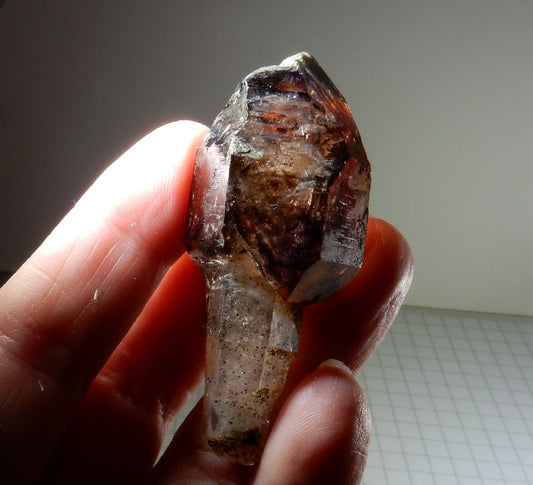

# 0.2 — Minerals & Mineral Identification

The single most useful skill in the field. Learn it well and every rock tells you a
story. (Full profiles of Nigeria's economic minerals are in **Part III**.)

## What counts as a mineral

A **mineral** is a naturally occurring, inorganic **solid** with a **defined
chemical composition** and an **ordered crystal structure**. Five tests:

1. Naturally occurring · 2. Inorganic · 3. Solid · 4. Fixed composition ·
5. Crystalline (repeating atomic lattice).

> *Quartz* and *pyrite* are minerals; *glass*, *amber*, and *coal* are not
> (coal is organic; glass and amber lack an ordered crystal lattice). A **rock** is
> one or more minerals locked together (e.g. granite = quartz + feldspar + mica).

*Figure 0.2a — Quartz crystal (here amethyst, a purple quartz variety). Hardness 7,
conchoidal fracture, glassy luster. Source: [prettyrock.com](https://prettyrock.com/collections/quartz-specimens).*

*Figure 0.2b — Pyrite (FeS₂), brass-yellow and metallic — easily mistaken for gold,
but hard (6–6½) and brittle. Source: [cementl.com](https://www.cementl.com/what-is-pyrite-the-fools-gold-when-nature-wears-golds-disguise/).*

## The properties you actually test in the field

| Property | How to test | What it tells you | Pitfalls |
|----------|-------------|-------------------|----------|
| **Hardness** | Scratch with fingernail (~2½), coin (~3), knife (~5½), glass (~5½) | Composition & structure | A weathered surface tests softer than fresh rock — break it first |
| **Luster** | Look: metallic vs non-metallic (glassy, pearly, dull, waxy) | Metallic → likely an ore | Tarnish can hide a true metallic lustre |
| **Color** | Observe | First clue only | **Unreliable** — impurities change colour (quartz can be white, pink, purple, or smoky) |
| **Streak** | Rub on unglazed porcelain | Powder colour; more reliable than colour | Hard minerals (>6½) won't streak — they scratch the plate |
| **Cleavage** | Look for flat, parallel break surfaces | Atomic structure | Cleavage vs crystal face: cleavage repeats on breaking |
| **Fracture** | Irregular break (conchoidal in quartz) | Diagnostic when no cleavage | — |
| **Crystal habit** | Shape (cubic, prismatic, platy) | Strong for well-formed crystals | Not all minerals show good crystals |
| **Specific gravity** | Heft it — heavy vs light | Dense ores (galena, barite, cassiterite) feel heavy | Compare equal-sized specimens |
| **Magnetism** | Hand magnet | Magnetite (strong), pyrrhotite (weaker) | Some rocks look metallic but aren't magnetic |
| **Acid test** | Drop dilute HCl | Carbonates fizz (calcite strong; dolomite weak) | Use a fresh surface; dolomite needs powder/warm acid |
| **Taste / feel** | (carefully) | Halite salty; talc soapy | Never taste unknowns in the field |

### Mohs hardness scale (1–10)

| 1 | 2 | 3 | 4 | 5 | 6 | 7 | 8 | 9 | 10 |
|---|---|---|---|---|---|---|---|---|----|
| Talc | Gypsum | Calcite | Fluorite | Apatite | Orthoclase | Quartz | Topaz | Corundum | Diamond |

**Handy references:** fingernail ≈ 2½ · copper coin ≈ 3 · steel nail/knife ≈ 5½ ·
window glass ≈ 5½ · quartz (7) will scratch glass · a knife will **not** scratch quartz.

> **Memory aid:** "**T**he **G**eologist **C**an **F**ind **A**n **O**rdinary **Q**uartz
> (**T**opaz, **C**orundum, **D**iamond)" — Talc, Gypsum, Calcite, Fluorite, Apatite,
> Orthoclase, Quartz, Topaz, Corundum, Diamond.

## Step-by-step field testing protocol

1. **Break a fresh surface** with the hammer (weathering alters surface properties).
2. **Lustre first** — metallic or non-metallic? This splits ores from gangue.
3. **Hardness** — try fingernail, then coin, then knife. Record what scratches what.
4. **Streak** on the plate — note the powder colour.
5. **Heft** — is it unusually heavy for its size?
6. **Special tests** — magnet, acid, taste/feel, fluorescence (UV).
7. **Habit & cleavage** — cubic? prismatic? flat sheets? conchoidal?
8. **Cross-check** against the profile in **Part III** before you commit to a name.

## A field identification flow

1. **Metallic or not?** Metallic lustre → likely an ore (pyrite, galena, hematite,
   chalcopyrite). *Cassiterite and gold are exceptions: cassiterite is non-metallic;
   gold is metallic but soft and malleable.*
2. **Hardness** — can a knife scratch it? Is it harder than glass?
3. **Streak** — the colour of the powder.
4. **Density** — unusually heavy?
5. **Cleavage/fracture & habit** — cubic? prismatic? flat sheets?
6. **Special tests** — magnet, acid, taste, feel.

## Quick-ID table: common Nigerian minerals

| Mineral | Key field test / giveaway |
|---------|---------------------------|
| **Quartz** | Hardness 7, glassy, conchoidal, no cleavage |
| **Calcite** | Hardness 3, rhombohedral cleavage, **strong acid fizz** |
| **Dolomite** | Like calcite but **weak fizz**; curved rhombs |
| **Feldspar** | Hardness 6, two cleavages ~90°, often porcelain-white/pink |
| **Mica** | Perfect one-way cleavage into elastic sheets |
| **Pyrite** | Hard (6–6½), brassy, brittle, green-black streak |
| **Chalcopyrite** | Softer than pyrite, greener brass, often iridescent |
| **Galena** | Very heavy, metallic, perfect cubic cleavage, soft |
| **Cassiterite** | Very heavy, very hard, brown-black, resinous |
| **Gold** | Soft, heavy, metallic yellow, **malleable**, yellow streak |
| **Magnetite** | Black, metallic, **strongly magnetic** |
| **Hematite** | Red-brown streak, metallic to earthy |
| **Gypsum** | Very soft (fingernail), no acid fizz |
| **Halite** | Salty taste, soft, cubic |
| **Kaolin/clay** | Soft, earthy, white, stains hands |
| **Tourmaline (schorl)** | Black, prismatic, striated, in pegmatite/schist |

## Lookalikes & how to tell them apart

| Confusion | Tell them apart by |
|-----------|--------------------|
| **Gold vs pyrite** | Gold is **soft & malleable**, yellow streak; pyrite is **hard & brittle**, green-black streak |
| **Gold vs chalcopyrite** | Chalcopyrite is greenish-brass and brittle |
| **Calcite vs dolomite** | Calcite fizzes strongly in cold acid; dolomite fizzes weakly (powder or warm acid) |
| **Calcite vs quartz** | Calcite (H3) is scratched by a knife and fizzes; quartz (H7) scratches glass and won't fizz |
| **Hematite vs magnetite** | Magnetite is magnetic and black; hematite is red-brown-streaked and non-magnetic |
| **Mica vs gold** | Mica peels into flexible, transparent/brown sheets |
| **Halite vs calcite** | Both soft, but halite tastes salty and dissolves in water; calcite fizzes in acid |
| **Gypsum vs talc** | Both very soft; gypsum has cleavage plates, talc feels soapy |

## Field kit for mineral ID

Hand lens (10×) · streak plate · dilute HCl · hand magnet · steel knife/nail ·
copper coin · **this handout** (Part III profiles). A hand-held XRF, if available,
speeds up assay-level checks but never replaces the basic tests.

## Tips & facts

- **Tip:** always test a **fresh** surface — weathering changes colour, hardness, and
  even streak.
- **Tip:** colour is the *least* reliable property; streak and hardness are your anchors.
- **Fact:** a mineral's **crystal habit** reflects its atomic lattice — cubic galena,
  rhombohedral calcite, platy mica.
- **Fact:** "fool's gold" (pyrite) fueled many disappointing rushes; the malleability
  test settles it in seconds.
- **Fact:** hardness is *directional* in some minerals (e.g. kyanite is ~5 along, ~7
  across its length).

## Related

- [The rock cycle](00-03-the-rock-cycle.md) · [The three rock families](00-04-three-rock-families.md) · **Part III** — Nigeria's minerals, each shown pure and in rock.
