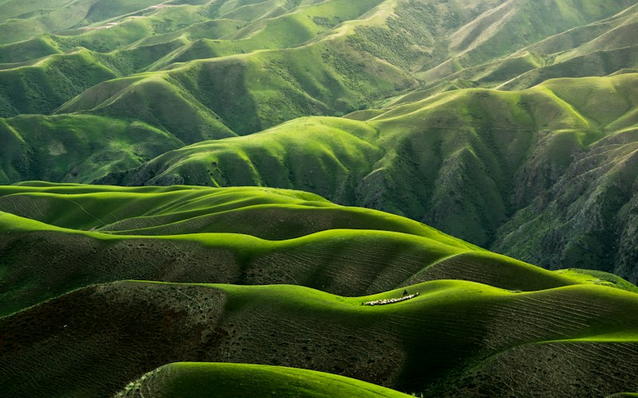
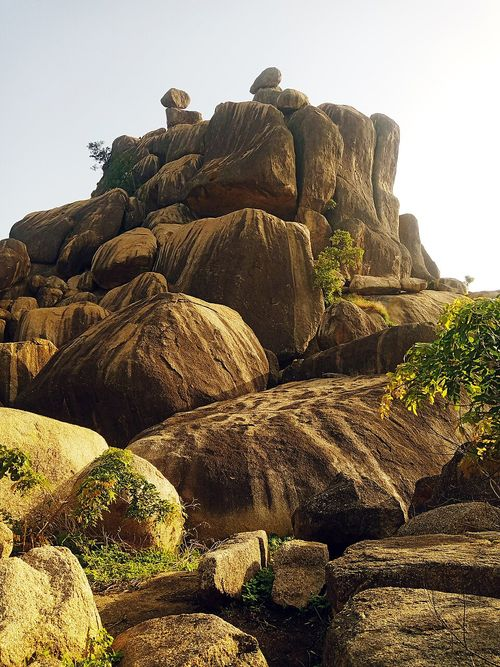

# 1.5 — The Younger Granite Ring Complexes (Jurassic)

## What they are

The **Younger Granites** are a famous set of **Jurassic-age (~200–140 million
years)** granitic intrusions emplaced into the Basement Complex — not in a smooth
batholith, but as **ring complexes**: circular/elliptical bodies of granite,
syenite, and related rocks surrounded by ring dykes and volcanic remnants.

They are concentrated on and around the **Jos Plateau**, one of the world's great
tin provinces. Over **40 ring complexes** and numerous dykes are known, including
**Jos–Bukuru, Ropp, Naraguta, Wase, Amo, and N'gell** complexes.

## Why they matter — the tin factory

The Younger Granites are **rich in rare elements** (tin, niobium, tantalum,
tungsten, and rare-earth elements) that concentrated into:

- **Pegmatites** — very coarse veins with **cassiterite (tin)**, **columbite–tantalite**.
- **Greisens & quartz veins** — **wolframite (tungsten)**, more cassiterite.
- **Alluvial/eluvial placers** — weathered tin and columbite washed into rivers and
  soils (historically the easiest to mine).

> The **Jos Plateau** tinfields were mined for decades and made "tin" a household
> word in Nigerian mining history. See **cassiterite, columbite–tantalite, and
> wolframite** in **Part III**.

## Anatomy of a ring complex

| Component | What it is | Mineralization |
|-----------|-----------|----------------|
| **Ring dykes** | Curved intrusions around a subsiding block | Pegmatites on margins |
| **Central pluton** | Granite/syenite core | Greisen + quartz veins (W, Sn) |
| **Fenites / aureole** | Alkali-altered country rock | Indicator of the complex |
| **Volcanic remnants** | Rhyolite–trachyte, tuff | Minor; caps the complex |
| **Pegmatite fields** | Coarse veins around the complex | **Cassiterite, columbite, gems** |

## The mineralization story

These are **anorogenic (within-plate) alkaline** complexes — unusually enriched in
incompatible elements. As the magma cooled and fluids separated, rare elements
crystallized into **pegmatites and greisens**, then **deep tropical weathering**
freed the dense cassiterite and columbite to concentrate as **placers** in rivers
and soils — the easiest ore to mine, and the backbone of the historic industry.

## The landscape

The plateau is a high, rugged, boulder-strewn granite terrain — the deep tropical
weathering has sculpted dramatic **tors** and **inselbergs**.

*Figure 1.5a — The rugged Jos Plateau, the heart of the Younger Granite tin province. Source: [geographyworlds.com](https://geographyworlds.com/blog/jos-plateau-nigeria-guide).*

*Figure 1.5b — Gog and Magog rocks, Jos Plateau: rounded granite tors, a classic landform of deeply weathered granite. Source: [Wikimedia Commons (via Wikivoyage, Plateau State)](https://en.wikivoyage.org/wiki/Plateau_State).*

## Where they occur (states)

Core area: **Plateau State** (Jos, Bukuru, Naraguta, Ropp, Wase). Related
occurrences extend into **Bauchi, Kaduna, and Nasarawa** states. Gem-bearing
pegmatites (emerald, aquamarine, tourmaline, topaz) occur across this province.

> **Field note.** If you find **coarse pegmatite with black cassiterite or
> black/brown columbite** on the Jos Plateau, you are in the right rock at the
> right time — sample systematically and map the vein/alteration halo.

## Exploration targeting (recap)

1. **Map the ring complexes** and their pegmatite fields.
2. **Pan rivers** draining the complex for cassiterite/columbite.
3. **Sample pegmatites & greisens**; look for **schorl (black tourmaline)** and
   quartz–mica alteration as fertility indicators.
4. Trace heavy-mineral anomalies **upstream** to the lode.

## Facts & tips

- **Fact:** the Younger Granites are **Jurassic** (~200–140 Ma) — far younger than
  the Precambrian Basement they cut.
- **Fact:** beyond tin, these complexes also yield **gems** (emerald, aquamarine,
  tourmaline, topaz) and **rare-earth minerals** (monazite).
- **Tip:** the classic alluvial cassiterite was won by **panning and sluicing** —
  the same cheap technique still works for first-pass exploration today.
- **Tip:** black tourmaline and fine quartz–mica (greisen) alteration mark the
  fertile zones.

## Related

- [The Basement Complex](01-02-basement-complex-and-pan-african.md)
- [Cenozoic volcanism](01-05-cenozoic-volcanism.md) — younger basalts cap parts of the plateau
- [Regolith & laterite](01-07-regolith-and-laterite.md) — how tin is concentrated into placers
- **Part IV, §4.1** — the Jos Plateau tin province. **Part III** — cassiterite, columbite, wolframite.
