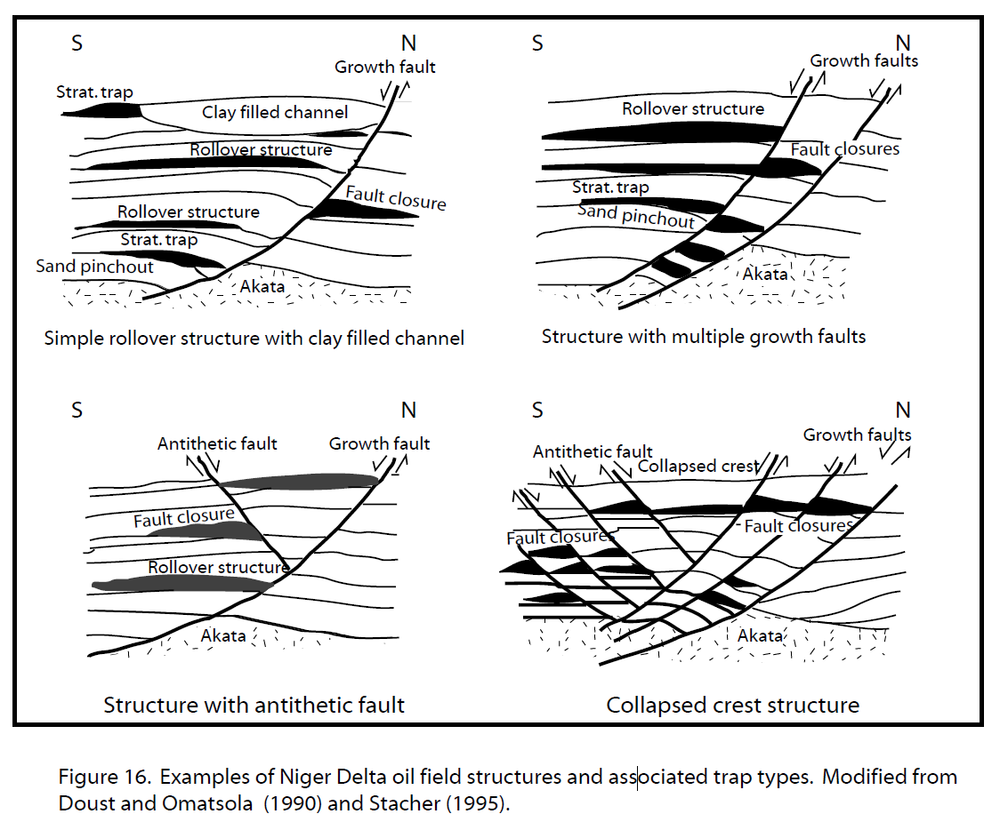

# 1.6–1.8 — The Sedimentary Basins

Nigeria's **sedimentary basins** (Domain 3) hold the country's **oil, gas, coal,
salt, limestone, lead-zinc, and gypsum**. There are five main basins.

## 1.6 — The Benue Trough (Cretaceous)

A huge **NE–SW** rift/sag basin (~800 km long) that splits the Basement into a
northwestern and a southeastern half. Its sediments (sandstone, shale, limestone,
coal) carry a rich mix of minerals.

**Stratigraphy (bottom → top):** **Bima Sandstone** (continental) → **Yolde** →
**Keana/Awe** → **Pindiga** → **Gongila** → **Fika** shales → **Lamja Sandstone**,
with the **Abakaliki** and **Enugu** formations carrying the coal and lead-zinc.

**Key resources:** **coal** (Enugu, Kogi — Ogboyaga, Nasarawa — Lafia/Obi),
**lead–zinc** (Enugu–Abakaliki, Zurak, Ishiagu), **salt** (Awe, Nasarawa),
**limestone** (Nkalagu, Gboko, Igalamela), **ironstone** (Agbaja, Ajabanoko — Kogi),
**barite, gypsum, clay, phosphate, uranium**.

**States:** **Benue, Kogi, Enugu, Ebonyi, Nasarawa, Plateau (south), Taraba,
Cross River, Anambra** (the western "Anambra Basin" sub-basin).

## 1.7 — The Chad (Borno) Basin (Cretaceous–Recent)

In the **northeast**, filled with Cretaceous to Recent sediments (notably the
**Chad Formation**) around **Lake Chad**.

**Key resources:** **gypsum, salt, limestone, diatomite, lignite, kaolin, clay,
uranium.**

**States:** **Borno, Yobe, Bauchi, Gombe, Jigawa.**

## 1.8 — The Niger Delta & Dahomey Basins (Cenozoic)

### Niger Delta Basin — Nigeria's oil & gas engine
A **Tertiary–Recent** delta built by the Niger/Benue river system. Its three rock
units are the key to the oil:

- **Benin Formation** — continental sands (youngest, on top).
- **Agbada Formation** — alternating sand & shale — the main **reservoir** rock.
- **Akata Formation** — marine shale — the **source & seal**.

*Figure 1.8 — Growth-fault/rollover structures typical of the Niger Delta, which trap the oil and gas. Source: [Wikipedia — Delta Field, Niger Delta](https://en.wikipedia.org/wiki/Delta_Field_(Niger_Delta)).*

**The petroleum system in one line:** organic-rich Akata shale **generates** oil,
which migrates up into sandy Agbada **reservoirs** and is trapped by **growth-fault
rollovers** and seals — Africa's most prolific hydrocarbon province.

**States:** **Rivers, Bayelsa, Delta, Akwa Ibom, Cross River, Imo, Ondo (onshore &
offshore), Edo.**

### Dahomey Basin (SW)
Extends in from Benin Republic/Togo into SW Nigeria. Hosts **bitumen/tar sands**
(notably **Ondo State**), **lignite, clay, kaolin, phosphate, limestone**.
**States:** **Lagos, Ogun, Ondo, Edo.**

## The Sokoto (Iullemmeden) Basin (NW)

Often listed with the basins — a Phanerozoic basin in NW Nigeria. Hosts
**phosphate, gypsum, limestone, clay, kaolin, ironstone, lignite, salt**.
**States:** **Sokoto, Zamfara, Kebbi, Katsina.**

## Basin-by-basin cheat sheet

| Basin | Age | Headline resource | Representative states |
|-------|-----|-------------------|-----------------------|
| Benue Trough | Cretaceous | Coal, lead-zinc, salt, limestone | Enugu, Benue, Kogi, Ebonyi, Nasarawa, Cross River |
| Chad (Borno) | Cretaceous–Recent | Gypsum, salt, limestone, uranium | Borno, Yobe, Gombe, Bauchi |
| Niger Delta | Cenozoic | **Oil & gas** | Rivers, Bayelsa, Delta, Akwa Ibom, Imo, Ondo |
| Dahomey (SW) | Cretaceous–Tertiary | Bitumen, clay, phosphate | Lagos, Ogun, Ondo, Edo |
| Sokoto/Iullemmeden | Phanerozoic | Phosphate, gypsum, limestone | Sokoto, Zamfara, Kebbi |

## Exploration in the basins (recap)

- **Coal** → map and drill the **coal measures**; assess seam thickness & quality.
- **Lead-zinc** → follow **gossans and calcite/quartz veins** in the Abakaliki/Enugu shales.
- **Limestone/salt/gypsum** → map beds; assay purity (CaO, NaCl, CaSO₄).
- **Oil & gas** → seismic + drilling for **structural traps** (a specialist play).
- **Phosphate** → map the Sokoto phosphatic beds.

## Facts & tips

- **Fact:** the **Benue Trough** is a fossil rift — its formation (~Cretaceous) was
  linked to the opening of the South Atlantic.
- **Fact:** the **Niger Delta** is one of the world's largest regressive deltas and
  Africa's top oil province.
- **Tip:** sedimentary ore bodies are found by **mapping beds + geochemistry +
  drilling** — quite different from the structure-focused Basement play.
- **Tip:** rusty **gossans** and lead-zinc veins in the Benue shales are surface
  clues to Mississippi-Valley-type mineralization.

## Related

- [The Basement Complex](01-02-basement-complex-and-pan-african.md)
- **Part II, II.C** — the sedimentary rocks. **Part III** — their minerals & energy.
- **Part IV, §4.3–4.6** — the provinces in detail.
