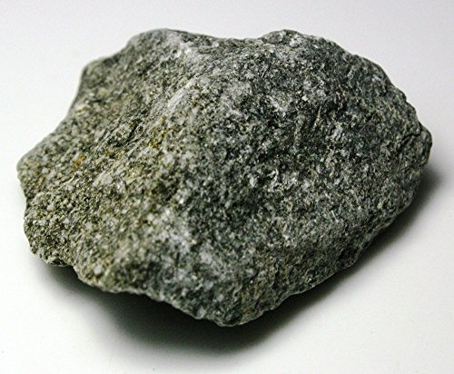
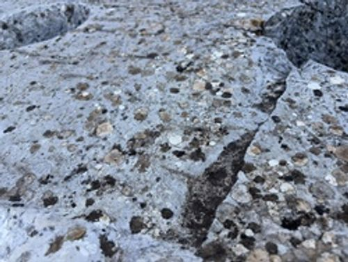
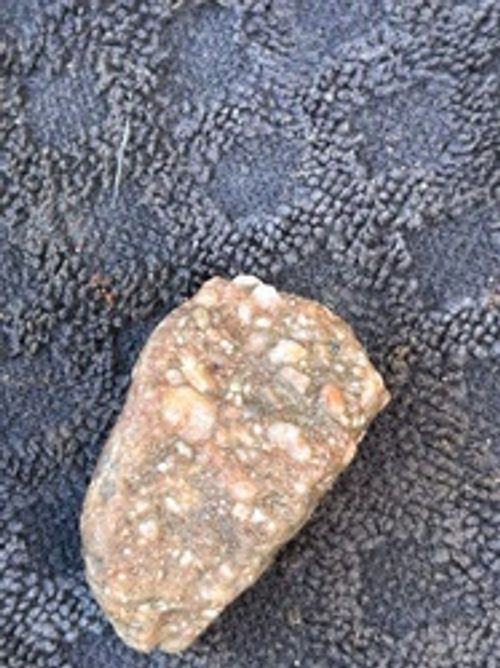

# Andesite

> **Family:** Igneous — extrusive (volcanic) · **Composition:** Intermediate
> **Coarse equivalent:** Diorite · **Silica:** ~57–63 wt% SiO₂
> **Quick ID:** Grey, fine-grained, often porphyritic intermediate lava — darker than rhyolite, lighter than basalt.

## At a glance

| Property | Value |
|---|---|
| Colour | Grey (sometimes reddish weathered) |
| Texture | Fine-grained (aphanitic), commonly porphyritic |
| Key minerals | Plagioclase + hornblende/biotite/pyroxene |
| Hardness | ~6–7 |
| Specific gravity | ~2.6–2.8 |
| Setting | Lava flows, volcanic arcs (subduction zones) |
| In Nigeria | **Uncommon/subordinate** (volcanism is alkaline) |

## Composition
An **intermediate volcanic** rock — **plagioclase feldspar** with **hornblende, biotite, and/or pyroxene**; silica (~57–63% SiO₂) **between basalt and rhyolite**. It is the fine-grained volcanic equivalent of **diorite**. Accessory **magnetite** and **apatite** are common.

## Geochemistry
- **Major oxides:** SiO₂ 57–63 wt%, Al₂O₃ 16–18%, CaO 6–8%, FeO+MgO 5–8%, alkalis 3–5%.
- **Trace elements:** moderate **Sr, Ba**; low **Ni, Cr** (less mafic than basalt). In arc settings, andesites show characteristic **LILE enrichment and Nb–Ta depletion** (a subduction fingerprint).
- **Nature in Nigeria:** because Nigerian volcanism is **alkaline (within-plate)**, true calc-alkaline andesite is uncommon; andesite is included for completeness and for comparison when working in arc settings elsewhere.

## Texture
**Fine-grained (aphanitic)**, commonly **porphyritic** (phenocrysts of plagioclase ± hornblende in a fine groundmass). The fine texture records rapid cooling of intermediate lava at the surface.

## Diagnostic field features
- Intermediate composition; typically **grey**; often porphyritic.
- **Darker than rhyolite, lighter and less mafic than basalt.**
- Fine-grained, dense; may show flow banding.
- Phenocrysts of pale **plagioclase** and/or dark **hornblende**.

## Identification tests — step by step
1. **Colour:** grey, intermediate between pale rhyolite and black basalt.
2. **Hand lens:** fine groundmass; identify phenocrysts — plagioclase (pale), hornblende/biotite (dark).
3. **Hardness:** 6–7; heavier than rhyolite, lighter than basalt.
4. **Acid:** no fizz.
5. **Context:** lava-flow form; in Nigeria, verify it is not a fine diorite/dolerite.

## Genesis & tectonic setting
Andesite forms from **intermediate magma** erupted at the surface, classically at **convergent (subduction-zone) margins** — hence its name from the Andes. It marks where oceanic crust melts beneath continental crust. Nigeria's volcanic rocks are mostly **alkaline** (within-plate), so true andesite is uncommon here.

## Host states / localities
Nigeria's volcanism is predominantly **alkaline** (basalt, trachyte, phonolite, rhyolite), so **andesite is uncommon/subordinate** here — it is included for completeness as an intermediate volcanic type you may encounter at convergent margins elsewhere (see [Basalt](basalt.md), [Rhyolite, Trachyte & Phonolite](rhyolite-trachyte-phonolite.md)).

## Associated minerals & rocks
Plagioclase, hornblende, pyroxene, biotite; associated with basalt/dacite/rhyolite. Coarse equivalent: **diorite**.

## Economic relevance
- **Aggregate and building stone** (widely used where abundant).
- Hosts some **epithermal gold–silver** and **porphyry copper** mineralisation in arc settings elsewhere.
- **Porphyry copper** deposits worldwide are typically associated with andesite–diorite porphyries.

## Lookalikes & how to distinguish

| Looks like | How to tell it apart |
|---|---|
| **Basalt** | Basalt is darker and more mafic (pyroxene-rich); andesite is grey with hornblende/feldspar. |
| **Rhyolite** | Rhyolite is paler and more felsic (quartz-bearing); andesite is grey, no quartz. |
| **Diorite** | Same composition but diorite is **coarse-grained** (intrusive); andesite is fine (extrusive). |
| **Trachyte** | Trachyte is alkali-feldspar-rich and pale; andesite has plagioclase + hornblende. |

## Field checklist
- [ ] Grey, fine-grained, intermediate?
- [ ] Porphyritic (plagioclase/hornblende phenocrysts)?
- [ ] Between basalt (dark) and rhyolite (pale)?
- [ ] Lava-flow form?
- [ ] No acid fizz?

## Field tips
- Fine-grained intermediate lava; grey; porphyritic — **between basalt and rhyolite** in composition and colour.
- Use colour as a quick guide: **black = basalt, grey = andesite, pale = rhyolite**.
- Confirm the dark mineral with a hand lens (hornblende → andesite; pyroxene → basalt).
- In Nigeria, double-check a grey fine rock against **diorite** and **dolerite** (both intrusive).

## Facts
- **Andesite** is named after the **Andes** mountains of South America — the classic subduction-zone volcanic arc.
- It is the **fine-grained equivalent of diorite**.
- Most of the world's great **porphyry copper deposits** are hosted in andesite–diorite porphyries.
- Andesite is uncommon in Nigeria because the country's volcanism is **alkaline (within-plate)**, not subduction-related.

*Figure II.A.15 — Andesite (intermediate volcanic rock). Source: [Amazon](https://www.amazon.com/Andesite-Extrusive-Ingeous-Rock-Unpolished/dp/B01FMKZVW4).*

*Figure II.A.15b — Porphyritic andesite. Source: [Rock.ID](https://rock.id/encyclopedia/andesite).*

*Figure II.A.15c — Porphyritic andesite (volcanic rock). Source: [Rock.ID](https://rock.id/encyclopedia/andesite).*

## Related
- [Basalt](basalt.md) · [Rhyolite, Trachyte & Phonolite](rhyolite-trachyte-phonolite.md) · [Gabbro & Dolerite](gabbro-dolerite.md) · [Granodiorite & Diorite](granodiorite-diorite.md)
