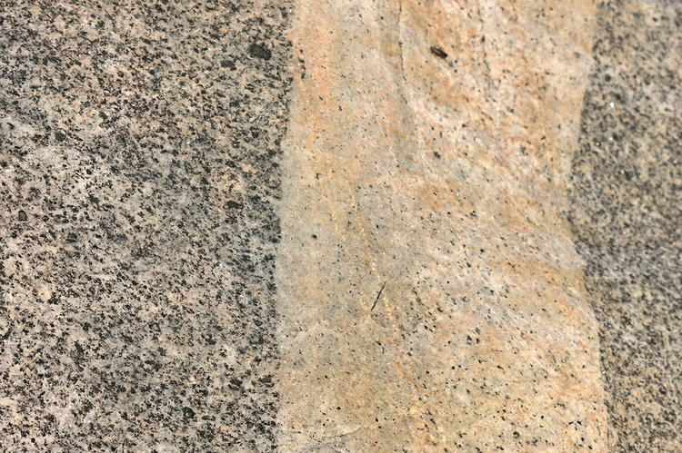
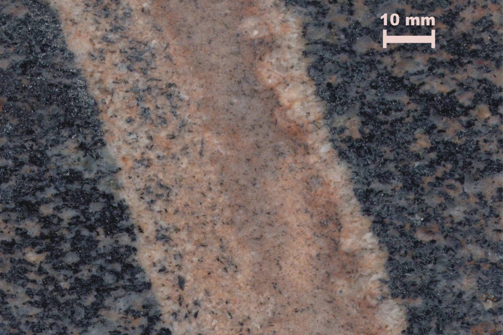
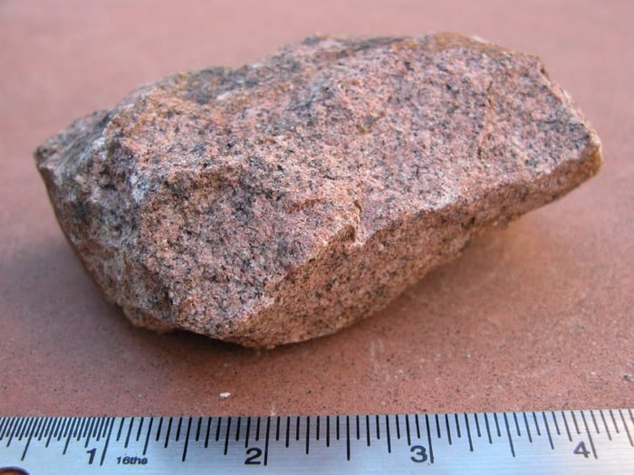
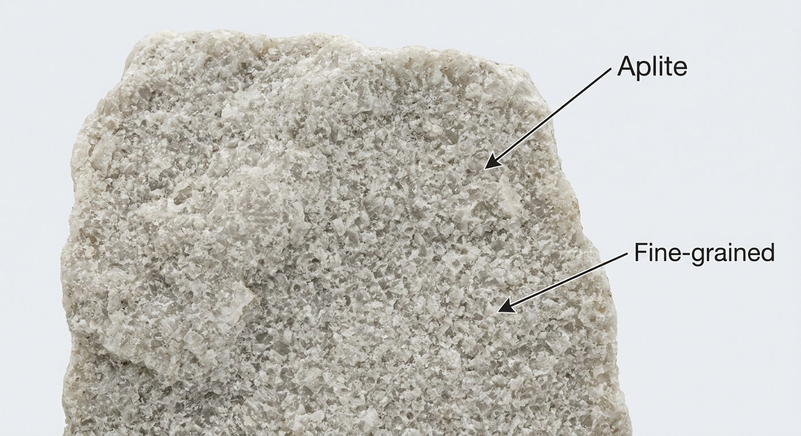
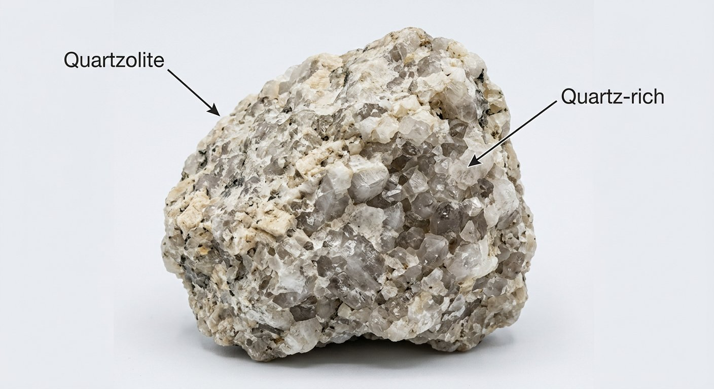

# Aplite & Quartzolite

> **Family:** Igneous — hypabyssal (late-stage differentiates) · **Composition:** Aplite = fine granite; Quartzolite = nearly pure quartz
> **Form:** Thin dikes/veins at granite & pegmatite margins · **Key clue:** Fine, even "sugary" pale rock in narrow dikes.
> **Quick ID:** Pale, fine, even-grained ("sugary") dike rock; aplite is fine granite, quartzolite is almost all quartz.

## At a glance

| Property | Aplite | Quartzolite |
|---|---|---|
| Composition | Fine **granite** (quartz + feldspar) | Nearly pure **quartz** |
| Colour | Pale grey/white/pink | White, vitreous |
| Texture | Aphanitic, "sugary," equigranular | Massive, sugary vitreous quartz |
| Form | Thin dikes/veins | Veins, pods, dikes |
| Setting | Margins of granite & pegmatites | Late-stage silica segregations |

## Composition
Fine-grained late-stage differentiates of granitic/pegmatitic systems:
- **Aplite** — a fine-grained ("sugary") **granite** (quartz + feldspar, ± muscovite).
- **Quartzolite** — nearly pure **quartz** (sometimes called quartz rock).

Chemically felsic: aplite is granitic (SiO₂ ≈ 70–77%); quartzolite is almost pure SiO₂ (>90%).

## Geochemistry
- **Aplite:** felsic, granitic composition (high SiO₂, alkalis, alumina).
- **Quartzolite:** essentially pure silica (SiO₂ >90%), with only trace impurities.
- **Nature in Nigeria:** both occur with the fertile **Younger Granite** and pegmatite systems — useful guides to granite/pegmatite fertility (tin, columbite, gems).

## Texture
**Aphanitic** (fine-grained) and equigranular — a "**sugary**" feel (grains too small to see individually, like sand). Quartzolite is massive, white, **vitreous** quartz with a sugary-to-glassy texture.

## Diagnostic field features
- Pale, fine, even-grained; occurs as **thin dikes/veins** at the margins of granites and around pegmatites.
- **Sugary texture** distinguishes it from coarse granite.
- Very hard (scratches glass and steel).
- Often forms a **network of thin light-coloured dikes** cutting coarser granite.

## Identification tests — step by step
1. **Grain size:** uniformly fine and even (sugary), unlike coarse granite.
2. **Colour:** pale/white; quartzolite may be glassy white.
3. **Hardness:** very hard — scratches glass easily.
4. **Form:** thin dike/vein cross-cutting granite or at pegmatite margins.
5. **Acid:** no fizz.

## Genesis & tectonic setting
Aplite and quartzolite form from the **last, quickly-cooled fractions** of granitic magma and its fluids, injected as thin dikes at the chilled margins of granite plutons and around pegmatites. Their fine texture records rapid cooling in narrow fractures; they are part of the same magmatic system as granite and pegmatite.

## Host states / localities
**Plateau, Bauchi, Kaduna, Nasarawa** — with the **Younger Granites, Older Granites**, and their pegmatite fields. They occur wherever fertile granite and pegmatite systems are found.

## Associated minerals & rocks
Pegmatite, granite, quartz, feldspar, muscovite, tourmaline (see [Pegmatite](pegmatite.md)). Often associated with the **cassiterite/columbite-bearing** zones of pegmatite fields.

## Economic relevance
Minor in itself (a **silica source**), but a useful **indicator of granite/pegmatite fertility** (tin, columbite, gems). Quartzolite can be a high-purity **quartz/silica** resource. Aplite/quartzolite dikes often outline the mineralised zone of a pegmatite field.

## Lookalikes & how to distinguish

| Looks like | How to tell it apart |
|---|---|
| **Granite** | Granite is coarse (visible crystals); aplite is fine and sugary. |
| **Quartz vein** | Quartz veins are massive/glassy and cross-cutting; quartzolite is a rock body of nearly pure quartz. |
| **Microgranite** | Microgranite is the fine equivalent of granite with phenocrysts; aplite is even finer and equigranular. |

## Field checklist
- [ ] Fine, even "sugary" texture?
- [ ] Pale/white colour?
- [ ] Thin dike/vein form at granite/pegmatite margin?
- [ ] Very hard (scratches glass)?
- [ ] No acid fizz?

## Field tips
- Fine sugary texture + pale colour + dike form; gradational with pegmatite and granite.
- Aplite/quartzolite dikes often **outline the mineralised core** of a pegmatite field — a useful mapping guide.
- Where you find aplite at a granite margin, look nearby for **pegmatite and its rare-metal minerals**.
- The sugary texture is the giveaway — no visible individual crystals.

## Facts
- **Aplite** gets its name from the Greek for "simple," reflecting its plain, even texture.
- Aplite and pegmatite are **opposites**: aplite is the finest-grained, pegmatite the coarsest-grained, product of the same granitic magma.
- **Quartzolite** is nearly pure quartz — among the purest silica rocks.
- Thin aplite dikes often form a **lacy network** at the chilled margins of granite plutons.

*Figure II.A.13 — Aplite dike cutting granodioritic host rock. Source: [Sandatlas](https://sandatlas.org/aplite/).*

*Figure II.A.13b — Aplite (fine-grained igneous rock). Source: [Rubyglint](https://rubyglint.com/rocks/aplite).*

*Figure II.A.13c — Aplite specimen. Source: [Rubyglint](https://rubyglint.com/rocks/aplite).*

*Figure II.A.13d — Labeled illustration: aplite fine-grained igneous rock. Original diagram prepared for this guide.*

*Figure II.A.13e — Labeled illustration: quartzolite quartz-rich rock. Original diagram prepared for this guide.*

## Related
- [Pegmatite](pegmatite.md) · [Granite](granite.md) · [Quartz, Silica & Glass sand](../../03-mineral-resources/industrial/quartz-glass-sand.md) · [Microgranite & Porphyry](microgranite-porphyry.md)
