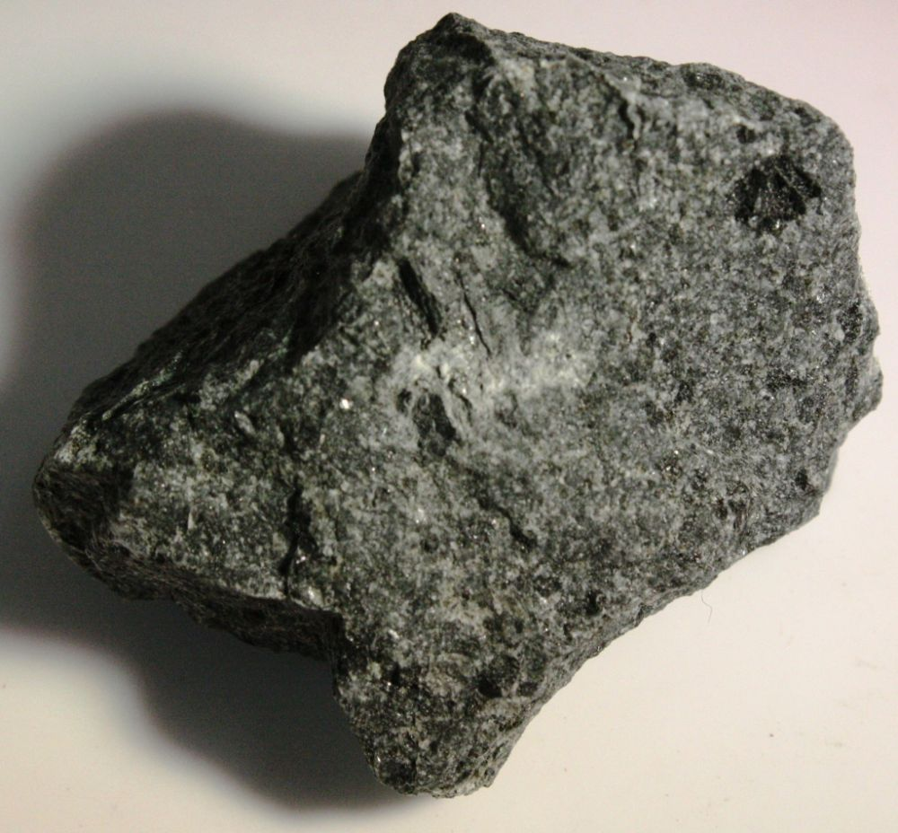
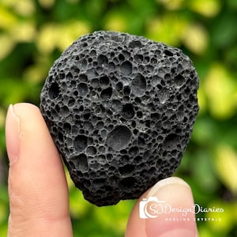
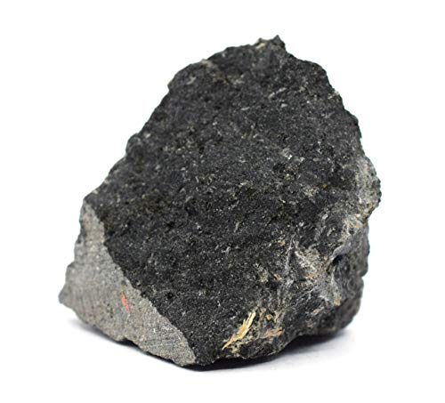
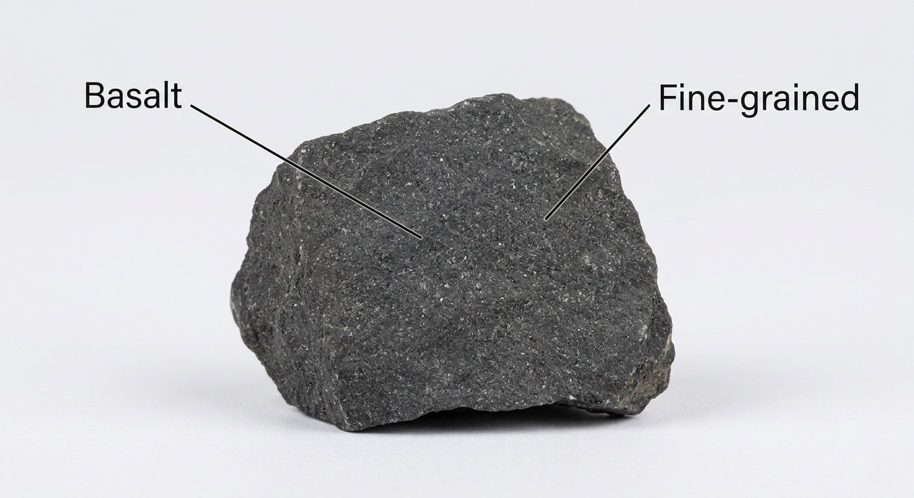
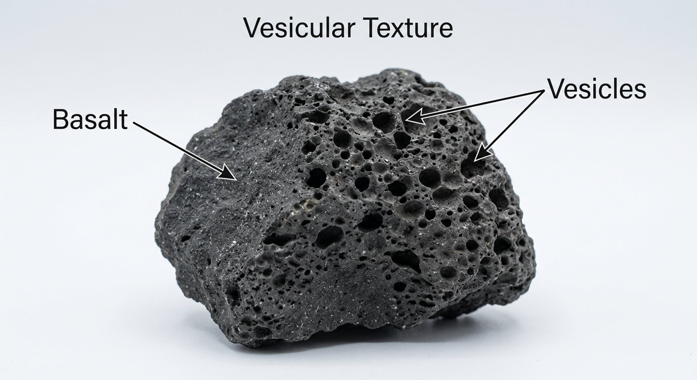

# Basalt (the Younger Basalts)

> **Family:** Igneous — extrusive (volcanic) · **Composition:** Mafic
> **Coarse equivalent:** Gabbro · **Mean density:** 2.9–3.0 g/cm³ · **Silica:** ~45–52 wt% SiO₂
> **Quick ID:** Dark, fine-grained, dense, often magnetic; may be vesicular or columnar; weathers red-brown.

## At a glance

| Property | Value |
|---|---|
| Colour | Black / dark grey (weathers red-brown) |
| Texture | Fine-grained (aphanitic), often porphyritic |
| Key minerals | Plagioclase + pyroxene (augite) ± olivine |
| Hardness | ~6 |
| Specific gravity | ~2.9–3.0 (heavy) |
| Magnetism | Often magnetic (magnetite) |
| Setting | Lava flows, plateaus, and dykes |

## Composition
**Plagioclase feldspar + pyroxene (augite)** ± **olivine** — the fine-grained **volcanic equivalent of gabbro**. Silica-poor (~45–52% SiO₂), rich in iron and magnesium. Accessory **magnetite and ilmenite** give it weight and often magnetism; vesicles may be filled with white **zeolites, calcite, or agate**.

## Geochemistry
- **Major oxides:** SiO₂ 45–52 wt%, CaO 10–13%, FeO+Fe₂O₃ 10–14%, MgO 6–12%, Al₂O₃ 14–16%, alkalis 2–4%.
- **Trace elements:** high **Ni, Cr, Sc, V** (mantle-compatible); low **Rb, K, Zr**.
- **Nature in Nigeria:** the Jos and Biu basalts are **alkali to transitional basalts** (sodium-rich), consistent with within-plate (anorogenic) magmatism of the Cenozoic volcanic episode.

## Texture
**Fine-grained (aphanitic)**, often **porphyritic**; may be **vesicular** (bubbly = scoria) or show **columnar jointing** — striking hexagonal columns that form as the lava cools and contracts (like the Giant's Causeway).

## Diagnostic field features
- **Dark (black/dark grey), fine-grained, dense, and heavy**.
- Often **magnetic** (contains magnetite) — may deflect a compass.
- May have **gas bubbles (vesicles)**, sometimes filled with white **zeolites** or calcite.
- Fresh surfaces are dark; weathers **reddish-brown** (iron oxidation).
- **Columnar jointing** (hexagonal columns) in thick flows.

## Identification tests — step by step
1. **Colour & texture:** dark + fine-grained + dense.
2. **Magnet/compass:** many basalts deflect a compass (magnetite).
3. **Hand lens:** fine matrix with tiny plagioclase + pyroxene; look for small phenocrysts.
4. **Vesicles:** gas bubbles (vesicles) confirm extrusive origin; scoria is very vesicular.
5. **Acid:** no fizz (unless calcite-filled vesicles — test a clean part).

## Genesis & tectonic setting
Basalt forms from **partial melting of the mantle** and eruption of fluid mafic lava at the surface. Nigeria's basalts belong to the **Cenozoic alkaline volcanic episode** — plateau/flood-type basalts and dyke swarms, unrelated to subduction (within-plate magmatism). **Columnar jointing** develops as thick flows cool and shrink into polygonal columns.

## Host states / localities
Nigeria's **Younger Basalts**:
- **Jos Plateau** "Younger Basalts" capping the granite (**Plateau**, edges of Bauchi/Kaduna).
- **Biu Plateau** basalt field (**Borno, Yobe**).
- Numerous **dykes** across the Basement.

## Associated minerals & rocks
**Olivine, augite, magnetite**; vesicles may hold **zeolites, calcite, agate**; rarely native copper or other minor minerals. Associated rocks: gabbro (coarse equivalent), rhyolite/trachte/phonolite, tuff.

## Economic relevance
- **Construction aggregate, road metal, railway ballast** — very high value in Nigeria.
- **Dimension stone** (also sold as "black granite").
- **Zeolites and agate** from vesicles have collector/niche value.
- Potential source of **copper/nickel** only rarely (in some mafic complexes).

## Lookalikes & how to distinguish

| Looks like | How to tell it apart |
|---|---|
| **Gabbro** | Same minerals; gabbro is **coarse-grained**, basalt is fine-grained. |
| **Dolerite** | Dolerite is medium-grained and in dykes; basalt is a fine lava flow. |
| **Andesite** | Andesite is intermediate — lighter grey, less mafic. |
| **Scoria/pumice** | Very vesicular basalt (scoria) is dark; pumice is pale and floats. |

## Field checklist
- [ ] Dark + fine-grained + dense?
- [ ] Magnetic / deflects compass?
- [ ] Vesicles or columnar jointing?
- [ ] Weathers red-brown?
- [ ] No acid fizz (clean part)?
- [ ] Lava-flow form (not a dyke)?

## Field tips
- **Dark + fine-grained + dense/magnetic** = basalt.
- **vs. gabbro:** gabbro is coarse-grained (same minerals).
- **Vesicular/pumiceous** varieties float or are very light.
- Look for **columnar jointing** in thick flows — a striking field indicator.
- Fresh basalt is a premier **roadstone/ballast** — note any quarrying.

## Facts
- Basalt is the **most common volcanic rock on Earth** — and the main rock of the ocean floor.
- The **Jos Plateau Younger Basalts** are among the youngest rocks in Nigeria (Cenozoic).
- **Columnar jointing** forms iconic hexagonal columns (e.g., the Giant's Causeway).
- Much "black granite" in the trade is actually **basalt, dolerite, or gabbro**.

*Figure II.A.10 — Basalt (porphyritic): fine-grained dark volcanic rock with
phenocrysts. Source: [beakersworld.com](https://beakersworld.com/product/porphyritic-basalt-igneous-rock-10-pieces-mineral-specimen/).*

*Figure II.A.10b — Basalt (vesicular volcanic rock). Source: [Etsy](https://www.etsy.com/market/volcanic_basalt_stone).*

*Figure II.A.10c — Basalt specimen. Source: [Amazon](https://www.amazon.com/Raw-Basalt-Igneous-Rock-Specimen/dp/B081BBKQGK).*

*Figure II.A.10d — Labeled illustration: basalt fine-grained volcanic rock. Original diagram prepared for this guide.*

*Figure II.A.10e — Labeled illustration: vesicular basalt with gas vesicles. Original diagram prepared for this guide.*

## Related
- [Gabbro & Dolerite](gabbro-dolerite.md) (coarse equivalent) · [Cenozoic volcanism](../../01-general-geology/01-05-cenozoic-volcanism.md) · [The three rock families](../../00-fundamentals/00-04-three-rock-families.md) · [Volcanic tuff & ignimbrite](volcanic-tuff-ignimbrite.md)
