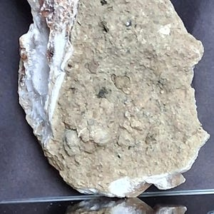
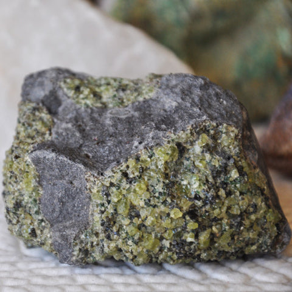
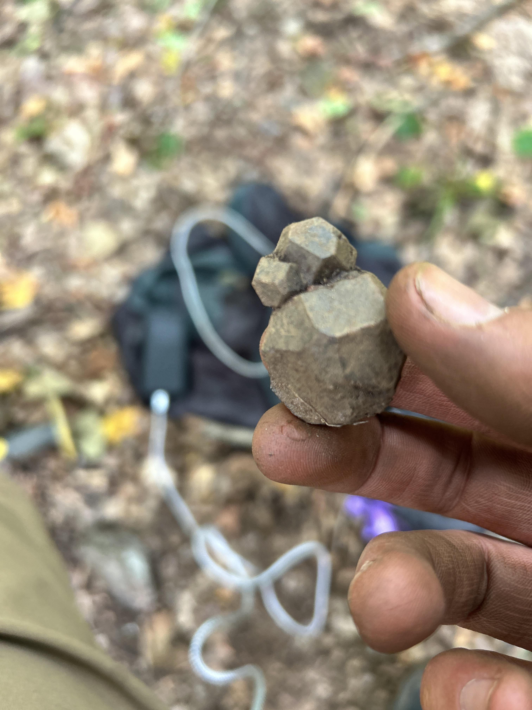
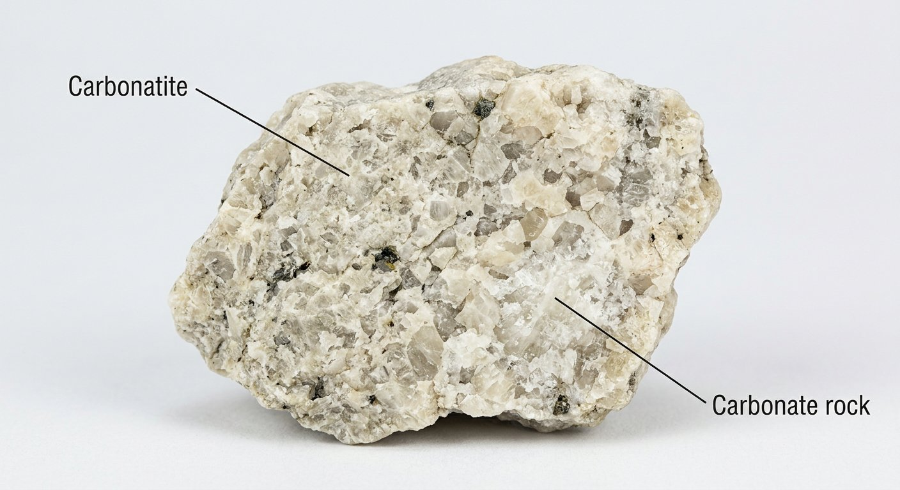
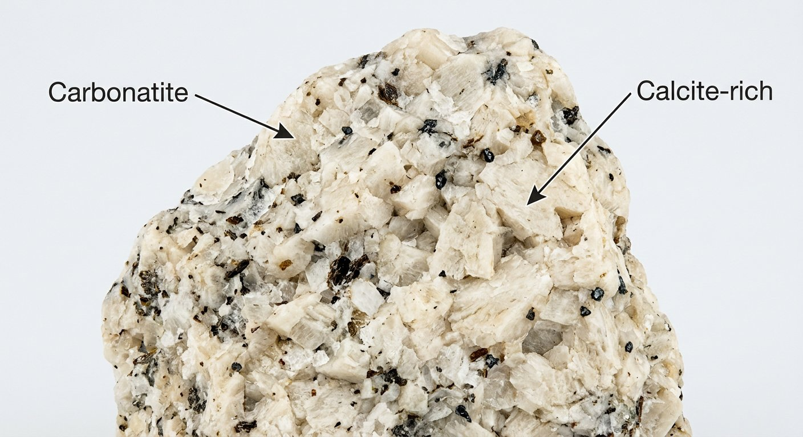

# Carbonatite

> **Family:** Igneous — intrusive (carbonate magma) · **Composition:** Carbonate-dominated, mantle-derived
> **Setting:** Cores of alkaline complexes · **Key clue:** A carbonate rock (fizzes in acid) that is **igneous** and associated with alkaline rocks.
> **Quick ID:** Fizzes in acid like limestone, but occurs as an igneous intrusion with syenite/nepheline syenite and REE–Nb minerals.

## At a glance

| Property | Value |
|---|---|
| Colour | White, grey, pink, brown, or buff |
| Composition | Mostly **calcite, dolomite, or ankerite** |
| Acid test | **Fizzes** vigorously (it is a carbonate) |
| Texture | Medium–coarse, massive, sometimes veined |
| Associated with | Syenite / nepheline syenite (alkaline complexes) |
| Economic | **REE, niobium, phosphate, fluorite, copper** |

## Composition
A rare **carbonate-rich igneous rock** — mostly **calcite, dolomite, or ankerite**, with alkali minerals (biotite, amphibole, aegirine). It is **mantle-derived** and associated with alkaline complexes. Unlike sedimentary limestone, it crystallised from **carbonate magma** and carries an exotic suite of rare-element minerals.

**Types:** *sövite* (coarse calcite), *alvikite* (fine calcite/dolomite), and *ferrocarbonatite* (iron- and REE-rich).

## Geochemistry
- **Major "oxides":** dominated by **CaO, MgO, FeO + CO₂** (very high CO₂), with very low **SiO₂** (<20%, often <10%).
- **Trace elements:** strongly enriched in **Sr, Ba, REE, Nb, Ta, Zr, P, F, Th, U** — carbonatite magmas concentrate the incompatible elements excluded from mantle minerals.
- **Nature in Nigeria:** no confirmed significant carbonatite yet; if found, assay for **REE, Nb, and phosphate**.

## Texture
Medium- to coarse-grained, massive, sometimes veined. Can be **sugary** (sövite) or fine and dense (alvikite); ferrocarbonatite veins are common and REE-rich.

## Diagnostic field features
- A **carbonate rock of igneous origin** — it **fizzes** in acid but occurs as an igneous intrusion associated with alkaline rocks (the key clue).
- Often buff/white/pink, and may carry **dark aegirine/biotite** speckles.
- Occurs as small plugs, dykes, or the **core of an alkaline ring complex**.
- May be rich in **magnetite / hematite** (ferrocarbonatite) and visibly radioactive minerals.

## Identification tests — step by step
1. **Acid:** fizzes vigorously (it is a carbonate) — but note the setting.
2. **Context:** is it an **igneous intrusion** with syenite/nepheline syenite and alkali minerals? If yes → carbonatite, not sedimentary limestone.
3. **Associated minerals:** look for **bastnäsite, monazite, pyrochlore, fluorite, apatite** — the rare-element markers.
4. **Hand lens:** coarse calcite/dolomite grains + dark aegirine/biotite; possible magnetite.

## Genesis & tectonic setting
Carbonatites crystallise from an exotic **carbonate magma** (mostly Ca–Mg–Fe carbonate, very low silica) generated in the **mantle** and emplaced in the cores of **alkaline ring complexes**. They are among the most element-enriched magmas on Earth, concentrating REE, Nb, P, and F. They form in **anorogenic (within-plate)** settings — the same setting as Nigeria's Younger Granite alkaline complexes.

## Host states / localities
Very rare and **not confirmed as significant in Nigeria**. It is a strategic "watch" rock type found with alkaline complexes globally (see [Syenite & Nepheline syenite](syenite-nepheline-syenite.md)). Given Nigeria's alkaline Younger Granite complexes, carbonatite is a rock type to keep in mind during mapping.

## Associated minerals & rocks
Nepheline syenite, alkaline rocks; **REE minerals (bastnäsite, monazite), niobium (pyrochlore), fluorite, apatite** (see [Zircon & Monazite](../../03-mineral-resources/metallic/zircon-monazite.md), [Fluorite](../../03-mineral-resources/industrial/fluorite.md)). Associated rocks: syenite, nepheline syenite, fenite (altered wall rock).

## Economic relevance
A major source of **rare-earth elements (REE)**, **niobium**, phosphate, fluorite, and copper — **strategically important** (many of the world's REE and Nb mines are carbonatites). Even a small carbonatite can be very valuable because of its extreme element enrichment.

## Lookalikes & how to distinguish

| Looks like | How to tell it apart |
|---|---|
| **Limestone / marble** | Both fizz; but limestone/marble are **sedimentary/metamorphic** with fossils or foliation, not igneous intrusions with alkali minerals. |
| **Dolomite** | Dolomite fizzes weakly (needs powdered/acid); carbonatite is igneous and REE/Nb-bearing. |
| **Calcite vein** | Calcite veins are thin; carbonatite forms larger bodies in alkaline complexes. |

## Field checklist
- [ ] Fizzes in acid (carbonate)?
- [ ] Igneous setting with alkaline rocks?
- [ ] Alkali minerals (aegirine, biotite) present?
- [ ] REE/Nb/fluorite/apatite markers?
- [ ] Core/plug of an alkaline complex?

## Field tips
- Carbonate rock (fizzes) but with **igneous texture/host and alkaline association** — distinguishes it from sedimentary limestone/marble.
- If you find a fizzing rock inside an alkaline ring complex, **assay it for REE and Nb**.
- Look for **ferrocarbonatite** (dark, iron- and REE-rich) veins — often the most mineralised part.
- Note radioactivity — carbonatites can carry **thorium and uranium** minerals.

## Facts
- Carbonatite is **molten carbonate** — an extraordinarily rare type of lava (essentially "limestone that was once molten").
- Most of the world's **niobium** and a large share of its **rare-earth elements** come from carbonatites.
- The only **actively erupting carbonatite lava** known is at **Ol Doinyo Lengai**, Tanzania.
- Carbonatites are the **most REE-enriched** natural materials known.

*Figure II.A.17 — Carbonatite specimen. Source: [Etsy](https://www.etsy.com/market/carbonatite_rock).*

*Figure II.A.17b — Carbonatite (carbonate-rich igneous rock). Source: [Imagine Childhood](https://imaginechildhood.com/products/carbonatite).*

*Figure II.A.17c — Betafite, a mineral typical of carbonatite complexes. Source: [Reddit r/Radioactive_Rocks](https://www.reddit.com/r/Radioactive_Rocks/comments/1najq5g/betafite_silver_crater_mine_ontario_canada/).*

*Figure II.A.17d — Labeled illustration: carbonatite carbonate-rich igneous rock. Original diagram prepared for this guide.*

*Figure II.A.17e — Labeled illustration: carbonatite calcite-rich rock. Original diagram prepared for this guide.*

## Related
- [Syenite & Nepheline syenite](syenite-nepheline-syenite.md) · [Zircon & Monazite](../../03-mineral-resources/metallic/zircon-monazite.md) · [Fluorite](../../03-mineral-resources/industrial/fluorite.md) · [Younger Granite ring complexes](../../01-general-geology/01-03-younger-granite-ring-complexes.md)
