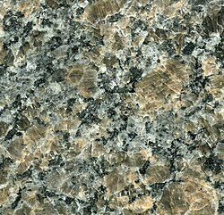
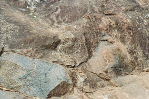
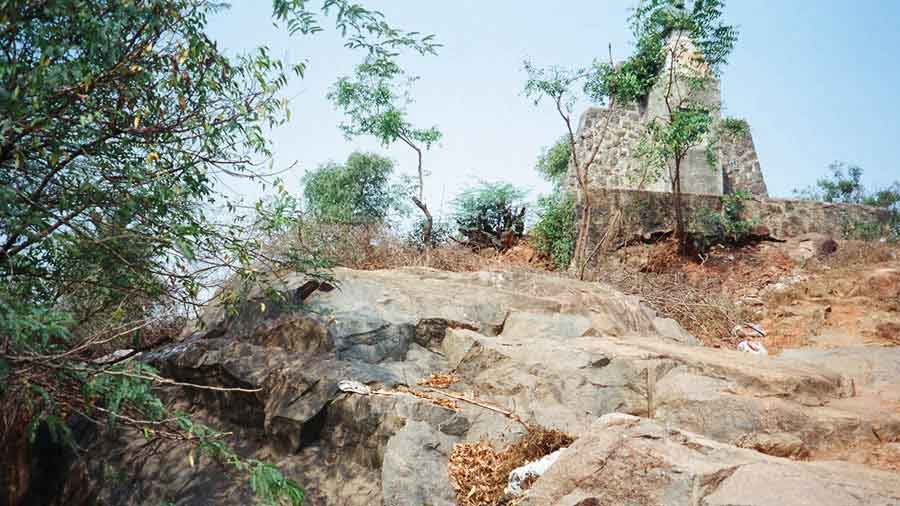
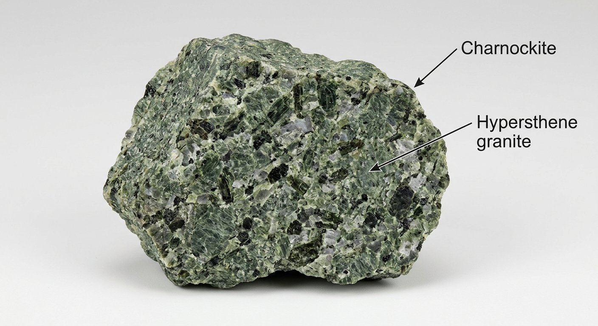
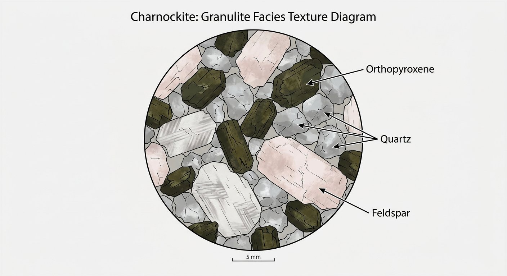

# Charnockite

> **Family:** Igneous/metamorphic — granulite-facies · **Composition:** Felsic (quartz + hypersthene + feldspar)
> **Setting:** High-temperature, high-pressure (granulite-facies) crust · **Mean density:** 2.7–2.9 g/cm³ · **Silica:** ~65–73 wt% SiO₂
> **Quick ID:** Granite-like but contains greenish-bronze **hypersthene** pyroxene; sugary equigranular; high-grade look.

## At a glance

| Property | Value |
|---|---|
| Colour | Greenish-grey to dark; often marketed brown/black "granite" |
| Texture | Granular to porphyritic; granulitic |
| Key minerals | Quartz, alkali feldspar, plagioclase, **hypersthene** ± garnet |
| Hardness | ~6–7 |
| Specific gravity | ~2.7–2.9 |
| Diagnostic test | Greenish-bronze **hypersthene** grains in a granite-like rock |
| Setting | Granulite-facies massifs (high T, high P) |

## Composition
**Quartz, alkali feldspar, plagioclase**, and the diagnostic **hypersthene** — an **orthopyroxene** that gives a distinctive greenish-bronze sheen — ± **garnet**. Essentially a **quartz–hypersthene granite** formed under **high temperature and pressure** (granulite-facies) conditions deep in the crust.

Chemically like granite (SiO₂ ≈ 65–73%) but formed in a **high-grade metamorphic environment**; closely related rocks include **mangerite** (hypersthene monzonite) and **enderbite**.

## Geochemistry
- **Major oxides:** SiO₂ 65–73 wt%, Al₂O₃ 13–16%, FeO+MgO 3–7% (higher Mg than granite, hence the pyroxene), CaO 2–4%, alkalis 5–8%.
- **Trace elements:** depleted in **LILE** (K, Rb, U, Th often lost during high-grade metamorphism); can retain **REE, Zr, Nb**.
- **Nature in Nigeria:** the charnockite massifs of the northern/north-central Basement are **Pan-African granulite-facies** rocks — records of deep, hot crust during continental collision.

## Texture
**Granular to porphyritic**, often showing a **granulitic texture** — equant, interlocking grains with straight boundaries (a sign of recrystallisation under high T). May be **gneissic (banded)** in places where deformation accompanied metamorphism.

## Diagnostic field features
- Granite-like but contains **greenish/bronzy hypersthene** (a pyroxene) — the giveaway.
- Commonly **greenish-grey to dark**; sometimes marketed as **brown/black "granite."**
- **Hard, massive**, with a sugary or "frozen" equigranular look; weathers to **rounded boulders**.
- Often associated with **dark mafic granulite bands** (pyroxene-rich layers).

## Identification tests — step by step
1. **Hand lens:** look for **bronze/green pyroxene** (hypersthene) in a granite-like rock — it has two cleavages near 90°.
2. **Hardness:** 6–7; scratches glass.
3. **Texture:** sugary, equigranular, high-grade look (grains meet at ~120° triple junctions).
4. **Context:** charnockite bodies mark **deep crustal levels**; check for associated mafic granulite.
5. **Acid:** no fizz.

## Genesis & tectonic setting
Charnockite forms under **granulite-facies** conditions — among the highest temperatures (700–900 °C) and pressures reached in the continental crust, where dry conditions stabilise **orthopyroxene + quartz** instead of the usual hydrous minerals. It can form by (a) high-grade **metamorphism** of granite/dry rocks, or (b) crystallisation of dry mafic magma at depth. In Nigeria, charnockite massifs occur in the **Pan-African granulite terranes** of the northern and north-central Basement.

## Host states / localities
Occurs as **charnockite massifs** in the **northern and north-central Basement** — reported in **Kaduna, Plateau, Bauchi, Katsina**, and nearby areas. These sit within the **Pan-African granulite terranes** of Nigeria. (The rock is named after **Job Charnock's tombstone** in Calcutta, India.)

## Associated minerals & rocks
- **Apatite, magnetite, garnet**, and associated granulite-facies minerals.
- Associated rocks: **mangerite, enderbite, mafic granulite**, and migmatite.
- Accessory **zircon, rutile, ilmenite**.

## Economic relevance
- **Dimension / ornamental stone** (sold as granite) — a growing quarrying sector in the north.
- **Aggregate.**
- Granulite terranes can be targets for **rare metals and graphite**; heavy-mineral sands derived from charnockite can carry **ilmenite, rutile, zircon, and monazite**.

## Lookalikes & how to distinguish

| Looks like | How to tell it apart |
|---|---|
| **Granite** | Charnockite contains **hypersthene pyroxene**; ordinary granite does not. |
| **Gabbro** | Gabbro is mafic (feldspar + pyroxene, dark); charnockite is felsic with quartz. |
| **Granitic gneiss** | Gneiss is strongly banded/foliated; charnockite is typically massive. |

## Field checklist
- [ ] Granite-like but with **hypersthene** (bronze/green pyroxene)?
- [ ] Sugary equigranular, high-grade texture?
- [ ] Associated with dark mafic granulite bands?
- [ ] No acid fizz?
- [ ] Hardness ≥ glass?

## Field tips
- Look for **bronze/green pyroxene** in a granite-like rock — confirm with a hand lens (hypersthene has two cleavages near 90°).
- The **sugary, equigranular texture** with a high-grade look is a strong clue.
- Charnockite bodies often mark **deep crustal levels** — useful for reconstructing the Basement's tectonic history.
- When quarrying, note that charnockite takes an excellent **polish** and sells well as black/brown granite.

## Facts
- The name **charnockite** comes from the tombstone of **Job Charnock** (founder of Calcutta) — the stone turned out to be this unusual hypersthene granite.
- Charnockite forms under **granulite-facies** conditions — among the highest temperatures and pressures reached in the continental crust.
- The famous **Kaduna charnockite massif** is one of Nigeria's best-known examples.
- Its pyroxene **hypersthene** gives the rock a subtle bronze glitter when turned in sunlight.

*Figure II.A.6 — Charnockite (a porphyritic quartz mangerite), a hypersthene-bearing
granulite-facies rock widely sold as ornamental granite. Source: [Wikipedia](https://en.wikipedia.org/wiki/Charnockite).*

*Figure II.A.6b — Charnockite, St Thomas Mount (type locality). Source: [Rangan Datta](https://rangandatta.wordpress.com/2025/08/24/charnockite-the-rock-of-job-charnock/).*

*Figure II.A.6c — Charnockite outcrop, St Thomas Mount. Source: [Telegraph India](https://www.telegraphindia.com/my-kolkata/lifestyle/the-discovery-of-charnockite-the-rock-of-charnock/cid/1961292).*

*Figure II.A.6d — Labeled illustration: charnockite hypersthene granite. Original diagram prepared for this guide.*

*Figure II.A.6e — Labeled illustration: charnockite orthopyroxene texture. Original diagram prepared for this guide.*

## Related
- [Granite](granite.md) · [Granulite](../metamorphic/granulite.md) · [Migmatite & Gneiss](../metamorphic/migmatite.md)
- [Granitoids of the Basement](../../01-general-geology/01-02-basement-complex-and-pan-african.md)
