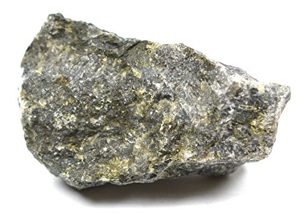

# Gabbro & Dolerite (Diabase)

> **Family:** Igneous — intrusive (gabbro) / hypabyssal (dolerite) · **Composition:** Mafic

## Composition
- **Gabbro:** **plagioclase feldspar + pyroxene** (augite), ± **olivine** — the
  coarse-grained equivalent of basalt.
- **Dolerite (diabase):** the same minerals, but **medium-grained**, typically forming
  **dykes and sills**.

## Texture
- **Gabbro:** coarse-grained (phaneritic), interlocking.
- **Dolerite:** medium-grained, often **ophitic** (pyroxene enclosing plagioclase
  laths) — a hallmark under the hand lens.

## Diagnostic field features
- **Dark, dense, heavy** rock.
- Visible **greenish-black pyroxene** and pale **plagioclase** (gabbro).
- Dolerite occurs as **sheet-like intrusions** (dykes/sills) cutting other rocks.
- Gabbro may be weakly **magnetic** (magnetite).

## Host states / localities
As layers/lenses and **dyke swarms** in the **Basement Complex** and around the
**Younger Granite** complexes: **Plateau, Kaduna, Bauchi, Oyo, Ondo, Niger, Kogi**,
and elsewhere.

## Associated minerals
**Magnetite, ilmenite**; in ultramafic variants **chromite, nickel sulfides**;
secondary **serpentine, chlorite, talc** where olivine alters.

## Economic relevance
- **Construction aggregate**, road metal, railway ballast.
- **"Black granite"** dimension stone (dolerite/gabbro is widely marketed under this name).
- Ultramafic/mafic varieties can carry **chromium, nickel, and platinum-group
  elements (PGE)** potential.

## Identification notes
- **Dark + coarse** = gabbro; **dark + fine** = basalt; **dark + medium, in a dyke** = dolerite.
- **vs. diorite:** diorite has hornblende (not pyroxene) and is lighter.
- Check for **pyroxene (green/black, two cleavages)** vs hornblende.

*Figure II.A.4 — Gabbro: coarse pyroxene + plagioclase, dark and dense. Source: [Amazon EISCO](https://www.amazon.com/Eisco-Gabbro-Specimen-Igneous-Approx/dp/B01J4807YC).*

## Related
- [Basalt](basalt.md) (fine-grained equivalent) · [Peridotite & Pyroxenite](peridotite-pyroxenite.md) · [Granodiorite & Diorite](granodiorite-diorite.md)
