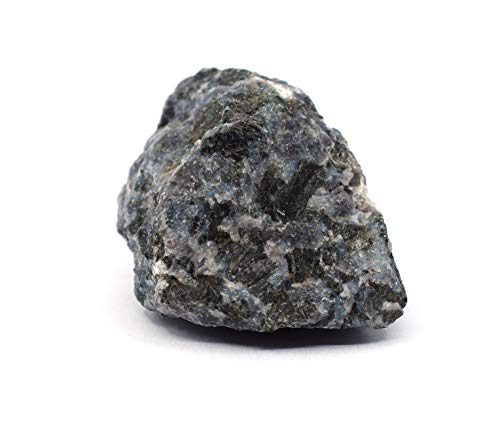

# Gabbro & Dolerite (Diabase)

> **Family:** Gabbro = intrusive (plutonic); Dolerite = hypabyssal (shallow dykes/sills) · **Composition:** Mafic
> **Extrusive equivalent:** Basalt · **Mean density:** 2.9–3.1 g/cm³ (heavy) · **Silica:** ~45–52 wt% (low)
> **Quick ID:** Dark, dense, heavy, coarse (gabbro) or medium (dolerite); pyroxene + plagioclase; often magnetic; dolerite forms sheet dykes.

## At a glance

| Property | Gabbro | Dolerite (diabase) |
|---|---|---|
| Colour | Black / dark green-grey | Dark grey / black |
| Grain size | Coarse (>1 mm) | Medium (fine-medium, "sugary") |
| Key minerals | Plagioclase (Ca-rich) + pyroxene (augite) ± olivine | Same, often **ophitic** |
| Hardness | ~6 | ~6 |
| Specific gravity | ~3.0 | ~2.9–3.0 |
| Setting | Layered plutons, lenses | **Dykes and sills** |
| Magnetism | Often weakly magnetic | Often weakly magnetic |

## Composition
- **Gabbro:** **plagioclase feldspar (Ca-rich, labradorite) + pyroxene (augite)**, ± **olivine** — the **coarse-grained equivalent of basalt**. Silica-poor (~45–52% SiO₂), rich in iron and magnesium.
- **Dolerite (diabase):** the **same minerals** but **medium-grained**, cooled a little faster in shallow **dykes and sills**.

Typical minerals: **calcic plagioclase, augite (clinopyroxene), olivine**, plus accessory **magnetite and ilmenite**. Olivine commonly alters to green **serpentine**, chlorite, and talc. On the QAPF diagram gabbro plots as plagioclase-rich with >10% mafic minerals and low quartz.

## Geochemistry
- **Major oxides:** SiO₂ 45–52 wt%, Al₂O₃ 14–18%, CaO 8–14%, FeO+Fe₂O₃ 8–14%, MgO 5–12% (high).
- **Trace elements:** high **Ni, Cr, Co, Sc, V** (compatible, mantle-derived); low **Rb, K, Zr**.
- **Nature in Nigeria:** mostly **tholeiitic** mafic magmas; dolerite dyke swarms cut the Basement; ultramafic-mafic bodies in schist belts can be Cr–Ni–PGE fertile.

## Texture
- **Gabbro:** coarse-grained (phaneritic), interlocking crystals, sometimes **layered** (cumulate layers in big mafic intrusions).
- **Dolerite:** medium-grained and famously **ophitic** — plates of plagioclase enclosed by larger pyroxene crystals, a hallmark seen under the hand lens.

## Diagnostic field features
- **Dark, dense, heavy** rock — noticeably heavier than granite.
- Visible **greenish-black pyroxene** and pale **plagioclase** (in gabbro).
- **Dolerite occurs as sheet-like intrusions** (dykes and sills) cutting across other rocks — a giveaway in outcrop.
- Often weakly **magnetic** (magnetite) — a compass may deflect near a dolerite dyke.
- Weathers reddish-brown (iron oxidation) or, if olivine-rich, to a rusty "brown rock."

## Identification tests — step by step
1. **Weight:** mafic rocks are distinctly heavier than granite/gneiss of similar size.
2. **Magnet/compass test:** many dolerites/gabbros deflect a compass — indicates magnetite.
3. **Hand lens the dark mineral:** confirm **pyroxene** (blocky, two cleavages ~90°) rather than hornblende (elongated, ~120°).
4. **Geometry:** note whether it is a **sheet (dyke/sill)** cross-cutting country rock → dolerite; a coarse lens/pluton → gabbro.
5. **Acid:** no fizz (non-carbonate), unless altered/carbonated.

## Genesis & tectonic setting
Gabbro and dolerite crystallise from **mafic (basaltic) magma**: gabbro slowly at depth (plutons, layered intrusions), dolerite faster in shallow fractures. In Nigeria, **dolerite dyke swarms** are abundant across the Basement (many emplaced during the Mesozoic breakup of Gondwana), and mafic/ultramafic bodies occur in some **schist belts (ophiolitic fragments)**.

## Host states / localities
As **layers/lenses and dyke swarms** in the **Basement Complex** and around the **Younger Granite** complexes: **Plateau, Kaduna, Bauchi, Oyo, Ondo, Niger, Kogi**, and elsewhere. Dolerite **dykes** cut across much of the Basement and are among the most common minor intrusions; large mafic/ultramafic bodies are less common but occur in some schist belts.

## Associated minerals & rocks
- **Magnetite, ilmenite**; in ultramafic variants **chromite, nickel sulfides**.
- Secondary **serpentine, chlorite, talc** where olivine alters.
- Associated rocks: granite, peridotite/pyroxenite, basalt (extrusive equivalent).

## Economic relevance
- **Construction aggregate, road metal, railway ballast** — very high value in Nigeria.
- **"Black granite" dimension stone** — dolerite and gabbro are widely polished and marketed under this name.
- Ultramafic/mafic varieties can carry **chromium (chromite), nickel, cobalt, and platinum-group element (PGE)** potential.
- Source of **magnetite** for heavy-media and, locally, iron.

## Lookalikes & how to distinguish

| Looks like | How to tell it apart |
|---|---|
| **Basalt** | Same minerals; basalt is **fine-grained** (extrusive). Gabbro is coarse. |
| **Diorite** | Diorite has **hornblende** (amphibole) and is lighter; gabbro has **pyroxene** and is darker. |
| **Peridotite** | Peridotite is mostly olivine (green, heavier); gabbro has abundant feldspar. |
| **Charnockite** | Charnockite is pale/felsic with hypersthene; gabbro is dark/mafic. |

## Field checklist
- [ ] Dark and noticeably heavy?
- [ ] Pyroxene (blocky) not hornblende (elongated)?
- [ ] Pale plagioclase present (gabbro)?
- [ ] Sheet-like cross-cutting geometry (dolerite)?
- [ ] Magnetic / deflects compass?
- [ ] No acid fizz?

## Field tips
- **Feel the weight** — mafic rocks are distinctly heavier than felsic ones.
- Use a hand lens to confirm **pyroxene** (blocky, two ~90° cleavages) rather than hornblende.
- Look for the **sheet geometry** of dolerite dykes — they cut cleanly across country rock.
- A **compass deflection** or a magnet test points to magnetite-rich dolerite/gabbro.
- In ultramafic variants, hunt for shiny **chromite** grains (a mineralisation clue).

## Facts
- Much of the **"black granite"** sold worldwide — including in Nigeria — is actually **gabbro or dolerite**.
- **Dolerite dykes** often form great **natural walls** in the landscape and are quarried as premium roadstone.
- **Ophitic texture** (pyroxene wrapping plagioclase) is a classic hand-lens clue that you are holding a dolerite.
- Gabbro and peridotite are the main rocks of the **oceanic crust** and upper mantle.

*Figure II.A.4 — Gabbro: coarse pyroxene + plagioclase, dark and dense. Source: [Amazon EISCO](https://www.amazon.com/Eisco-Gabbro-Specimen-Igneous-Approx/dp/B01J4807YC).*

*Figure II.A.4b — Gabbro specimen. Source: [Amazon](https://www.amazon.com/Eisco-Gabbro-Specimen-Igneous-Approx/dp/B01J4807YC).*

*Figure II.A.4c — Gabbro (igneous rock) specimen. Source: [Amazon](https://www.amazon.com/Raw-Gabbro-Igneous-Rock-Specimen/dp/B081BC7L2R).*

## Related
- [Basalt](basalt.md) (fine-grained equivalent) · [Peridotite & Pyroxenite](peridotite-pyroxenite.md) · [Granodiorite & Diorite](granodiorite-diorite.md)
- [Dykes & sills in the Basement](../../01-general-geology/01-06-structural-controls.md)
