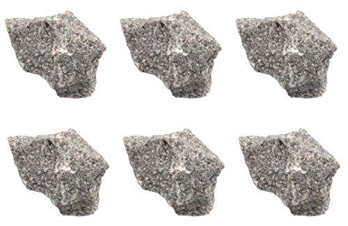
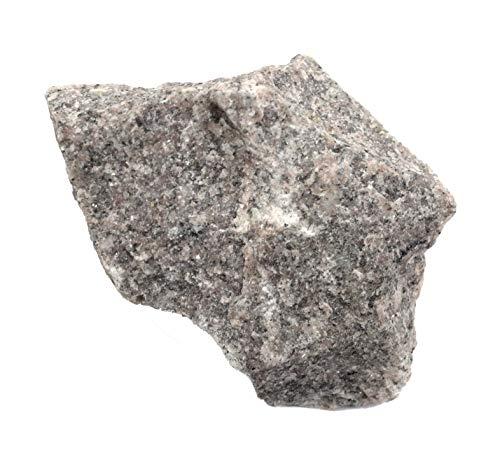
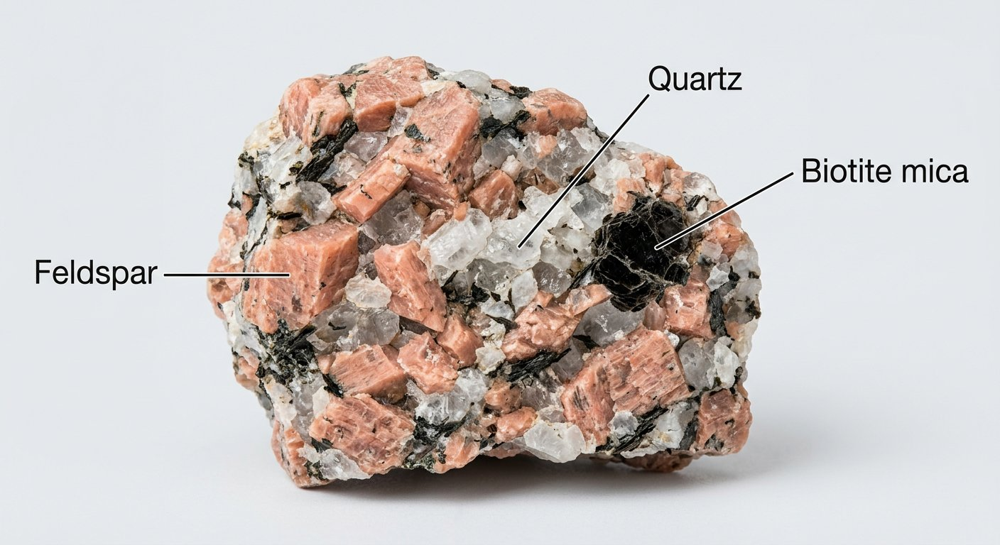
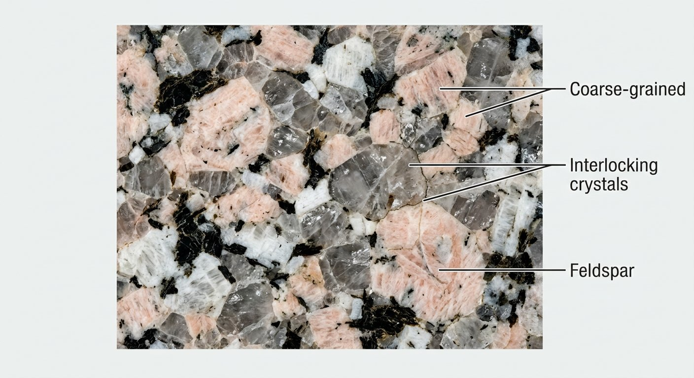

# Granite (Older Granites & granite *sensu lato*)

> **Family:** Igneous — intrusive (plutonic) · **Composition:** Felsic (acidic)
> **Extrusive equivalent:** Rhyolite · **Mean density:** 2.6–2.7 g/cm³ · **Silica:** ~70–77 wt% SiO₂
> **Quick ID:** Coarse, interlocking quartz (grey) + feldspar (pink/white) + mica; hard; salt-and-pepper; no banding.

## At a glance

| Property | Value |
|---|---|
| Colour | White, pink, grey, or cream ("salt-and-pepper") |
| Texture | Coarse-grained (phaneritic), interlocking |
| Grain size | 1–30+ mm (sugar-granular) |
| Hardness | ~6–7 (scratches glass; feldspar ~6, quartz ~7) |
| Specific gravity | ~2.6–2.7 (moderately heavy) |
| Key minerals | Quartz + alkali feldspar + plagioclase + mica |
| Acid (HCl) | No fizz (non-carbonate) |
| Diagnostic test | Hardness > glass; grains interlock; no banding |
| Setting | Basement plutons & Younger Granite ring complexes |

## Composition
A crystalline mosaic of four main minerals:
- **Quartz** (20–40%) — glassy grey, no cleavage, no acid reaction.
- **Alkali feldspar** (orthoclase / microcline, 30–60%) — the pink or white blocky grains with two good cleavages.
- **Plagioclase feldspar** (oligoclase–andesine) — often white/grey with fine striations on cleavage faces.
- **Mica** — black **biotite** ± silvery **muscovite**, plus minor **hornblende**.

On the **IUGS QAPF diagram** a "true granite" carries **20–60% quartz** of the light-mineral (QAP) fraction and is dominated by alkali feldspar over plagioclase. Varieties by increasing plagioclase: *alkali-feldspar granite → syenogranite → monzogranite* (toward granodiorite). **Named varieties:** biotite granite, muscovite (two-mica) granite, porphyritic granite, graphic granite (quartz–feldspar intergrowth), hornblende granite.

## Geochemistry
- **Major oxides:** SiO₂ 70–77 wt%, Al₂O₃ 13–15%, (Na₂O+K₂O) 6–9%, FeO+Fe₂O₃ ~2–4%, CaO ~1–3%, MgO <1%.
- **Trace elements:** enriched in **Rb, Ba, Th, U, Pb, Sn, Li, Be, Nb, Ta, REE** (the "granite" incompatible-element signature); poor in Ni, Cr, Mg.
- **Nature in Nigeria:** the **Older Granites** are typically **calc-alkaline, metaluminous to weakly peraluminous (I-type/S-type)** granitoids formed during the Pan-African orogeny; the **Younger Granites** are **anorogenic, more alkaline and peraluminous (A-type)**, enriched in Sn–Nb–Ta–F and the source of the rare-metal pegmatites.

## Texture
**Coarse-grained (phaneritic)** — interlocking crystals 1–30 mm, easily seen with the naked eye, from **slow cooling** of magma deep underground. Typically **equigranular** (even grains) or **porphyritic** (large feldspar in a finer matrix). Grain boundaries interlock tightly like a mosaic — never loose or cemented.

## Diagnostic field features
- **Salt-and-pepper** mix of glassy grey **quartz**, pink/white **feldspar**, and black **mica**.
- **No layering, banding, or grain alignment** (alignment would make it a **gneiss**).
- **Hard** — a knife leaves a shiny streak; granite scratches glass and steel.
- Feels **heavy and dense**; conchoidal-to-granular fracture.
- **No reaction to dilute HCl** (unlike limestone).
- Fresh surfaces pale; weathers to gritty sand and rounded, **spheroidal "corestone" boulders**.

## Identification tests — step by step
1. **Hardness:** try to scratch a glass bottle or steel file — granite (6–7) will scratch it. A copper coin (3) will not scratch granite.
2. **Streak:** rub on unglazed porcelain — feldspar/mica give a white/grey streak; look for metallic minerals (none expected in clean granite).
3. **Acid:** a drop of dilute HCl on a fresh surface should produce **no fizz** (rules out calcite/limestone).
4. **Hand lens:** confirm three mineral types — quartz (glassy, no cleavage), feldspar (blocky, two cleavages), mica (shiny plates).
5. **Alignment check:** look for banding — if grains are aligned/foliated, it is a metamorphic rock (gneiss), not granite.

## Genesis & tectonic setting
Granite forms where **felsic magma cools slowly at depth** (plutons 2–30+ km down). In Nigeria there are two great families:
- **Older Granites** (Pan-African, ~600–750 Ma): syntectonic granitoids intruded during continental collision that welded the Basement Complex — I/S-type, forming the backbone of the shield.
- **Younger Granites** (anorogenic, Jurassic–Cretaceous ~140–200 Ma): ring complexes of the Jos Plateau/Biu, emplaced in an intraplate extension setting — alkaline, peraluminous, tin-bearing.

## Host states / localities
The **most abundant rock of the Nigerian Basement Complex** and the **Younger Granites**.
- **Older Granites** (Pan-African): Basement plutons across the whole shield.
- **Younger Granites** (ring complexes): **Jos Plateau** and Biu.
- Major quarrying states: **FCT (Abuja), Ogun (Abeokuta), Oyo (Ibadan), Ondo, Ekiti, Osun, Kwara, Niger (Minna), Plateau (Jos), Kaduna, Kano, Bauchi**, and more — dimension-stone quarries occur in almost every Basement state.

## Associated minerals & rocks
- In nearby **pegmatites** and **quartz veins**: **cassiterite, columbite–tantalite, wolframite, mica, feldspar, quartz**, tourmaline, and gemstones.
- Marginal/accessory minerals: **magnetite, sphene (titanite), zircon, apatite, allanite**.
- Country rocks: migmatite/gneiss, schist, older granodiorite, xenoliths of Basement.

## Economic relevance
- **Dimension / ornamental stone** — one of Nigeria's largest quarrying sectors (tiles, slabs, kerbs, monuments); a major export.
- **Construction aggregate** and road metal.
- **Parent/host rock for tin–columbite–tungsten–lithium** in associated pegmatites (Jos Plateau — a world-class tin province).
- Source of industrial **feldspar, quartz, and mica** from associated bodies.

## Lookalikes & how to distinguish

| Looks like | How to tell it's granite |
|---|---|
| **Gneiss** | Gneiss is banded/foliated; granite is massive. |
| **Syenite** | Syenite has little/no quartz (more feldspar, no grey glassy grains). |
| **Granodiorite / Diorite** | More dark mineral, less obvious quartz & pink feldspar. |
| **Charnockite** | Contains greenish-bronze **hypersthene** pyroxene. |
| **Sandstone** | Sandstone is loose/gritty, layered, grains cemented (not interlocked). |
| **Quartzite** | Metamorphic; quartz grains fused/recrystallised (no feldspar). |

## Field checklist
- [ ] Coarse interlocking grains (no cement)?
- [ ] Quartz + feldspar + mica present?
- [ ] No visible layering/alignment?
- [ ] Hardness ≥ glass?
- [ ] No acid fizz?
- [ ] SG feels moderate (not exceptionally heavy)?

## Field tips
- Use a **hand lens**: confirm quartz (glassy, no cleavage) vs feldspar (blocky, cleaves) vs mica (shiny plates).
- **Scratch test** against glass or a steel file to confirm hardness.
- A drop of **dilute HCl** should do **nothing** — rules out carbonate-bearing rocks.
- Record grain size and whether crystals are **aligned** (aligned → metamorphic, not granite).
- Note jointing and weathering — **spheroidal weathering and corestones** are classic granite indicators.

## Facts
- Granite and its metamorphosed equivalents make up most of the **continental crust**.
- Much of the rock **sold as "black granite"** in Nigeria is actually **dolerite or gabbro**, not true granite.
- The **Jos Plateau** tin industry (once among the world's largest exporters) came from minerals in pegmatites **associated with the Younger Granites**.
- Pink granite's colour comes from tiny hematite inclusions in the feldspar.

*Figure II.A.1 — Coarse-grained granite: interlocking quartz (grey), feldspar (pink/white) and mica (black). Source: [Amazon EISCO](https://www.amazon.com/Pink-Granite-Igneous-Rock-Specimen/dp/B083TJ9694).*

*Figure II.A.1b — Pink granite specimen. Source: [Amazon](https://www.amazon.ca/Pink-Granite-Igneous-Rock-Specimens/dp/B083THD1BG).*

*Figure II.A.1c — Pink granite (igneous rock). Source: [Amazon](https://www.amazon.com/Pink-Granite-Igneous-Rock-Specimen/dp/B083TJ9694).*

*Figure II.A.1d — Labeled illustration: granite showing feldspar, quartz and biotite mica. Original diagram prepared for this guide.*

*Figure II.A.1e — Labeled illustration: granite coarse-grained interlocking crystal texture. Original diagram prepared for this guide.*

## Related
- [The three rock families](../../00-fundamentals/00-04-three-rock-families.md) · [Granitoids of the Basement](../../01-general-geology/01-02-basement-complex-and-pan-african.md)
- [Charnockite](charnockite.md) · [Pegmatite](pegmatite.md) · [Granodiorite & Diorite](granodiorite-diorite.md) · [Rhyolite (equivalent)](rhyolite-trachyte-phonolite.md)
