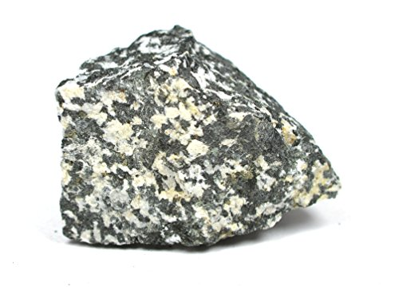

# Granodiorite & Diorite

> **Family:** Igneous — intrusive · **Composition:** Intermediate (granodiorite) to intermediate-mafic (diorite)

## Composition
- **Granodiorite:** quartz + **plagioclase > alkali feldspar**, biotite, hornblende — between granite and diorite.
- **Diorite:** **plagioclase feldspar + hornblende/biotite**, with little or no quartz.

## Texture
**Coarse-grained (phaneritic)**, interlocking crystals — slow-cooled magma.

## Diagnostic field features
- **Diorite:** a striking black-and-white "salt-and-pepper" of black hornblende and
  white plagioclase, with **little/no quartz**.
- **Granodiorite:** looks granite-like but with more dark mineral and less obvious
  quartz/pink feldspar.
- Hard, massive (no layering), non-magnetic to weakly so.

## Host states / localities
Common in the **Basement Complex** and as marginal/mafac phases of the **Younger
Granite** complexes: **Plateau, Kaduna, Bauchi, Oyo, Ondo, Niger, Kwara**, and elsewhere.

## Associated minerals
Magnetite, sphene (titanite); **skarn minerals** (garnet, pyroxene, scheelite) where
diorite intrudes limestone; minor sulfides.

## Economic relevance
- **Aggregate** and **dimension stone**.
- Contact (skarn) zones with limestone can carry **iron, tungsten, copper**.
- Source of **titanium** (titanite) locally.

## Identification notes
- **More dark mineral than granite**, **less quartz than granite**.
- **Diorite vs. gabbro:** gabbro is darker and dominated by **pyroxene** (not hornblende).
- **Diorite vs. andesite:** same composition, but andesite is fine-grained (extrusive).

*Figure II.A.2 — Diorite: black hornblende + white plagioclase, little quartz. Source: [Amazon EISCO](https://www.amazon.com/Eisco-Diorite-Specimen-Igneous-Approx/dp/B01K2WJINA).*

## Related
- [Granite](granite.md) · [Gabbro & Dolerite](gabbro-dolerite.md) · [The three rock families](../../00-fundamentals/00-04-three-rock-families.md)
