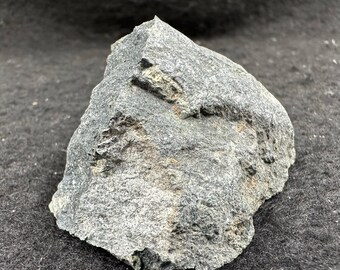

# Kimberlite

> **Family:** Igneous — ultramafic volcanic / volcaniclastic (mantle-derived) · **Composition:** Ultramafic, potassic, CO₂-rich
> **Setting:** Explosive volcanic **pipes and dykes** · **Silica:** very low (~30–40 wt% SiO₂)
> **Quick ID:** Dark green altered, brecciated ultramafic in a pipe/dike; **pan for indicator minerals** (pyrope garnet, chromite).

## At a glance

| Property | Value |
|---|---|
| Colour | Dark green to blue-green (altered); "blue ground"/"yellow ground" |
| Texture | Porphyritic to **brecciated** |
| Form | **Pipes and dykes** (a restricted, distinctive shape) |
| Key minerals | Olivine, phlogopite mica, carbonate; serpentine |
| Diagnostic test | **Indicator minerals** in stream pan concentrate |
| Economic | The world's **primary source of diamond** |

## Composition
An **ultramafic volcanic rock** derived from the **mantle** — rich in **olivine, phlogopite mica, and carbonate**, often heavily **serpentinized**. It is the **primary host of diamond**. Fresh kimberlite is dark ("blue ground"); it weathers to a yellow-brown oxidised form ("yellow ground").

## Geochemistry
- **Major oxides:** SiO₂ 30–40 wt% (very low), MgO 25–40% (very high), CO₂ 5–20%, H₂O high, K₂O elevated (potassic).
- **Trace elements:** enriched in **incompatible elements** (REE, Sr, Ba) and mantle indicators; very low Al and Na.
- **Nature in Nigeria:** any kimberlite found should be checked for **diamond-indicator minerals** (G10/G9 pyrope garnets, magnesian ilmenite, chromite, Cr-diopside).

## Texture
Porphyritic to **brecciated** (kimberlite breccia); occurs in **pipes and dykes**; heavily altered (serpentinized "blue ground" / weathered "yellow ground"). The brecciated, chaotic texture reflects its explosive, gas-rich emplacement.

## Diagnostic field features
- Dark green to blue-green, altered, porphyritic/brecciated.
- Contains **indicator minerals**: **pyrope garnet, ilmenite, chromite, chrome diopside**.
- Occurs as **pipes/dikes** — a distinctive, restricted form (carrot-shaped pipes).
- Soft/altered compared to fresh basalt; may fizz where carbonate-rich.

## Identification tests — step by step
1. **Form:** pipe (funnel-shaped body) or narrow dyke — kimberlite's signature geometry.
2. **Composition:** ultramafic, olivine/mica-rich, altered (green, soft).
3. **Panning:** process stream sediment near the pipe — look for **indicator minerals** (purple-red pyrope garnet, black chromite/ilmenite).
4. **Acid:** carbonate-rich varieties fizz.
5. **Microscope/assay:** confirm indicator mineral chemistry (G10 garnet) for diamond potential.

## Genesis & tectonic setting
Kimberlite is erupted from the **deep mantle (150–250 km)** as a volatile-rich (CO₂, H₂O), gas-driven **explosive volcanic pipe**. Its great depth of origin is why it is the main carrier of **diamond** (stable only in the mantle). Pipes are typically small but deep "carrot"-shaped bodies cutting through old cratonic crust.

## Host states / localities
**Plateau, Bauchi**, and other Basement areas — kimberlite pipes/dykes are reported in Nigeria, but the known ones have so far proven largely **barren of diamond**. Nigeria sits largely on **Pan-African mobile belt** rather than ancient Archaean craton, which lowers (but does not eliminate) diamond-kimberlite prospectivity.

## Associated minerals & rocks
Diamond, pyrope garnet, ilmenite, chromite, chrome diopside, olivine, phlogopite (see [Diamond](../../03-mineral-resources/gemstones/diamond.md), [Garnet](../../03-mineral-resources/gemstones/garnet.md)). Associated rocks: peridotite/pyroxenite (mantle xenoliths), basalt, Granite/Basement host.

## Economic relevance
The world's main source of **diamond** (primary). In Nigeria, an **exploration target only** — reported pipes have not yielded commercial diamond, but indicator-mineral studies continue. Kimberlites can also carry **rare-earth, phosphate, and titanium** minerals.

## Lookalikes & how to distinguish

| Looks like | How to tell it apart |
|---|---|
| **Basalt** | Basalt is fine-grained lava, not brecciated; lacks kimberlite's ultramafic olivine/mica + indicators. |
| **Lamprophyre** | Lamprophyre is a dike rock with mica/hornblende phenocrysts but lacks the brecciated pipe form. |
| **Serpentinite** | Serpentinite is greasy green altered peridotite; kimberlite is brecciated with indicator minerals. |

## Field checklist
- [ ] Pipe or dyke form (not a lava flow)?
- [ ] Dark green altered, brecciated, soft?
- [ ] Olivine/mica-rich ultramafic composition?
- [ ] Indicator minerals in pan concentrate?
- [ ] Carbonate (fizz) in places?

## Field tips
- Dark, altered, brecciated ultramafic in a pipe/dike; **pan for indicator minerals**.
- Distinguish from basalt by its **ultramafic** (olivine/mica-rich) composition and **brecciation**.
- If you find a kimberlite, **pan stream sediment** around it and check garnets under a microscope — the presence of **G10 pyrope garnets** is the key diamond clue.
- Record the pipe's size, shape, and whether it contains mantle xenoliths.

## Facts
- Kimberlite is the world's **primary source of diamond** — erupted from over 150 km deep.
- The word comes from **Kimberley**, South Africa, site of the famous diamond pipes.
- "**Blue ground**" (fresh) and "**yellow ground**" (weathered) are classic kimberlite field terms.
- Kimberlite pipes are often **carrot-shaped**, narrowing with depth.

*Figure II.A.12 — Kimberlite (diamond-bearing volcanic rock). Source: [Etsy](https://www.etsy.com/listing/1556680341/kimberlite-raw-stone-diamond-ore-rough).*

## Related
- [Peridotite & Pyroxenite](peridotite-pyroxenite.md) · [Diamond](../../03-mineral-resources/gemstones/diamond.md) · [Ore deposits 101](../../00-fundamentals/00-07-ore-deposits-101.md) · [Lamprophyre](lamprophyre.md)
