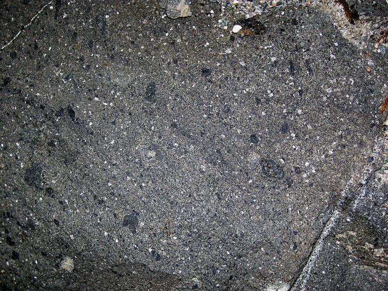
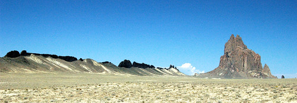

# Lamprophyre

> **Family:** Igneous — hypabyssal (shallow dike rock) · **Composition:** Potassic mafic–ultramafic
> **Form:** Dikes and swarms · **Key clue:** Dark porphyritic dike rich in **biotite/hornblende phenocrysts**.
> **Quick ID:** Dark, heavy, porphyritic dike with abundant shiny mica/hornblende phenocrysts.

## At a glance

| Property | Value |
|---|---|
| Colour | Dark grey/black/green |
| Texture | **Porphyritic**, mafic-phenocryst-rich ("panidiomorphic") |
| Phenocrysts | Biotite / phlogopite / hornblende |
| Groundmass | Fine, with feldspar or feldspathoid |
| Form | **Dikes and dike swarms** |
| Setting | Basement, cutting older rocks |

## Composition
A group of dark, **potassic mafic–ultramafic dike rocks** — rich in mafic minerals (**biotite/hornblende, sometimes phlogopite**) with feldspar or feldspathoid in a fine groundmass. Named varieties by the dominant mafic mineral:
- **Minette** — biotite/phlogopite-rich.
- **Kersantite** — biotite + plagioclase.
- **Vogesite / spessartite** — hornblende/pyroxene-rich.

Chemically potassic (high K₂O), silica-poor to intermediate, volatile-rich (H₂O, CO₂).

## Geochemistry
- **Major oxides:** SiO₂ 40–55 wt%, K₂O elevated (potassic signature), MgO 6–15%, FeO high.
- **Trace elements:** enriched in **LILE** (K, Rb, Ba, Sr) and volatiles; the potassic, volatile-rich character distinguishes lamprophyres from ordinary basaltic dykes.
- **Nature in Nigeria:** lamprophyre dykes occur in the Basement, often associated with (or near) granite intrusions.

## Texture
**Porphyritic**, with abundant mafic phenocrysts (biotite/hornblende) in a fine groundmass; typically **"panidiomorphic"** — the mafic phenocrysts are well-formed and conspicuous. Fine-grained groundmass cooled quickly in the narrow dike.

## Diagnostic field features
- Dark, heavy, porphyritic **dike** rocks.
- Conspicuous shiny **biotite/hornblende phenocrysts** — often abundant and eye-catching.
- Occurs as narrow dikes/swarms cross-cutting older rocks.
- Weathers to a rusty, mica-speckled surface.

## Identification tests — step by step
1. **Form:** narrow dike cross-cutting country rock → a dike rock.
2. **Hand lens:** abundant, well-formed **biotite/hornblende** phenocrysts in a fine groundmass.
3. **Colour:** dark; mica phenocrysts give a shiny sparkle.
4. **Distinguish from dolerite:** dolerite is pyroxene-dominated and even-grained; lamprophyre is mica/hornblende-rich and porphyritic.

## Genesis & tectonic setting
Lamprophyres crystallise from **volatile-rich, potassic magma** injected as **dikes** into the crust, often associated with deeper granite magmatism. Their volatile-rich, potassic character reflects a mantle source enriched in incompatible elements. Dike swarms can mark **deep structural pathways**.

## Host states / localities
Basement areas nationwide — **Kaduna, Plateau, Bauchi**, etc., as **dikes/swarms** cutting the older rocks. They are a common minor intrusion wherever granite intrudes the Basement.

## Associated minerals & rocks
Granite, diorite; occasionally carries mineralization (see [Granite](granite.md), [Gabbro & Dolerite](gabbro-dolerite.md)). May carry **calcite, pyrite, quartz** in veins; associated with **gold** in some districts.

## Economic relevance
Mostly minor in itself, but dike swarms can mark **structural pathways** and, rarely, **host or indicate mineralization** (including gold). Their proximity to fertile granite/pegmatite systems can flag rare-metal potential. Mainly of interest as a **structural guide** in exploration.

## Lookalikes & how to distinguish

| Looks like | How to tell it apart |
|---|---|
| **Dolerite** | Dolerite is pyroxene-dominated, even-medium grained; lamprophyre is mica/hornblende-rich and porphyritic. |
| **Kimberlite** | Kimberlite is a brecciated pipe with indicator minerals; lamprophyre is a dike with mica phenocrysts. |
| **Porphyritic basalt** | Basalt porphyry lacks the abundant biotite/hornblende and potassic character. |

## Field checklist
- [ ] Narrow dike / dike swarm cross-cutting host?
- [ ] Abundant shiny biotite/hornblende phenocrysts?
- [ ] Fine groundmass with feldspar/feldspathoid?
- [ ] Dark and heavy?
- [ ] Associated with granite nearby?

## Field tips
- Dark porphyritic dike with abundant mafic phenocrysts; distinguished from dolerite by its **mica/hornblende-rich, potassic** character.
- Map dike orientations — they often follow (and reveal) deep faults/fractures.
- Note proximity to granite: lamprophyres can flag a fertile magmatic system.
- Sample along the dike where it widens; contacts may carry mineralisation.

## Facts
- Lamprophyres are typically **volatile-rich and potassic** — unusual for dark dike rocks.
- The name means "shining stone" — a nod to their glittering mica phenocrysts.
- Some of the world's **diamond-bearing** dykes are lamproites/lamprophyres (related to kimberlite).
- They commonly occur as **swarms of narrow dikes**, useful structural markers.

*Figure II.A.14 — Lamprophyre (mafic dike rock). Source: [Geology Is The Way](https://geologyistheway.com/igneous/lamprophyres/).*

*Figure II.A.14b — Minette (a lamprophyre) dike, Ship Rock, New Mexico. Source: [Flickr (James St. John)](https://www.flickr.com/photos/jsjgeology/29472579101).*

*Figure II.A.14c — Lamprophyre (monchiquite) dike. Source: [Geology Is The Way](https://geologyistheway.com/igneous/lamprophyres/).*

## Related
- [Gabbro & Dolerite](gabbro-dolerite.md) · [Granite](granite.md) · [Kimberlite](kimberlite.md)
