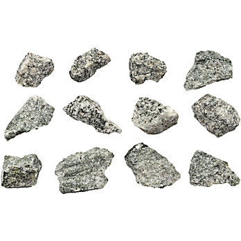
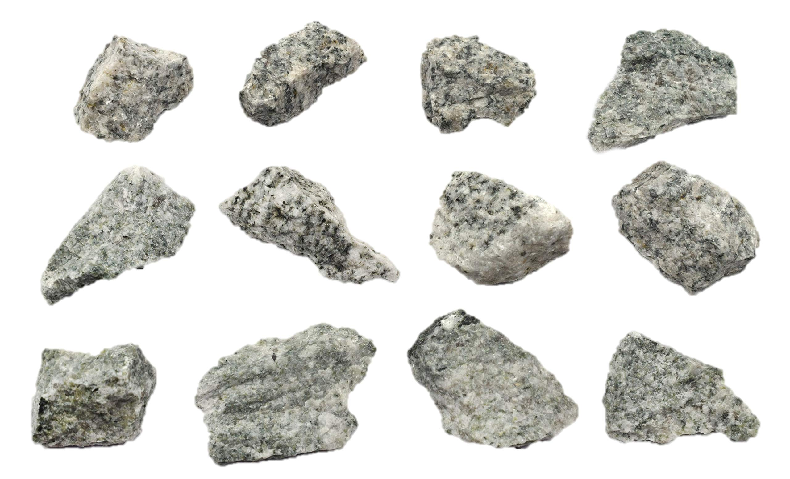

# Microgranite & Porphyry

> **Family:** Igneous — hypabyssal (shallow intrusions) · **Composition:** Microgranite = felsic; "porphyry" = a *texture* (any composition)
> **Mean density:** 2.6–2.8 g/cm³ · **Key clue:** Large **phenocrysts** in a fine-grained groundmass (porphyritic texture).
> **Quick ID:** Big crystals floating in a fine matrix; microgranite is the fine-grained twin of granite.

## At a glance

| Property | Value |
|---|---|
| Colour | Pale grey/pink (microgranite); variable (porphyry) |
| Texture | Fine-grained with **phenocrysts** (porphyritic) |
| Phenocrysts | Feldspar, quartz, sometimes hornblende/biotite |
| Groundmass | Fine (aphanitic) |
| Setting | Dyke/sill margins of granites and volcanic plugs |
| Key clue | **Two-stage cooling**: big early crystals + fine late matrix |

## Composition
- **Microgranite:** the **fine-grained equivalent of granite** — the same felsic minerals (quartz, feldspar, mica) but cooled quickly in shallow **dykes and sills**.
- **Porphyry:** defined by **texture, not composition** — large crystals (**phenocrysts**) set in a fine-grained **groundmass**. Porphyries can be **felsic, intermediate, or mafic** in composition; "porphyry" only describes the two-size texture.

Chemically, microgranite is felsic (SiO₂ ≈ 68–75%); the wider porphyry family spans the whole silica range.

## Geochemistry
- **Microgranite:** felsic, like granite (SiO₂ 68–75%, high alkalis and alumina).
- **Porphyry systems:** in mineralised porphyries, look for **Cu–Mo–Au** enrichment plus **alteration** signatures — potassic (K-feldspar/biotite), phyllic (sericite–quartz–pyrite), and propylitic (chlorite–epidote) zones, and a geochemical halo of Cu, Mo, Au, Ag.

## Texture
**Fine-grained (aphanitic)** with visible **phenocrysts** — the classic **porphyritic texture**: big early-formed crystals floating in a fine matrix. This records a **two-stage cooling history**: large crystals grew slowly deep down, then the magma rose and chilled rapidly, freezing the rest as a fine groundmass.

## Diagnostic field features
- Look closely (hand lens): **large crystals in a fine matrix** — the phenocrysts stand out against a dense groundmass.
- **Microgranite:** pale, fine-grained, of granite composition.
- **Porphyry:** prominent phenocrysts (often **feldspar**, sometimes quartz) in a compact groundmass.
- The groundmass is usually **even, dense, and hard**.

## Identification tests — step by step
1. **Hand lens:** confirm **phenocrysts** (big crystals) in a **fine groundmass** — the porphyritic texture.
2. **Phenocryst type:** feldspar (pale) → felsic/intermediate; hornblende/biotite (dark) → intermediate/mafic.
3. **Colour:** pale overall → microgranite/porphyry (felsic); dark → porphyritic basalt.
4. **Context:** cross-cutting dyke → intrusive (microgranite); flow banding → extrusive.

## Genesis & tectonic setting
The porphyritic texture records a **two-stage history**: phenocrysts grew slowly at depth, then the magma rose and quenched. **Microgranite** forms in shallow dykes/sills at the chilled margins of granite plutons. **Porphyry** (the texture) is famous worldwide as the host of **porphyry copper–gold–molybdenum deposits**, which form above subduction-zone magma chambers.

## Host states / localities
Margins and **dykes of the Younger Granite complexes** and Basement intrusions: **Plateau, Bauchi, Kaduna, Nasarawa**, and elsewhere as dykes. Porphyritic textures are extremely common in the **margins of granite plutons** and in **volcanic necks/plugs**.

## Associated minerals & rocks
- Generally minor accessory minerals; phenocrysts of feldspar, quartz, biotite, hornblende.
- Porphyritic textures can be associated with **porphyry-style copper–gold–molybdenum systems** elsewhere in the world — not a major Nigerian deposit type, but worth recognising the texture because it flags such potential when combined with alteration and geochemistry.
- Associated rocks: granite, rhyolite, basalt, dolerite.

## Economic relevance
- **Aggregate** and **building stone** (microgranite makes good roadstone and fill).
- Recognising **porphyritic texture** is key to spotting potential **porphyry-style mineralisation** (Cu–Au–Mo) when combined with alteration (e.g., potassic/phyllic) and geochemistry.
- Some porphyritic rhyolites host **gem-bearing cavities**.

## Lookalikes & how to distinguish

| Looks like | How to tell it apart |
|---|---|
| **Rhyolite** | Both fine + felsic; microgranite is **intrusive** (hypabyssal), rhyolite is **extrusive** (volcanic) — often hard to tell in a hand specimen. |
| **Basalt (porphyritic)** | Basalt porphyry is **dark/mafic**; microgranite porphyry is **pale/felsic**. |
| **Granite** | Granite is uniformly coarse; microgranite has a fine groundmass with scattered phenocrysts. |

## Field checklist
- [ ] Phenocrysts in a fine groundmass?
- [ ] Phenocrysts feldspar (pale) or mafic (dark)?
- [ ] Pale overall (→ microgranite) vs dark (→ basalt)?
- [ ] Cross-cutting dyke (intrusive) vs flow banding (extrusive)?
- [ ] Any alteration / quartz veins (porphyry-system flag)?

## Field tips
- **Porphyritic texture** = phenocrysts in a fine matrix — look for it with a hand lens (see the porphyritic basalt image in [Basalt](basalt.md) for a clear example).
- Note whether the phenocrysts are **feldspar (pale)** or **mafic (dark)** — this gives the composition.
- In exploration, flag porphyritic intrusions with **alteration** (bleached/sericitic/quartz veins) as possible **porphyry-system** targets.
- Distinguishing microgranite (intrusive) from rhyolite (extrusive) in hand specimen is genuinely hard — use **context** (dyke cross-cutting = intrusive; flow banding = extrusive).

## Facts
- **Porphyry** is named from a purple-red igneous rock used in ancient Rome (porphyry = "purple").
- The porphyritic texture records **two cooling stages** — a favourite teaching example of magma history.
- Some of the world's biggest **copper and gold mines** are **porphyry deposits** — recognising the texture is a valuable exploration skill.
- **Microgranite** forms in the chilled margins of granite intrusions, cooling much faster than the coarse interior.

*Figure II.A.8 — Porphyritic granite (porphyry): large feldspar phenocrysts in a fine groundmass — the porphyritic texture. Source: [Amazon EISCO](https://www.amazon.com/Porphyritic-Granite-Igneous-Rock-Specimen/dp/B0CC3PDWRF).*

*Figure II.A.8b — Porphyritic granite (microgranite). Source: [Thomas Sci](https://www.thomassci.com/p/porphyritic-granite-raw-igneous-rock-specimens-approx-1-inch-pk12).*

*Figure II.A.8c — Porphyritic granite specimen. Source: [Amazon](https://www.amazon.com/Porphyritic-Granite-Igneous-Rock-Specimen/dp/B0CC3PDWRF).*

## Related
- [Granite](granite.md) · [Rhyolite, Trachyte & Phonolite](rhyolite-trachyte-phonolite.md) · [Basalt](basalt.md) · [Aplite & Quartzolite](aplite-quartzolite.md)
