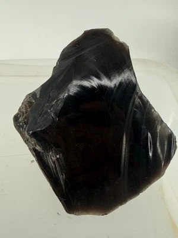
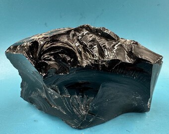

# Obsidian (Volcanic Glass)

> **Family:** Igneous — extrusive volcanic glass · **Composition:** Felsic (rhyolitic), amorphous
> **Form:** Lava-flow margins, domes, dykes · **Silica:** ~70–75 wt% SiO₂ (as glass)
> **Quick ID:** Black/brown glassy rock; **conchoidal fracture**, razor-sharp edges; no crystals.

## At a glance

| Property | Value |
|---|---|
| Colour | Black; also brown, grey, banded ("mahogany," "rainbow") |
| Lustre | **Vitreous (glassy)** |
| Fracture | **Conchoidal** (shell-like), razor-sharp edges |
| Texture | **Glassy** (amorphous, no crystals) |
| Hardness | ~5–5.5 (glass) |
| Translucency | Thin edges can be translucent |

## Composition
**Volcanic glass** — a rhyolitic (felsic) magma **quenched so rapidly** that atoms could not arrange into crystals; effectively **natural, amorphous silica-rich glass**. Chemically like rhyolite/granite (SiO₂ ≈ 70–75%, high alkalis and alumina) but without a crystal structure. Trace water (~1%) is what technically distinguishes it from manufactured glass.

## Geochemistry
- **Major oxides:** SiO₂ 70–75 wt%, Al₂O₃ 12–14%, (Na₂O+K₂O) 7–9% — essentially the same bulk chemistry as rhyolite.
- **Key difference:** *no crystal structure* — the atoms are frozen in a disordered (glassy) state because cooling was too fast for crystallisation.
- **Trace elements:** broadly rhyolitic; low H₂O (<~1%) keeps it as glass rather than crystallising to pumice/perlite.

## Texture
**Glassy**; breaks with a sharp **conchoidal fracture** (smooth, shell-like curved surfaces); thin edges can be **translucent**. Lacks crystals (unlike rhyolite). May contain tiny **spherulites** (radial crystal growths) where devitrification has begun.

## Diagnostic field features
- Black (sometimes brown/banded), **glassy**, **conchoidal fracture**, razor-sharp edges.
- **Lacks crystals** (unlike rhyolite).
- Feels smooth and glassy; breaks into curved, knife-sharp flakes.
- Thin splinters may be translucent brown.

## Identification tests — step by step
1. **Lustre:** vitreous/glassy — shines like bottle glass.
2. **Fracture:** conchoidal (curved, shell-like), producing very sharp edges.
3. **Transparency:** hold a thin edge to the light — obsidian can be translucent.
4. **No crystals:** unlike rhyolite, there is no crystalline groundmass.
5. **Hardness:** ~5–5.5 — about the same as window glass.

## Genesis & tectonic setting
Obsidian forms when **felsic (rhyolitic) lava cools extremely rapidly** — typically at the chilled margins of lava flows, domes, or where lava meets water — so atoms cannot form crystals and freeze into glass. Its occurrence signals **high-silica, fast-quenched** volcanism.

## Host states / localities
Requires very rapid cooling of felsic magma; **rare in Nigeria** and not a significant Nigerian rock — included for completeness (see [Rhyolite, Trachyte & Phonolite](rhyolite-trachyte-phonolite.md)). It can occur where rhyolitic magma quenched quickly, e.g., at flow/dome margins, but Nigeria's alkaline volcanism is not typically obsidian-forming.

## Associated minerals & rocks
Rhyolite, pumice, perlite; spherulites may be present. Associated rocks: rhyolite, trachyte, tuff.

## Economic relevance
- **Ornamental / gemstone** material (cabochons, beads).
- Historically used for **cutting tools and weapons** (razor-sharp flakes); modern **surgical scalpels** exploit obsidian's ultra-sharp edge.
- **Specialty glass** and collector specimens.
- Not a bulk industrial material in Nigeria.

## Lookalikes & how to distinguish

| Looks like | How to tell it apart |
|---|---|
| **Quartz** | Quartz is **crystalline** (with cleavage and crystal form); obsidian is glassy with conchoidal fracture and no crystals. |
| **Rhyolite** | Rhyolite has a **crystalline** groundmass; obsidian is pure glass. |
| **Anthracite / bitumen** | Obsidian is glassy and lighter; coal/bitumen are duller, combustible. |

## Field checklist
- [ ] Glassy (vitreous) lustre?
- [ ] Conchoidal fracture, sharp edges?
- [ ] No crystals / amorphous?
- [ ] Thin edges translucent?
- [ ] Black/brown colour?

## Field tips
- Glassy lustre + conchoidal fracture + sharp edges; distinguish from **quartz** (crystalline) and from **rhyolite** (crystalline groundmass).
- Handle with care — obsidian flakes are **razor-sharp** and can cut skin.
- Look for obsidian at the **chilled margins** of rhyolite flows/domes.
- Banded varieties ("mahogany," "rainbow" obsidian) are prized by collectors.

## Facts
- Obsidian is **natural volcanic glass** — chemically like granite but with no crystal structure.
- Ancient peoples made **sharp cutting tools and mirrors** from obsidian; modern surgery uses obsidian blades sharper than steel.
- **"Rainbow" and "mahogany" obsidian** show banding from trace impurities.
- Obsidian forms where **felsic lava quenches too fast** for crystals to grow.

*Figure II.A.16 — Obsidian (volcanic glass). Source: [eBay](https://www.ebay.com/b/volcanic-glass/bn_7024762122).*

*Figure II.A.16b — Obsidian (volcanic glass). Source: [Etsy](https://www.etsy.com/listing/1125677465/black-obsidian-volcanic-glass-with).*

*Figure II.A.16c — Black obsidian specimen. Source: [eBay](https://www.ebay.com/b/volcanic-glass/bn_7024762122).*

## Related
- [Rhyolite, Trachyte & Phonolite](rhyolite-trachyte-phonolite.md) · [Volcanic Tuff, Ignimbrite & Agglomerate](volcanic-tuff-ignimbrite.md) · [Quartz, Silica & Glass sand](../../03-mineral-resources/industrial/quartz-glass-sand.md)
