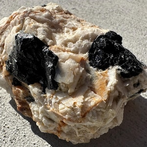
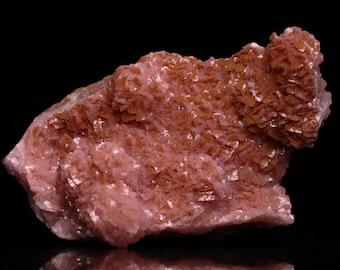
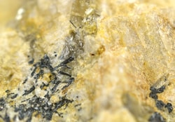

# Pegmatite — the ore-bearing "giant crystal" rock

> **Family:** Igneous — intrusive (late-stage) · **Composition:** Granitic, enriched in rare elements
> **Mean density:** 2.6–2.7 g/cm³ · **Grain size:** centimetres to **several metres**
> **Quick ID:** Extremely coarse, giant crystals (feldspar, quartz, mica) in veins/dykes; black tourmaline, beryl; zoned bodies.

## At a glance

| Property | Value |
|---|---|
| Colour | Pale (white, pink, grey) with black mica/tourmaline |
| Texture | **Extremely coarse-grained** (pegmatitic) |
| Crystal size | 1 cm to several **metres** |
| Key minerals | Quartz, feldspar, muscovite/lepidolite; **tourmaline, beryl** |
| Setting | Veins, dykes, pods at granite margins |
| Key clue | **Zoning** + huge crystals + rare-element minerals |

## Composition
Essentially **granitic** (quartz, feldspar, mica) but formed from the **water- and element-rich final fluids** of a crystallising granite intrusion. Enriched in rare/incompatible elements: **Li, Be, B, Sn, Nb, Ta, W, REE, U, Th, Cs**. These late fluids carry elements that don't fit into ordinary granite minerals, so they crystallise as special, valuable minerals.

**Types:** *simple* pegmatites (just feldspar, quartz, mica) and *rare-element / complex* pegmatites (rich in Li, Be, Ta, Sn, gems) — the latter are the economically important ones.

## Geochemistry
- **Major oxides:** broadly granitic (SiO₂ 70–77%) but with high **volatiles** (H₂O, F, B, P, Cl) that drive giant-crystal growth.
- **Trace elements:** strongly enriched in **Li, Be, Rb, Cs, Sn, Nb, Ta, W, U, Th, REE, Zr, Hf** — the "incompatible" elements excluded from common granite minerals.
- **Nature in Nigeria:** the **Jos Plateau** pegmatites are classic **LCT-type** (Lithium–Cesium–Tantalum) rare-element pegmatites, enriched in Sn–Nb–Ta–Li — a world-class tin-tantalum province.

## Texture
**Extremely coarse-grained** — crystals from **centimetres to several metres**. Often **zoned** (minerals change from the wall to the centre) and may show **graphic texture** — quartz wedges intergrown with feldspar, resembling ancient cuneiform writing. Giant crystals form because the watery fluid lets atoms migrate far and build huge minerals.

## Diagnostic field features
- **Giant crystals** of feldspar, quartz, and mica (muscovite / lepidolite).
- Common **black tourmaline (schorl)** and **beryl**.
- Occurs as **veins, dykes, and pods** cutting through granite — not as large masses.
- **Zoned**: sample across the whole body, as different minerals concentrate in different zones (outer wall zone → intermediate → core).
- May contain **hollow crystal-lined cavities (miarolitic cavities)** with beautiful gem crystals.

## Identification tests — step by step
1. **Grain size:** if individual crystals exceed several centimetres, it is a pegmatite.
2. **Mineralogy:** look for feldspar + quartz + mica, plus the markers — **black tourmaline, beryl, lepidolite**.
3. **Heavy dark grains:** dense, black **cassiterite** or **columbite** may be visible in tin-bearing bodies.
4. **Geometry:** veins/dykes/pods cross-cutting granite, not uniform plutons.
5. **Zoning:** note how minerals change across the body — sample every zone.

## Genesis & tectonic setting
Pegmatites form from the **residual, water-rich melt and fluids** left after a granite has mostly crystallised. Because these fluids are rich in water and rare elements and cool slowly, they grow **giant crystals**. **LCT pegmatites** (like Nigeria's) form in **anorogenic granite cupolas** — the tops of fertile granite plutons — and are the source of most of the world's Li, Ta, Be, and Sn.

## Host states / localities
A hallmark of the **Younger Granites (Jos Plateau)** and many Basement granites: **Plateau, Bauchi, Kaduna, Nasarawa, Oyo, Kwara, Niger**, and gem-bearing pegmatites in several states. The **Jos–Bukuru** area is famous for its tin-bearing pegmatite fields.

## Associated minerals
**Cassiterite (tin), columbite–tantalite (niobium–tantalum), wolframite (tungsten), beryl, tourmaline, spodumene/lepidolite (lithium), monazite, zircon, topaz, and gemstones** (emerald, aquamarine, garnet, topaz). Also industrial **feldspar, mica, and quartz**.

## Economic relevance
**The single most important rock for Nigeria's rare-metal and gemstone wealth.** Pegmatites are the primary source of **tin, columbite-tantalite, lithium, beryllium, tungsten**, and many **gemstones** (see **Part III**). The Jos Plateau's historic tin industry was built on cassiterite from these bodies.

## Lookalikes & how to distinguish

| Looks like | How to tell it apart |
|---|---|
| **Granite** | Pegmatite has **giant crystals** (cm–m) and occurs in veins/dykes; granite is uniformly coarse. |
| **Quartz vein** | Quartz veins are nearly all quartz; pegmatites have abundant feldspar + mica. |
| **Aplite** | Aplite is the opposite — very fine-grained, sugary. |

## Field checklist
- [ ] Giant crystals (cm–m)?
- [ ] Occurs as vein/dyke/pod, not pluton?
- [ ] Markers present (tourmaline, beryl, lepidolite)?
- [ ] Heavy dark grains (cassiterite/columbite)?
- [ ] Zoned body — sample every zone?

## Field tips
- **Huge crystals + zoning** = pegmatite.
- **Hunt for black tourmaline, micas, cassiterite (heavy dark grains), and beryl** — the high-value markers.
- **Sample the whole body**: minerals concentrate in different zones (e.g., cassiterite and columbite near the margins, gems in the core).
- **Look up** at pit walls — giant crystals are best seen in cross-section.
- Record the **relationship to the parent granite** (pegmatites cluster around and above granite cupolas).

## Facts
- Some pegmatite crystals are among the **largest crystals on Earth** — spodumene over 14 m and feldspar over 10 m have been recorded.
- Nigeria's **Jos Plateau** was once one of the **world's largest exporters of tin**, all from pegmatite-derived cassiterite.
- The word comes from the Greek **pegma**, "to join together," referring to the intergrown graphic texture.
- **Rare-element pegmatites** supply most of the world's **lithium, tantalum, and beryllium**.

*Figure II.A.7 — Pegmatite: very coarse feldspar + quartz with large black tourmaline
crystals. Source: [Etsy](https://www.etsy.com/market/pegmatite_crystals).*

*Figure II.A.7b — Pegmatite (very coarse-grained igneous rock). Source: [Etsy](https://www.etsy.com/listing/750687996/pegmatite-intrusive-igneous-rock-10).*

*Figure II.A.7c — Pegmatite specimen. Source: [Fisher Scientific](https://www.fishersci.com/shop/products/pegmatite-igneous-rock-specimen-2/S27590).*

## Related
- [Granite](granite.md) (parent rock) · [Aplite & Quartzolite](aplite-quartzolite.md) · [The Younger Granite ring complexes](../../01-general-geology/01-03-younger-granite-ring-complexes.md)
- **Part III** — [Cassiterite](../../03-mineral-resources/metallic/cassiterite.md), [Columbite–Tantalite](../../03-mineral-resources/metallic/columbite-tantalite.md), [Wolframite & Scheelite](../../03-mineral-resources/metallic/wolframite-scheelite.md), gems.
