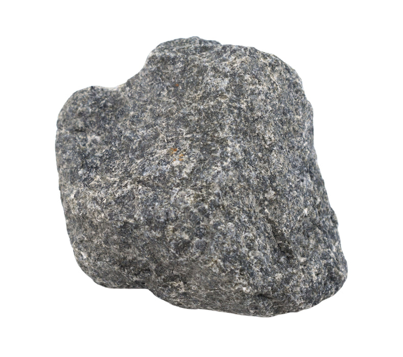
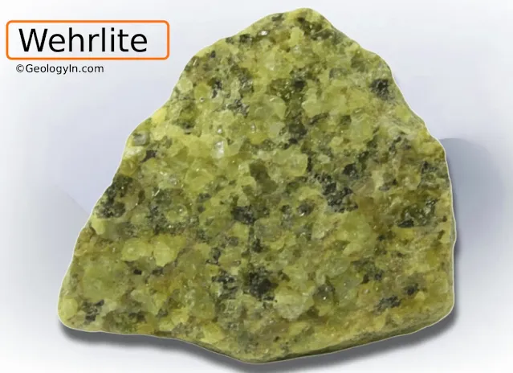
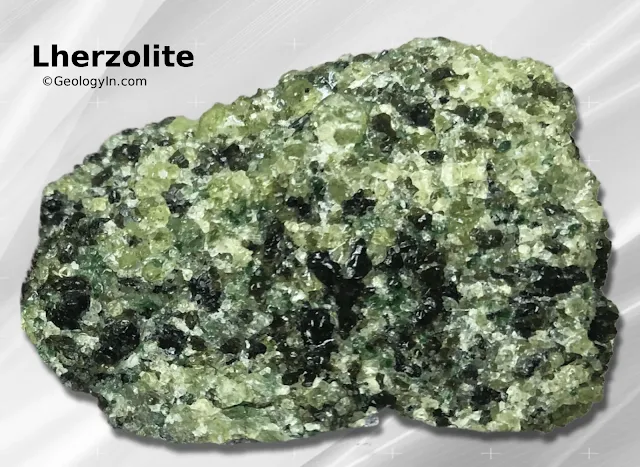
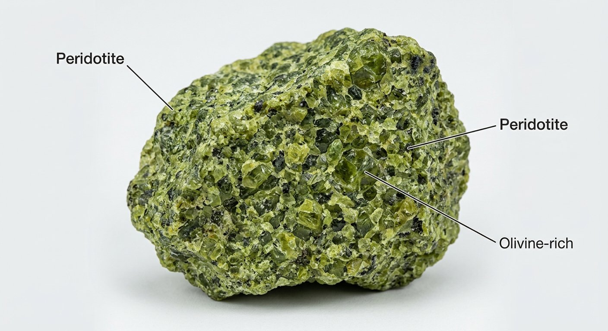
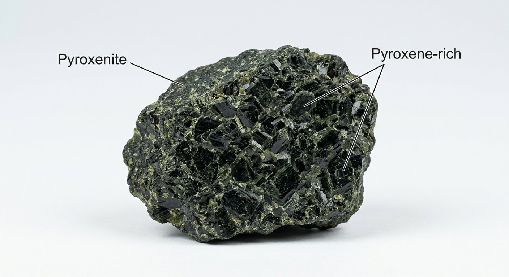

# Peridotite & Pyroxenite (Ultramafics)

> **Family:** Igneous — intrusive (plutonic) · **Composition:** Ultramafic (very low silica, <45% SiO₂)
> **Mean density:** 3.0–3.3+ g/cm³ (very heavy) · **Origin:** Upper-mantle rocks
> **Quick ID:** Green (olivine) + dark pyroxene; **very heavy**; fresh olivine weathers to soft, greasy green serpentine.

## At a glance

| Property | Peridotite | Pyroxenite |
|---|---|---|
| Chief mineral | **Olivine** (+ pyroxene) | **Pyroxene** (± olivine) |
| Colour | Green / olive | Dark green-black |
| Varieties | Dunite (all olivine), harzburgite (ol+opx), lherzolite (ol+2 pyx) | Orthopyroxenite, clinopyroxenite |
| Hardness | ~6.5–7 (olivine) | ~5.5–6 |
| Specific gravity | ~3.2–3.4 | ~3.1–3.3 |
| Feel | Very heavy | Very heavy |
| Alteration | → green **serpentinite** | → serpentine / talc |

## Composition
- **Peridotite:** dominated by **olivine** + **pyroxene**, with almost no feldspar. Named by the pyroxene present:
  - **Dunite** — nearly all olivine.
  - **Harzburgite** — olivine + **orthopyroxene**.
  - **Lherzolite** — olivine + both ortho- and clinopyroxene.
- **Pyroxenite:** almost entirely **pyroxene** (bronzite, augite) ± olivine.

Chemically **ultramafic**: very low SiO₂ (<45%), very high MgO and FeO, and **very low aluminium** — the opposite end of the spectrum from granite. These rocks come from the **Earth's mantle**.

## Geochemistry
- **Major oxides:** SiO₂ 38–45 wt%, MgO 35–49%, FeO 6–16%, CaO 1–8%, Al₂O₃ 1–4% (very low).
- **Trace elements:** high **Ni, Cr, Co** (compatible, mantle); very low **K, Na, Zr, Rb**.
- **Nature in Nigeria:** ultramafic/ophiolitic fragments carry elevated **Cr, Ni, Co, and PGE** — economically the most metal-rich of the ultramafic family.

## Texture
**Coarse-grained (phaneritic)**, with tightly packed, often equant crystals. Commonly **serpentinized** — olivine converts to green, greasy **serpentine**; pyroxenite may develop **talc** and **carbonate** along veins. Dunite can show a coarse "sugary" olivine texture.

## Diagnostic field features
- **Bright green (olivine)** + dark **pyroxene** where fresh; unmistakable green glassy olivine grains.
- **Very dense and heavy** — heavier than gabbro.
- Fresh olivine weathers to **serpentinite** — green, soft, with a **greasy or soapy feel**.
- Often forms **lenses, pods, and layers** within other rocks rather than large masses.
- May show a **network of white asbestos (chrysotile) veins** in serpentinized zones.

## Identification tests — step by step
1. **Weight & colour:** very heavy + green → think olivine/peridotite.
2. **Hardness:** fresh olivine ~6.5–7; but **serpentinized** rock is **soft** (scratched by a knife) and greasy.
3. **Hand lens:** green glassy olivine grains + dark pyroxene; look for shiny black **chromite**.
4. **Alteration:** green, soft, soapy = serpentinized peridotite (serpentinite).
5. **Context:** occurs as pods/lenses in schist belts, not as large uniform bodies.

## Genesis & tectonic setting
Peridotite and pyroxenite are **mantle rocks**, brought up as **ophiolite fragments** (slices of ancient oceanic lithosphere) emplaced into the crust at **suture zones** during continental collision. In Nigeria they occur as **ultramafic / ophiolite fragments** within some **schist belts and suture zones** of the Basement (reported in the southwest and central basement) — minor in extent but economically interesting where found.

## Host states / localities
Uncommon but present in Nigeria — occur as **ultramafic / ophiolite fragments** within some **schist belts and suture zones** of the Basement (reported in parts of the **southwest and central basement**). Minor in extent, but **economically interesting** where found because ultramafics concentrate certain metals.

## Associated minerals & rocks
- **Chromite** (in dunite/peridotite), **magnetite**, **nickel** (in serpentinized peridotite).
- **Asbestos (chrysotile)** and **talc** from serpentine alteration.
- **PGE (platinum-group elements)** in some ultramafics.
- Associated rocks: gabbro, serpentinite, chlorite/talc schist (alteration products).

## Economic relevance
- **Chromium (chromite), nickel, cobalt, magnesium.**
- **Talc, asbestos (chrysotile), serpentine** (ornamental/"verde" stone).
- **PGE (platinum-group)** potential in some ultramafic bodies.
- Olivine is also used as a **foundry sand** and **refractory** material elsewhere.

## Lookalikes & how to distinguish

| Looks like | How to tell it apart |
|---|---|
| **Serpentinite** | Serpentinite is the *altered* peridotite — softer, greasier, often banded. |
| **Gabbro** | Gabbro has abundant pale feldspar and is less green/heavy. |
| **Amphibolite** | Amphibolite is metamorphic, dominated by black hornblende (not green olivine). |

## Field checklist
- [ ] Green + very heavy?
- [ ] Olivine (green glassy) + pyroxene?
- [ ] Soft/greasy (serpentinized) or hard (fresh)?
- [ ] Shiny black chromite grains present?
- [ ] White asbestos vein fibres (serpentinite)?
- [ ] Pod/lens geometry in schist belt?

## Field tips
- **Green + very heavy** → think olivine/peridotite.
- **Serpentinized** peridotite is **soft and greasy** (vs. hard fresh gabbro) — it can even be scratched by a knife.
- Look for small shiny black **chromite** grains — a sign of the dunite-rich, chromium-bearing type.
- Handle with care: **asbestos** occurs as white vein fibres in some serpentinites — avoid generating dust.
- Map these bodies closely: ultramafics concentrate **Ni, Cr, Co, and PGE** and are prime exploration targets.

## Facts
- **Peridotite** is the dominant rock of the **Earth's mantle** — the source of basalt magma.
- Single crystals of olivine from peridotite, the gem **peridot**, have been found in **meteorites** and even on **Mars**.
- **Dunite** (nearly pure olivine) is named after **Dun Mountain**, New Zealand.
- When peridotite serpentinizes, it **expands** and can even produce weak magnetic anomalies — a useful geophysical exploration signal.

*Figure II.A.5 — Peridotite: coarse olivine + pyroxene, an ultramafic rock. Source: [allschoolabs.com](https://allschoolabs.com/product/raw-peridotite-igneous-rock-specimen-approx-3-hand-sample/).*

*Figure II.A.5b — Peridotite (wehrlite): olivine + clinopyroxene. Source: [GeologyIn](https://www.geologyin.com/2025/09/peridotite-composition-types.html).*

*Figure II.A.5c — Peridotite (lherzolite). Source: [GeologyIn](https://www.geologyin.com/2025/09/peridotite-composition-types.html).*

*Figure II.A.5d — Labeled illustration: peridotite olivine-rich ultramafic rock. Original diagram prepared for this guide.*

*Figure II.A.5e — Labeled illustration: pyroxenite pyroxene-rich rock. Original diagram prepared for this guide.*

## Related
- [Gabbro & Dolerite](gabbro-dolerite.md) · [Serpentinite](../metamorphic/serpentinite.md) · [Talc/Chlorite schist](../metamorphic/talc-chlorite-schist.md) (alteration products)
- **Part III** — [Chromite](../../03-mineral-resources/metallic/chromite.md)
