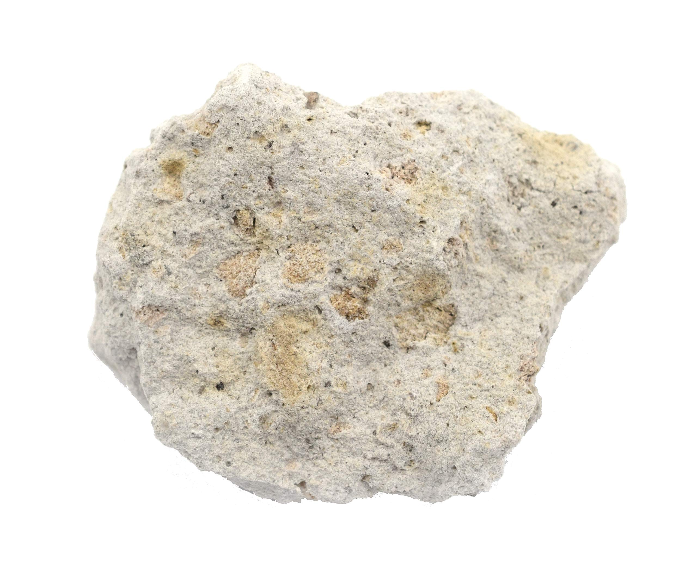

# Rhyolite, Trachyte & Phonolite (Younger Volcanics)

> **Family:** Igneous — extrusive (volcanic) · **Composition:** Felsic to intermediate-alkaline
> **Plutonic equivalents:** Rhyolite → granite; Trachyte → syenite; Phonolite → nepheline syenite
> **Quick ID:** Fine-grained, pale volcanic rocks; rhyolite flow-banded; **phonolite rings when struck**.

## At a glance

| Property | Rhyolite | Trachyte | Phonolite |
|---|---|---|---|
| Equivalent of | Granite | Syenite | Nepheline syenite |
| Key minerals | Quartz + feldspar | Alkali feldspar (little quartz) | Feldspathoid (nepheline) |
| Colour | Pale pink/cream/grey | Pale grey | Darker grey |
| Texture | Fine, often flow-banded | Fine, phenocrystic | Fine, dense |
| Field test | Flow banding | Tiny feldspar phenocrysts | **Rings when struck** |

## Composition
The **fine-grained volcanic equivalents** of the plutonic rocks:
- **Rhyolite** = extrusive equivalent of **granite** (quartz + feldspar).
- **Trachyte** = extrusive equivalent of **syenite** (alkali feldspar, little quartz).
- **Phonolite** = extrusive equivalent of **nepheline syenite** (feldspathoid-bearing, silica-undersaturated).

Chemically felsic to alkaline: rhyolite SiO₂ ≈ 69–78%; phonolite ≈ 55–62% with high alkalis and low silica (hence the feldspathoid).

## Texture
**Fine-grained (aphanitic)** to **glassy**; commonly **porphyritic** and **flow-banded** (bands produced as lava flowed). May contain **obsidian** or **pumice**. The fine texture records rapid cooling at the surface.

## Diagnostic field features
- **Rhyolite:** pale (pink/cream/grey), fine-grained, often **flow-banded** — swirling streaky layering from moving lava.
- **Trachyte:** pale, with tiny **alkali-feldspar phenocrysts** visible with a lens.
- **Phonolite:** darker grey; **rings like a bell when struck with a hammer** — a neat and distinctive field test caused by its dense, uniform, slightly glassy texture.
- All may contain **cavities (vesicles)** sometimes filled with zeolites or calcite.

## Host states / localities
The **Younger volcanics** of the **Jos Plateau** (trachyte/phonolite flows and necks) and associated with the **Biu Plateau** and other volcanic fields: **Plateau, Bauchi, Borno, Kaduna, Nasarawa**. These are part of Nigeria's **Cenozoic volcanic episode**.

## Associated minerals & rocks
- **Sanidine / orthoclase** phenocrysts, **quartz** (rhyolite), **nepheline** (phonolite), **aegirine**.
- **Obsidian, pumice**; minor rare minerals.
- Associated rocks: basalt, tuff, ignimbrite, syenite/nepheline syenite plutons.

## Economic relevance
- **Aggregate, building / dimension stone, pumice** (abrasives, construction).
- **Phonolite** can be a source of **nepheline** for alumina/ceramics.
- Host for some **gemstones** in cavities; **obsidian** for ornamental use.
- **Rhyolite** and related volcanic rocks can carry **gold–silver** mineralisation in some districts worldwide.

## Lookalikes & how to distinguish

| Looks like | How to tell it apart |
|---|---|
| **Basalt** | Basalt is **dark/mafic**; rhyolite/trachte/phonolite are pale or lighter. |
| **Microgranite** | Same composition but microgranite is **intrusive** (cross-cuts); volcanic rocks show flow banding/vesicles. |
| **Trachyte vs rhyolite** | Rhyolite has **quartz** phenocrysts; trachyte has alkali feldspar and little/no quartz. |

## Field tips
- **Fine-grained + flow banding** → volcanic (extrusive).
- **Phonolite rings** when struck — tap a fresh piece and listen.
- Use a **hand lens**; confirm composition with chemistry if the sample matters.
- Look for **phenocrysts** to identify the type (quartz = rhyolite; feldspar = trachyte; feldspathoid = phonolite).
- Map the volcanic **stratigraphy** (flows, tuffs, plugs) — it records Nigeria's young volcanic history.

## Facts
- **Rhyolite** can be so glassy it grades into **obsidian** (volcanic glass).
- **Pumice** is frothy rhyolite so full of gas bubbles that it **floats on water**.
- The **Jos Plateau volcanics** are relatively young (Cenozoic) — far younger than the granites they sit on.
- **Phonolite's ringing** when struck is a reliable, memorable field test for this unusual alkaline lava.

*Figure II.A.9 — Rhyolite: fine-grained, pale volcanic (extrusive) rock. Source: [Amazon EISCO](https://www.amazon.com/Eisco-Rhyolite-Specimen-Igneous-Approx/dp/B01J480HEC).*

## Related
- [Granite](granite.md) · [Syenite & Nepheline syenite](syenite-nepheline-syenite.md) · [Basalt](basalt.md) · [Obsidian](obsidian.md) · [Volcanic tuff & ignimbrite](volcanic-tuff-ignimbrite.md)
- [Cenozoic volcanism](../../01-general-geology/01-05-cenozoic-volcanism.md)
