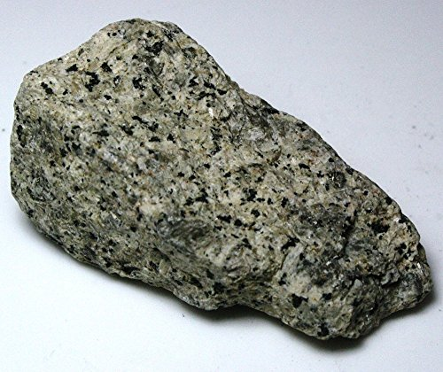

# Syenite & Nepheline Syenite

> **Family:** Igneous — intrusive · **Composition:** Intermediate-felsic, alkali-rich, quartz-poor

## Composition
- **Syenite:** mostly **alkali feldspar** + hornblende/biotite, with **little or no quartz**.
- **Nepheline syenite:** alkali feldspar + **nepheline** (a feldspathoid) instead of quartz — even more silica-poor and alkali-rich.

## Texture
**Coarse-grained (phaneritic)**; sometimes with aligned feldspar (trachytic).

## Diagnostic field features
- Looks granite-like but **lacks visible quartz**.
- Dominated by **pale feldspar** with dark hornblende/biotite.
- Nepheline syenite is typically **grey**, feldspathoid-bearing, may show a greasy
  luster on nepheline.

## Host states / localities
Chiefly in the **Younger Granite** ring complexes of the **Jos Plateau** and environs:
**Plateau, Bauchi, Kaduna, Nasarawa**. Rare in the older Basement.

## Associated minerals
Nepheline syenites may host **zircon, aegirine, riebeckite, rare-earth minerals,
cancrinite, sodalite**; syenites may carry **apatite, magnetite, titanite**.

## Economic relevance
- **Nepheline syenite** is a valuable industrial mineral — a substitute for feldspar
  in **glass, ceramics, and alumina** production (important where bauxite is scarce).
- Potential host for **rare-earth elements (REE)**.
- **Dimension stone / aggregate**.

## Identification notes
- **No quartz** distinguishes it from granite.
- **Feldspar-dominated** with less mafic mineral than diorite.
- **Nepheline** confirmed by its greasy luster and reaction with acid (gelatinizes).

*Figure II.A.3 — Syenite: feldspar-rich, quartz-poor coarse-grained igneous rock. Source: [Amazon](https://www.amazon.com/Syenite-Igneous-Rock-Unpolished-Specimens/dp/B01FMLWE2S).*

## Related
- [Granite](granite.md) · [Nepheline/Rhyolite group](rhyolite-trachyte-phonolite.md) · [Pegmatite](pegmatite.md)
