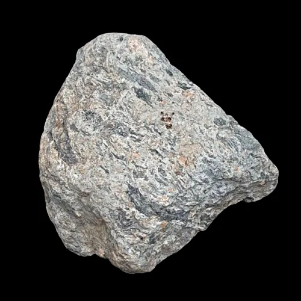
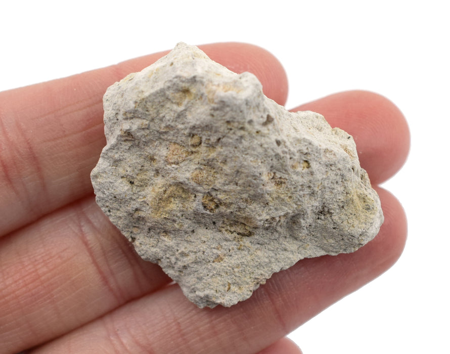
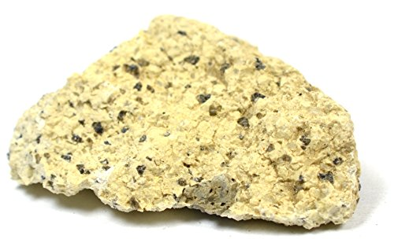

# Volcanic Tuff, Ignimbrite & Agglomerate

> **Family:** Igneous — volcaniclastic (fragmented volcanic material) · **Composition:** Variable (ash to blocks)
> **Key clue:** **Fragmental (clastic) texture** — broken volcanic fragments, not crystallised lava.
> **Quick ID:** Light, fine, fragmental rock that looks like solidified ash; ignimbrite shows flattened pumice "fiammé."

## At a glance

| Property | Tuff | Ignimbrite | Agglomerate |
|---|---|---|---|
| Material | Consolidated volcanic **ash** | Hot, **welded** ash-flow deposit | Coarse **bombs/blocks** |
| Texture | Fine, fragmental | **Welded**, flame-like "eutaxitic" | Coarse, angular/rounded |
| Clue | Feels like solidified ash | Flattened pumice (**fiammé**) | Obvious volcanic bombs |

## Composition
**Volcaniclastic** rocks — fragmented volcanic material.
- **Tuff** = consolidated volcanic **ash** (fragments <2 mm).
- **Ignimbrite** = a hot, **welded** ash-flow (pyroclastic-flow) deposit.
- **Agglomerate** = coarse volcanic **bombs/blocks** (>64 mm).

The fragments are of volcanic glass, crystals (quartz, feldspar, sanidine), and rock chips; composition can be **rhyolitic, trachytic, or basaltic** depending on the source volcano.

## Geochemistry
- Broadly reflects the source magma (rhyolitic to basaltic ash).
- **Welding** requires high-temperature ash (>600 °C) that fuses fragments together.
- Trace-element and crystal chemistry of ash shards can fingerprint the source volcano.

## Texture
Fine-grained and **fragmental**; ignimbrites show a **welded, flame-like "eutaxitic" texture** with flattened pumice fragments (**fiammé**); agglomerates are coarse and angular/rounded. The fragmental (clastic) texture — broken pieces, not crystallised lava — is the defining feature.

## Diagnostic field features
- Light-coloured, fine, fragmental; looks like a **solidified ash**.
- Ignimbrite: flattened/streaked pumice fragments; agglomerate: obvious volcanic bombs.
- **Distinguish from lava flows by the fragmental (clastic) texture.**
- Generally **lighter and softer** than the associated lavas.

## Identification tests — step by step
1. **Texture:** fragmental/clastic — broken angular fragments, not interlocking crystals (→ not a lava flow).
2. **Grain size:** fine ash (tuff) vs coarse bombs (agglomerate).
3. **Ignimbrite:** look for **fiammé** — dark, flattened, flame-shaped pumice streaks.
4. **Hardness:** generally softer than lava; may scratch with a knife.
5. **Reaction:** rhyolitic tuff no fizz; basaltic tuff may alter.

## Genesis & tectonic setting
These rocks form during **explosive volcanism**: ash and bombs are ejected and then settle (tuff, agglomerate) or race downslope as hot **pyroclastic flows** that weld together (ignimbrite). Ignimbrites are among the most voluminous volcanic deposits, emplaced by fast-moving, super-hot ash flows.

## Host states / localities
**Plateau (Jos), Bauchi, Nasarawa, Kaduna** — the volcanic phase of the **Younger Granite ring complexes** (e.g., rhyolitic–trachytic tuffs and ignimbrites). They form part of Nigeria's Cenozoic volcanic sequence.

## Associated minerals & rocks
Rhyolite, trachyte, phonolite, granite; crystals of **quartz, feldspar, sanidine**. Associated rocks: basalt, ignimbrite, volcanic plugs.

## Economic relevance
- **Dimension/building stone, aggregate** (lightweight where porous).
- **Pumice** (a very vesicular volcaniclastic) for abrasives and construction.
- Volcaniclastic horizons can **localize mineralization** (e.g., epithermal deposits) and host **zeolites** in cavities.
- Weathered volcanic ash produces fertile soils.

## Lookalikes & how to distinguish

| Looks like | How to tell it apart |
|---|---|
| **Rhyolite / trachyte lava** | Lavas are crystalline and dense; tuff is **fragmental** and often lighter/softer. |
| **Sedimentary sandstone/greywacke** | Sandstone is sedimentary (rounded grains, fossils possible); tuff is volcanic (glass shards, crystals, fiammé). |
| **Shale/mudstone** | Tuff is fragmental volcanic ash; shale is compacted mud (often fissile). |

## Field checklist
- [ ] Fragmental (clastic) texture, not crystalline?
- [ ] Fine ash (tuff) or coarse bombs (agglomerate)?
- [ ] Fiammé (flattened pumice) → ignimbrite?
- [ ] Lighter/softer than associated lava?
- [ ] Associated with acid/intermediate volcanics?

## Field tips
- Look for **fragmental texture, fiammé, and association with acid/intermediate volcanics**.
- Generally **lighter and softer** than the associated lavas — a quick field clue.
- Tuff may break with a gritty, ashy feel; look for **glass shards** under a hand lens.
- Map volcaniclastic layers within the volcanic stratigraphy — they record eruptive episodes.

## Facts
- **Ignimbrites** are among the **largest-volume** volcanic deposits on Earth — single flows can exceed 1000 km³.
- **Fiammé** (Italian for "flames") are flattened pumice streaks in welded ignimbrite.
- **Tuff** can be so soft and light it is easily carved — used for building since antiquity (e.g., Roman tuff).
- **Pumice** is a volcaniclastic so full of gas bubbles that it floats on water.

*Figure II.A.11 — Welded ignimbrite (tuff). Source: [Geology Superstore](https://www.geologysuperstore.com/shop/product/ignimbrite-welded-tuff).*

*Figure II.A.11b — Volcanic tuff. Source: [Eisco Labs](https://www.eiscolabs.com/products/esng0051pk12).*

*Figure II.A.11c — Volcanic tuff specimen. Source: [Amazon](https://www.amazon.com/Eisco-Volcanic-Specimen-Igneous-Approx/dp/B01J480K1M).*

## Related
- [Rhyolite, Trachyte & Phonolite](rhyolite-trachyte-phonolite.md) · [Younger Granites](../../01-general-geology/01-03-younger-granite-ring-complexes.md) · [Microgranite / Porphyry](microgranite-porphyry.md) · [Basalt](basalt.md)
