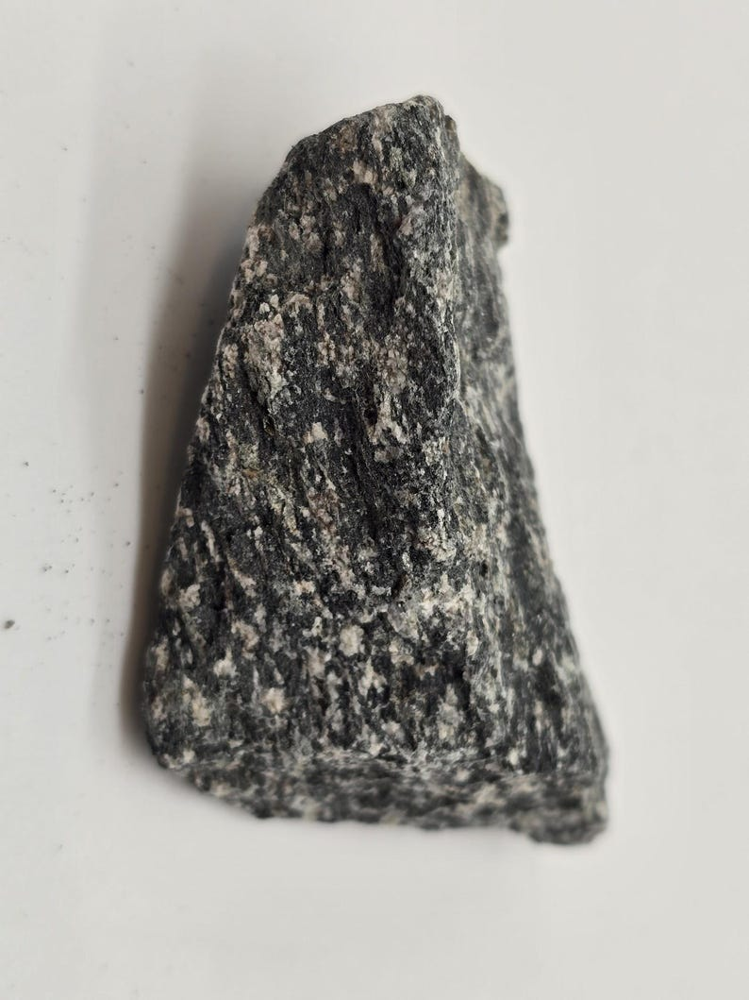
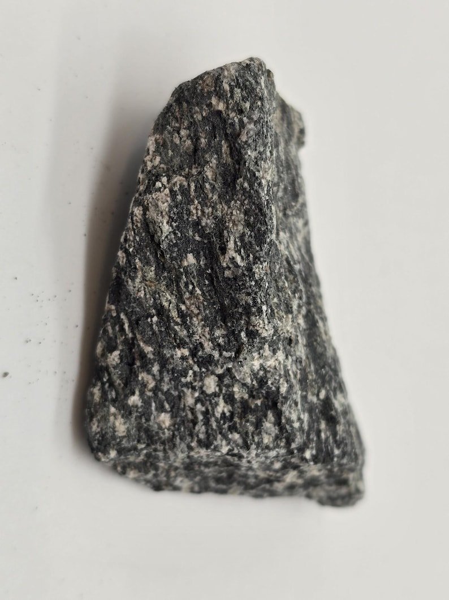
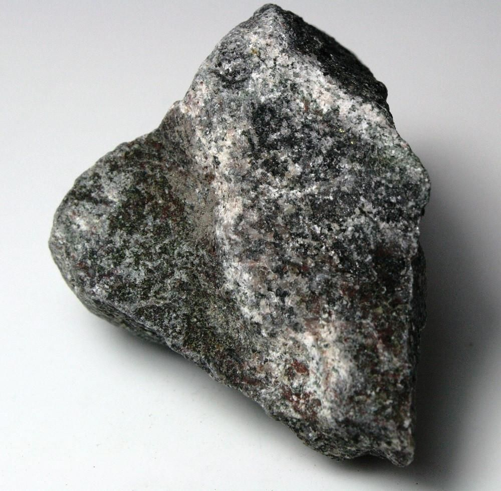
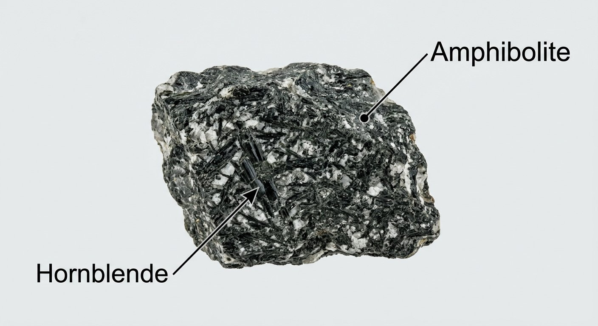
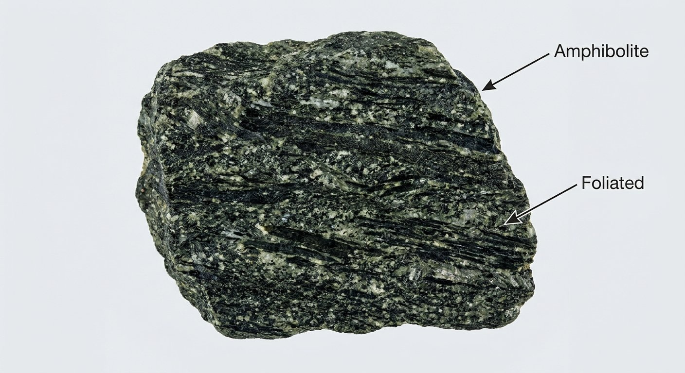

# Amphibolite

> **Family:** Metamorphic (amphibolite-facies) · **Protolith:** basalt/gabbro (mafic rock) or marl
> **Key feature:** Hornblende-dominated, dark green-black · **Quick ID:** Dark, hornblende-rich, foliated/lineated; hornblende shows ~120° cleavage.

## At a glance

| Property | Value |
|---|---|
| Colour | Dark green to black |
| Texture | Foliated to lineated (sometimes massive) |
| Key minerals | **Hornblende (amphibole)** + plagioclase feldspar |
| Accessory | Garnet, biotite, quartz |
| Hardness | ~5.5–6 |
| Facies | Amphibolite-facies (medium-high grade) |
| Setting | Bands/lenses in Basement & schist belts |

## Composition
Chiefly **hornblende (amphibole)** + **plagioclase feldspar**, ± **garnet, biotite, quartz**. Formed by metamorphism of **mafic igneous rocks** (basalt/gabbro) or marl (impure carbonate). Hornblende and plagioclase are the two defining minerals.

## Protolith & metamorphic grade
Amphibolite forms from a **mafic protolith** under **amphibolite-facies** (medium-to-high-grade) metamorphism — the mafic minerals pyroxene/olivine of basalt/gabbro react to form **hornblende + plagioclase**. The presence of **garnet** signals the higher-grade end (toward granulite/eclogite).

## Texture & foliation
Typically **foliated to lineated** (aligned hornblende) but can be **massive**; medium-to-coarse grained, dark green to black. The **lineation** — hornblende crystals aligned in one direction — is a common and diagnostic texture.

## Diagnostic field features
- **Dark green-black**, dense, dominated by **hornblende** (elongated black/green crystals).
- May show a **lineation** (minerals aligned in a direction).
- Harder than gabbro where well metamorphosed.
- The metamorphic equivalent of basalt/gabbro.

## Identification tests — step by step
1. **Hand lens:** confirm **hornblende** — elongated crystals with two cleavages at **~120°** (vs pyroxene at ~90°).
2. **Texture:** foliated/lineated (metamorphic) vs massive gabbro (igneous).
3. **Colour:** dark green-black, hornblende-rich.
4. **Vs gabbro:** amphibolite is foliated and hornblende (not pyroxene) dominated.
5. **Vs greenschist:** amphibolite has abundant hornblende and is higher grade.

## Genesis & setting
Amphibolite forms by **regional metamorphism of mafic rock** — basalt/gabbro buried and heated so its pyroxene and olivine convert to **hornblende + plagioclase**. Amphibolites mark the mafic (basaltic) layers within a metamorphic sequence and often record subduction or collisional tectonics.

## Host states / localities
Occurs as **bands and lenses within the Basement Complex** and schist belts: **Plateau, Kaduna, Oyo, Kwara, Kogi, Niger**, and elsewhere. Common in the mafic layers of the schist belts.

## Associated minerals & rocks
Garnet, plagioclase; sometimes **gold** where in the schist belts. Associated rocks: mica schist, greenschist, quartzite, gabbro (protolith).

## Economic relevance
- **Aggregate and dimension stone.**
- Indicator of mafic rock in the sequence; occasionally **gold**-associated.
- **Garnet** can be recovered as an abrasive where abundant.

## Lookalikes & how to distinguish

| Looks like | How to tell it apart |
|---|---|
| **Gabbro** | Gabbro is igneous, massive, **pyroxene**-dominated (~90° cleavage); amphibolite is foliated, **hornblende**-dominated (~120°). |
| **Greenschist** | Greenschist is green, softer, chlorite/epidote-rich (lower grade); amphibolite is darker, hornblende-rich. |
| **Dolerite** | Dolerite is medium-grained igneous dyke rock; amphibolite is foliated metamorphic. |

## Field checklist
- [ ] Dark green-black, hornblende-rich?
- [ ] Hornblende cleavage ~120° (hand lens)?
- [ ] Foliated/lineated (metamorphic)?
- [ ] Mafic setting (band/lens in schist belt)?
- [ ] No acid fizz?

## Field tips
- **Dark + hornblende-rich** = amphibolite.
- Distinguished from **gabbro** by foliation/lineation and hornblende (vs pyroxene).
- Hornblende shows the classic **~120° cleavage** under a hand lens — the key mineral test.
- Amphibolite bands in schist belts are worth checking for **gold**.

## Facts
- Amphibolite is the **metamorphic equivalent of basalt/gabbro**.
- The name comes from **hornblende** (an amphibole mineral).
- Amphibolite-facies conditions are the "bread and butter" grade of regional metamorphism.
- Well-foliated amphibolite can be polished as an attractive dark **dimension stone**.

*Figure II.B.5 — Amphibolite: dark, hornblende-rich metamorphic rock. Source: [Etsy](https://www.etsy.com/listing/738946785/amphibolite-metamorphic-rock-10).*

*Figure II.B.5b — Amphibolite (metamorphic rock). Source: [Etsy](https://www.etsy.com/listing/738946785/amphibolite-metamorphic-rock-10).*

*Figure II.B.5c — Amphibolite specimen. Source: [Beakers World](https://beakersworld.com/product/amphibolite-metamorphic-rock-10-unpolished-mineral-specimens/).*

*Figure II.B.5d — Labeled illustration: amphibolite (hornblende + plagioclase). Original diagram prepared for this guide.*

*Figure II.B.5e — Labeled illustration: amphibolite foliated texture. Original diagram prepared for this guide.*

## Related
- [Banded gneiss](banded-gneiss.md) · [Gabbro & Dolerite](../igneous/gabbro-dolerite.md) · [Greenschist](greenschist.md)
