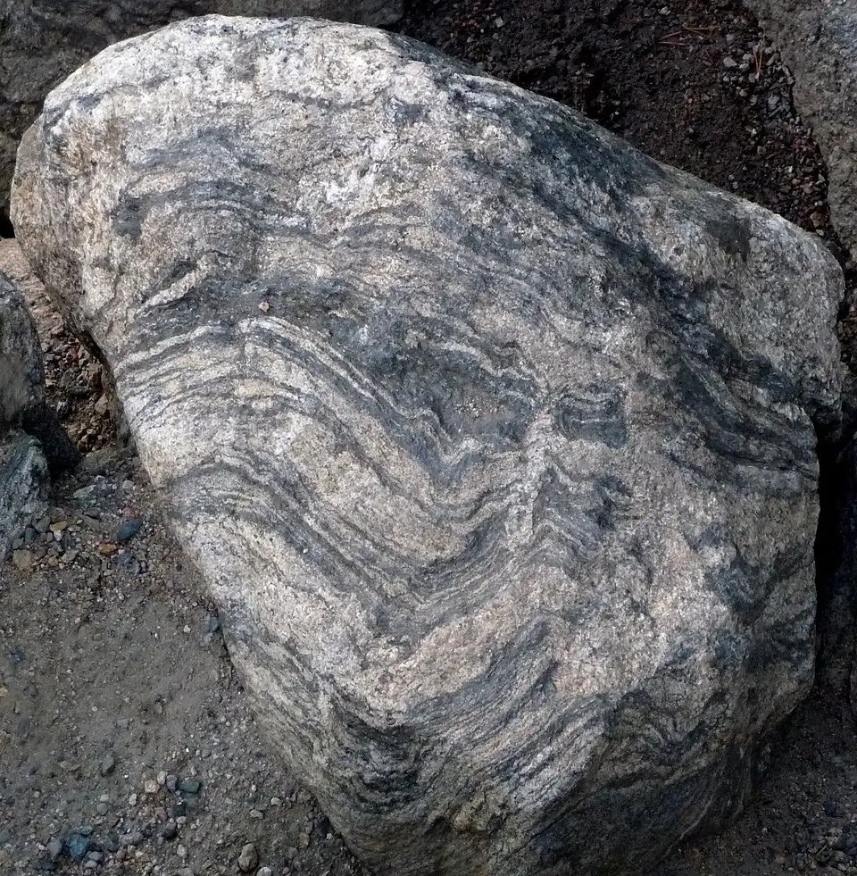

# Banded Gneiss & Augen Gneiss

> **Family:** Metamorphic (medium-to-high grade) · **Protolith:** granite or sedimentary rock
> **Key feature:** Gneissic banding (light/dark mineral layers) · **Quick ID:** Wavy light/dark mineral banding, splits along foliation but coarser than schist.

## At a glance

| Property | Value |
|---|---|
| Colour | Banded light (pink/grey) + dark (grey/black) |
| Texture | Strongly foliated and banded (gneissic) |
| Key minerals | Quartz, feldspar, mica and/or hornblende |
| Index minerals | Garnet, kyanite, sillimanite |
| Variety | **Augen gneiss** (eye-shaped feldspar) |
| Setting | Widespread in the Basement Complex |

## Composition
Quartz, feldspar, mica and/or hornblende, ± **garnet, kyanite, sillimanite**. Essentially a **metamorphosed granite or sedimentary rock** in which the minerals have been segregated into bands by heat, pressure, and flow.

## Protolith & metamorphic grade
Gneiss forms from a granitic (or arkosic/sedimentary) protolith under **medium-to-high-grade** metamorphism. The **index minerals** (garnet, kyanite, sillimanite) reveal the grade: kyanite → high pressure; sillimanite → high temperature. Nigerian Basement gneisses are typically **amphibolite- to granulite-facies**.

## Texture & foliation
Strongly **foliated and banded (gneissic)** — alternating **light (quartz–feldspar)** and **dark (mica/hornblende)** mineral bands. **Augen gneiss** has large, lens- or eye-shaped (**augen**) feldspar grains set in a finer foliated matrix, formed by shearing of large feldspar crystals.

## Diagnostic field features
- **Mineral banding** (light/dark layers), often wavy.
- **Augen** = big "eye" feldspar crystals in augen gneiss.
- Splits along foliation but **less perfectly than schist**.
- Bands are **coarser and more irregular** than schist's fine foliation.

## Identification tests — step by step
1. **Banding:** look for alternating light/dark mineral layers.
2. **Foliation strength:** gneiss splits along foliation but is blockier than schist.
3. **Augen:** look for large eye-shaped feldspar porphyroclasts.
4. **Index minerals:** garnet/kyanite/sillimanite indicate grade.
5. **Vs granite:** granite has no banding/alignment.

## Genesis & setting
Gneiss forms when a granitic or sedimentary rock is subjected to **directed pressure and heat**, segregating minerals into compositionally distinct bands. **Augen gneiss** specifically records **shear deformation** that stretched large feldspar crystals into lens shapes. Gneisses are the hallmark of ancient, deeply buried continental crust.

## Host states / localities
Widespread in the **Basement Complex**: **Plateau, Kaduna, Oyo, Kwara, Niger, Ekiti, Ondo, Kogi, Nasarawa**, and elsewhere. Banded gneiss and migmatite dominate much of the Nigerian Basement.

## Associated minerals & rocks
Garnet, kyanite, sillimanite; **gold** in some gneissic belts; quartz and feldspar. Associated rocks: migmatite, granite, mica schist, quartzite.

## Economic relevance
- **Dimension stone and aggregate** (gneiss can be a handsome, banded building stone).
- Associated **gold** in places; source of **feldspar, quartz**.
- **Kyanite/sillimanite** (refractory minerals) occur locally.

## Lookalikes & how to distinguish

| Looks like | How to tell it apart |
|---|---|
| **Granite** | Granite is **massive** (no banding); gneiss is banded/foliated. |
| **Migmatite** | Migmatite has **granitic leucosome veins** that look melted/injected; gneiss has regular mineral bands. |
| **Schist** | Schist is finely, evenly foliated and splits into sheets; gneiss has coarse, irregular bands. |

## Field checklist
- [ ] Alternating light/dark mineral banding?
- [ ] Foliated but blocky (not sheet-like)?
- [ ] Augen (eye) feldspar (augen gneiss)?
- [ ] Index minerals (garnet/kyanite/sillimanite)?
- [ ] No granitic injected veins (→ not migmatite)?

## Field tips
- **Banding/foliation** distinguishes gneiss from granite.
- **Augen eyes** = augen gneiss.
- Banding is **coarser and more irregular** than schist's fine foliation.
- Gneissic belts can host **gold** — look for quartz veins and alteration.

## Facts
- Gneiss (pronounced "nice") is one of the classic high-grade metamorphic rocks.
- **Augen** is German for "eyes" — referring to the lens-shaped feldspar porphyroclasts.
- Gneisses record some of the **oldest crust** on Earth (Acasta gneiss is ~4 billion years old).
- Banded gneiss is widely used as an attractive **dimension stone**.

*Figure II.B.2 — Banded gneiss: alternating light (quartz-feldspar) and dark
(mica) mineral bands. Source: [Geoscopy](https://geoscopy.com/rock/gneiss/).*

## Related
- [Migmatite](migmatite.md) · [Mica schist & Phyllite](mica-schist-phyllite.md) · [Charnockite](../igneous/charnockite.md)
