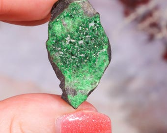
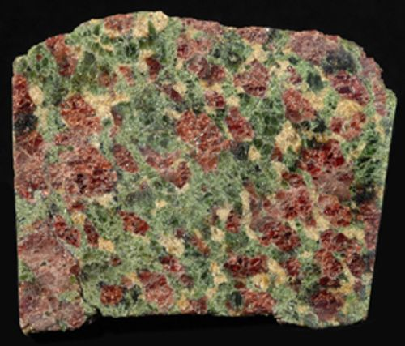
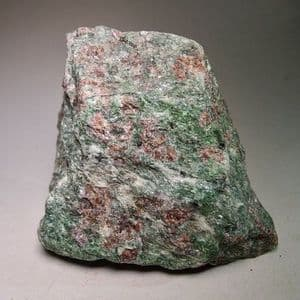
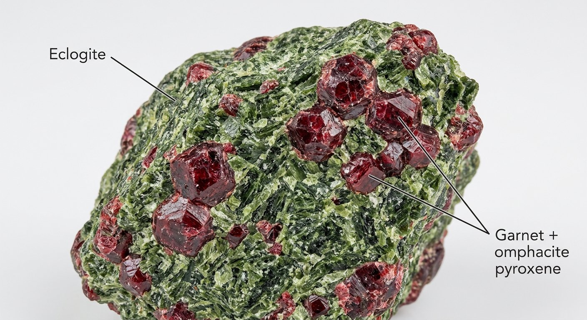
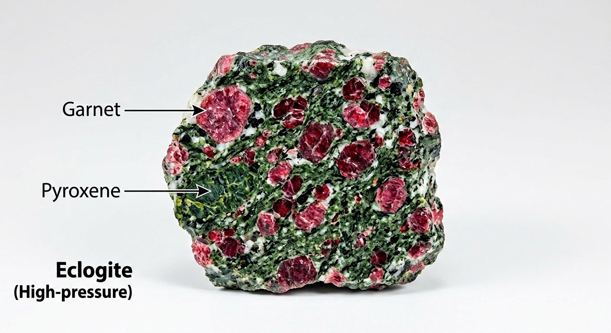

# Eclogite

> **Family:** Metamorphic (eclogite-facies — very high pressure) · **Protolith:** basalt/gabbro subducted to depth
> **Grade:** Very high pressure (and moderate–high temperature) · **Quick ID:** Striking **red garnet (pyrope) + green omphacite**, no plagioclase — a high-pressure signature.

## At a glance

| Property | Value |
|---|---|
| Colour | Striking **red-and-green** (garnet + omphacite) |
| Texture | Medium–coarse, granoblastic, dense |
| Key minerals | **Omphacite** (Na-rich pyroxene) + **pyrope garnet** |
| Plagioclase | **Absent** (converted at high pressure) |
| Facies | Eclogite (very high pressure) |
| In Nigeria | **Not established** — reference high-pressure rock |

## Composition
A **very high-pressure** metamorphic rock — **omphacite** (a Na-rich pyroxene) + **pyrope garnet**, ± kyanite and quartz. **No plagioclase** (it is consumed at high pressure to form omphacite + garnet). The red-and-green colour is unmistakable.

## Protolith & metamorphic grade
Eclogite forms from a **basaltic (mafic) protolith** driven to **very high pressure** (and moderate–high temperature) — typically in a **subduction zone** or deep continental collision, where plagioclase breaks down to form the dense omphacite + garnet assemblage. The **absence of plagioclase** and presence of omphacite + pyrope are the eclogite-facies fingerprint.

## Texture & foliation
Medium- to coarse-grained, **granoblastic**; striking **red garnet + green omphacite**. Usually massive (weakly foliated); very **dense** (high-pressure minerals are compact).

## Diagnostic field features
- **Red-and-green colour** (garnet + omphacite).
- An indicator of **very high pressure** (subduction / ultra-high-pressure) metamorphism.
- Very dense and heavy for its size.
- No plagioclase.

## Identification tests — step by step
1. **Colour:** red garnet + green omphacite — the classic red-and-green look.
2. **Plagioclase:** confirm its **absence** (a high-pressure indicator).
3. **Minerals:** omphacite (green Na-pyroxene) + pyrope (red Mg-garnet).
4. **Density:** unusually dense/heavy for a metamorphic rock.
5. **Context:** high-pressure terrane (subduction/UHP).

## Genesis & setting
Eclogite forms when mafic rock is carried to **great depth** (subduction or deep collision), where extreme pressure transforms plagioclase + pyroxene into the denser **omphacite + garnet**. It is a key indicator of **subduction-zone / ultra-high-pressure** tectonics and of the deep return of crustal material into the mantle.

## Host states / localities
Requires high-pressure conditions **not typical of Nigeria's Basement** (which is mostly amphibolite- to granulite-facies). **Not established in Nigeria** — included for completeness as a reference high-pressure rock (see [Granulite](granulite.md), [Amphibolite](amphibolite.md)).

## Associated minerals & rocks
Garnet (pyrope), omphacite, kyanite, quartz, glaucophane (see [Garnet](../../03-mineral-resources/gemstones/garnet.md), [Kyanite](../../03-mineral-resources/gemstones/kyanite.md)). Associated rocks: blueschist (glaucophane schist), amphibolite, granulite.

## Economic relevance
- An indicator of **high-pressure terranes** (guides tectonic reconstruction).
- **Garnet** can be recovered as an abrasive.
- Eclogites host some deposits elsewhere; mainly of scientific/exploration value.

## Lookalikes & how to distinguish

| Looks like | How to tell it apart |
|---|---|
| **Amphibolite** | Amphibolite has **plagioclase + hornblende**; eclogite has **omphacite + garnet, no plagioclase**. |
| **Garnet rock / skarn** | Skarn is at a granite–carbonate contact; eclogite is a regional high-pressure mafic rock. |
| **Granulite** | Granulite is high-temperature (orthopyroxene); eclogite is high-pressure (omphacite + garnet). |

## Field checklist
- [ ] Red garnet + green omphacite?
- [ ] **No plagioclase**?
- [ ] Very dense/heavy?
- [ ] High-pressure terrane context?
- [ ] Red-and-green colour?

## Field tips
- Red garnet + green omphacite, no plagioclase — a **high-pressure assemblage**.
- The **red-and-green** colour is the fastest field clue.
- Eclogite signals **subduction / ultra-high-pressure** conditions — important for tectonic interpretation.
- In Nigeria, if you find a red-and-green dense rock, check carefully — eclogite would be a notable discovery.

## Facts
- Eclogite forms at **very high pressure** — deep in subduction zones or collision roots.
- It is **denser than the mantle**, so subducted eclogite can sink deep into the Earth.
- The **absence of plagioclase** is the diagnostic high-pressure clue.
- Eclogite is **not established in Nigeria** — the Basement reached granulite, not eclogite, grade.

*Figure II.B.16 — Eclogite (red garnet + green omphacite). Source: [Etsy](https://www.etsy.com/listing/700683534/eclogite-redblackgreen-09-kg-2217-eurokg).*

*Figure II.B.16b — Eclogite (high-pressure metamorphic rock). Source: [All-Geo](https://all-geo.org/metageologist/2011/09/what-you-ought-to-know-about-metamorphism).*

*Figure II.B.16c — Eclogite hand specimen (Norway). Source: [The Rock Gallery](https://www.therockgallery.co.uk/eclogite-hand-specimen---norway-12121-p.asp).*

*Figure II.B.16d — Labeled illustration: eclogite (garnet + omphacite). Original diagram prepared for this guide.*

*Figure II.B.16e — Labeled illustration: eclogite garnet + pyroxene. Original diagram prepared for this guide.*

## Related
- [Granulite](granulite.md) · [Amphibolite](amphibolite.md) · [Garnet](../../03-mineral-resources/gemstones/garnet.md) · [Kyanite](../../03-mineral-resources/gemstones/kyanite.md)
