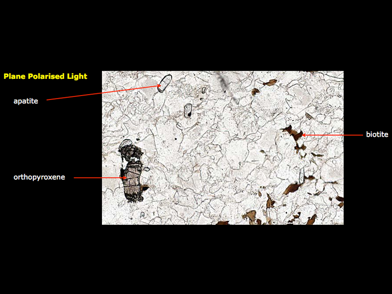
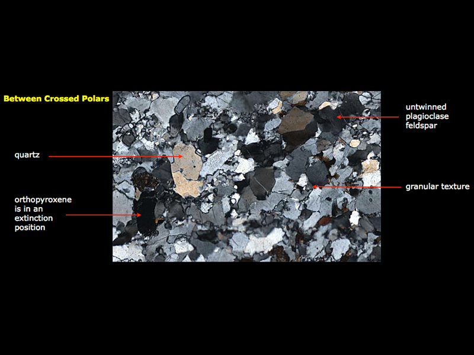
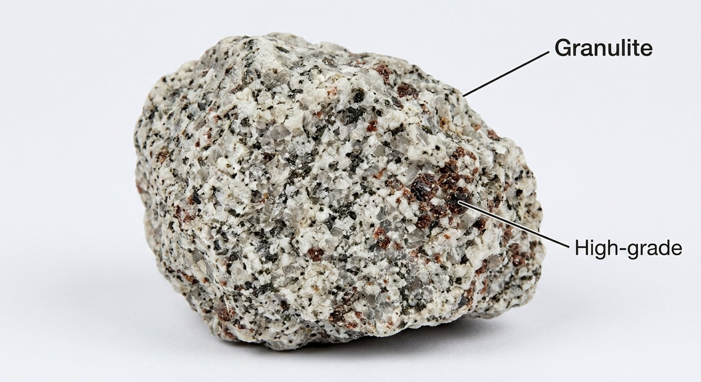
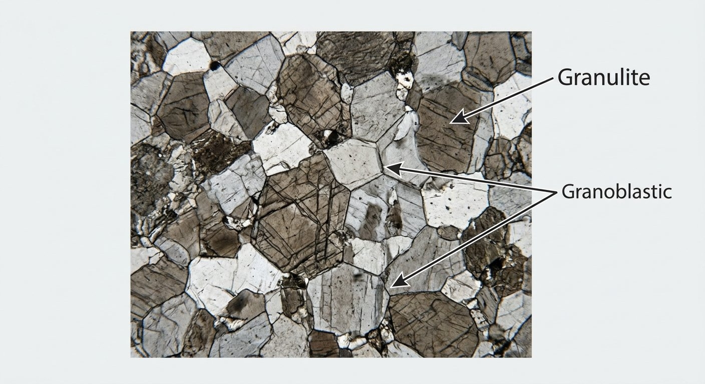

# Granulite

> **Family:** Metamorphic (granulite-facies — very high grade) · **Protolith:** felsic to mafic crustal rock
> **Grade:** Very high temperature (700–900 °C), moderate–high pressure · **Quick ID:** Pyroxene + garnet + quartz/feldspar; high-grade "sugary" look; charnockite is its igneous cousin.

## At a glance

| Property | Value |
|---|---|
| Colour | Grey to dark; pyroxene-rich varieties darker |
| Texture | Granoblastic, medium–coarse, massive (sometimes weakly gneissic) |
| Key minerals | Quartz, feldspar, **pyroxene (orthopyroxene)**, garnet |
| Facies | Granulite (highest T of common metamorphic rocks) |
| Igneous cousin | **Charnockite** (orthopyroxene-bearing granitoid) |
| Setting | High-grade Basement terranes (deep, hot crust) |

## Composition
A **high-grade (granulite-facies)** metamorphic rock — quartz, feldspar, **pyroxene (orthopyroxene / hypersthene)**, and garnet. **Charnockite** is the igneous (orthopyroxene-bearing granitoid) member of this facies. Mafic granulites are pyroxene + plagioclase rich; felsic granulites approach charnockite.

## Protolith & metamorphic grade
Granulites form under the **highest temperatures** of the common metamorphic facies (**~700–900 °C**), typically at moderate-to-high pressure. The dry, hot conditions stabilise **orthopyroxene + quartz** instead of the hydrous minerals (hornblende, biotite) of lower grades. The **orthopyroxene + garnet** assemblage is the diagnostic granulite-facies signature.

## Texture & foliation
**Granoblastic**, medium- to coarse-grained, **massive** (sometimes weakly gneissic). Grains are equant and interlocking with straight boundaries (a sign of recrystallisation under high T).

## Diagnostic field features
- **Pyroxene + garnet + quartz/feldspar**; evidences **high-temperature** metamorphism.
- Darker, pyroxene-rich granulites; **charnockite** is the hypersthene-granite equivalent (see [Charnockite](../igneous/charnockite.md)).
- Sugary, equigranular, high-grade texture.
- No hydrous minerals (little/no hornblende or biotite).

## Identification tests — step by step
1. **Hand lens:** confirm **pyroxene** (blocky, cleavages ~90°) — orthopyroxene/hypersthene in felsic varieties.
2. **Index minerals:** garnet + orthopyroxene = granulite-facies.
3. **Hydrous minerals:** granulites lack abundant hornblende/biotite (dry conditions).
4. **Acid:** no fizz.
5. **Vs charnockite:** charnockite is the felsic, igneous-textured member; granulite is the broader metamorphic facies.

## Genesis & setting
Granulites form in the **deepest, hottest levels** of the continental crust, where temperatures are high enough to drive off water and stabilise anhydrous minerals. They record the roots of ancient mountain belts and are key to reconstructing the tectonic history and depth of the Basement.

## Host states / localities
High-grade Basement terranes — **Kaduna, Plateau, Bauchi**, and other north-central areas. The **Kaduna charnockite massif** is a prime Nigerian example of granulite-facies rocks.

## Associated minerals & rocks
Charnockite, gneiss, migmatite, pyroxene, garnet (see [Banded gneiss](banded-gneiss.md), [Migmatite](migmatite.md)). Accessory zircon, rutile, ilmenite.

## Economic relevance
- **Dimension stone** (charnockite sold as granite).
- Indicator of **deep crustal levels** — guides tectonic reconstruction.
- Can host mineralization; granulite terranes are targets for **rare metals and graphite**.
- Source of heavy minerals (**ilmenite, rutile, zircon, monazite**) in derived sands.

## Lookalikes & how to distinguish

| Looks like | How to tell it apart |
|---|---|
| **Charnockite** | Charnockite is the felsic igneous-textured member; granulite is the broader metamorphic facies (includes mafic varieties). |
| **Gneiss** | Gneiss is strongly banded/foliated; granulite is typically massive (granoblastic). |
| **Amphibolite** | Amphibolite is hornblende-rich (lower grade); granulite is pyroxene-rich (higher grade). |

## Field checklist
- [ ] Pyroxene + garnet + quartz/feldspar?
- [ ] Granoblastic, sugary, high-grade texture?
- [ ] Little/no hydrous minerals (hornblende/biotite)?
- [ ] Deep Basement (high-grade terrane)?
- [ ] No acid fizz?

## Field tips
- Pyroxene + garnet + quartz/feldspar, high grade; closely related to (and transitional with) charnockite.
- The **absence of hornblende/biotite** (dry assemblage) is a key clue to the high grade.
- Granulite terranes mark **deep crustal levels** — useful for reconstructing Basement history.
- Note any **garnet** (a guide to grade and potential heavy-mineral sources).

## Facts
- Granulites form at the **highest temperatures** of the common metamorphic facies.
- The **orthopyroxene + quartz** assemblage is the granulite-facies fingerprint (dry, hot conditions).
- The **Kaduna charnockite massif** is one of Nigeria's best-known granulite-facies bodies.
- Granulites reveal the **roots of ancient mountain belts** — windows into deep crust.

*Figure II.B.15 — Charnockite, a granulite-facies rock. Source: see [Charnockite](../igneous/charnockite.md).*

*Figure II.B.15b — Granulite (myrmekitic granulite/charnockite, thin section). Source: [Virtual Microscope](https://www.virtualmicroscope.org/content/myrmekitic-granulitecharnockite).*

*Figure II.B.15c — Granulite/charnockite (thin section). Source: [Virtual Microscope](https://www.virtualmicroscope.org/content/myrmekitic-granulitecharnockite).*

*Figure II.B.15d — Labeled illustration: granulite high-grade metamorphic rock. Original diagram prepared for this guide.*

*Figure II.B.15e — Labeled illustration: granulite granoblastic texture. Original diagram prepared for this guide.*

## Related
- [Charnockite](../igneous/charnockite.md) · [Banded gneiss](banded-gneiss.md) · [Migmatite](migmatite.md) · [Amphibolite](amphibolite.md)
