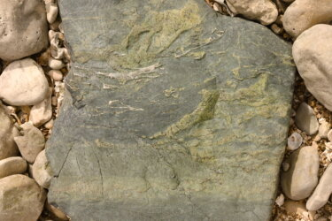
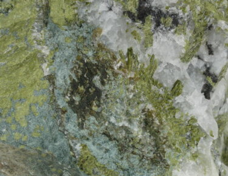
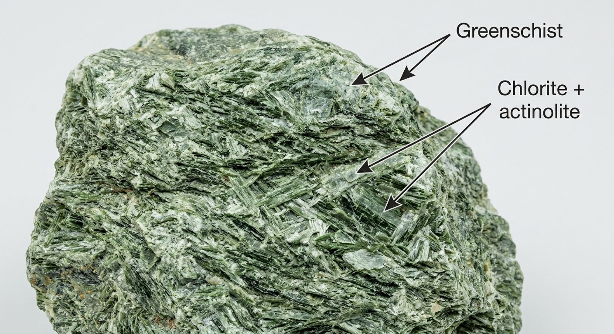
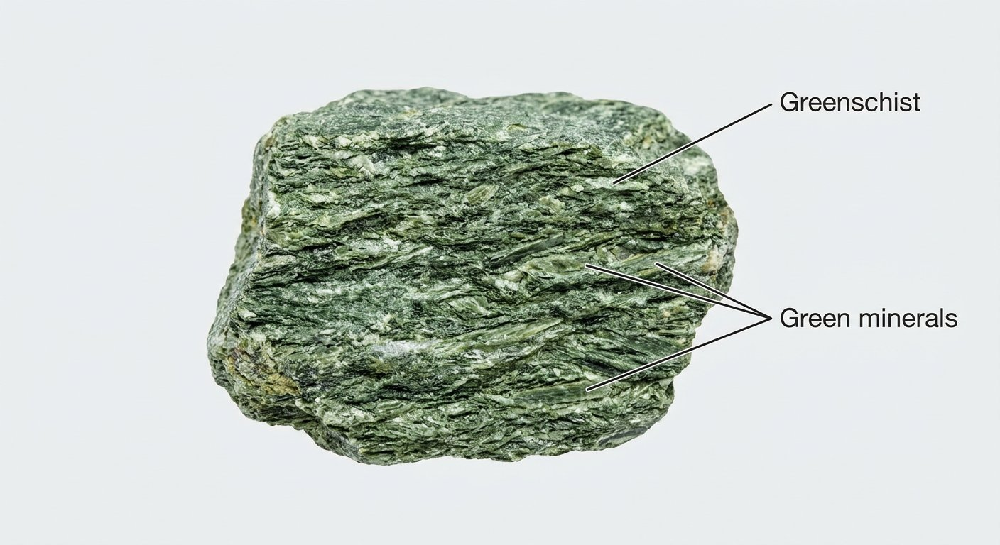

# Greenschist

> **Family:** Metamorphic (greenschist-facies — low grade) · **Protolith:** basalt / mafic volcanic rock
> **Key feature:** Green colour from chlorite + epidote · **Quick ID:** Green, schistose, soft/greasy; lower grade than amphibolite.

## At a glance

| Property | Value |
|---|---|
| Colour | Distinctive **green** (chlorite/epidote) |
| Texture | Schistose (foliated), fine-grained |
| Key minerals | Chlorite, epidote, actinolite, albite, quartz |
| Facies | Greenschist (low grade, ~300–450 °C) |
| Hardness | ~3–4 (softer than amphibolite) |
| Setting | SW Nigeria schist belts |

## Composition
A fine-grained **greenschist-facies** metamorphic rock dominated by **green minerals** — **chlorite, epidote, actinolite** — with albite and quartz. The green colour comes from chlorite and epidote; actinolite (a green amphibole) may be present.

## Protolith & metamorphic grade
Greenschist forms by **low-grade** regional metamorphism of a **mafic (basaltic) protolith** — the original pyroxene/olivine of basalt alter to **chlorite + epidote + actinolite** at relatively low temperature (~300–450 °C). It grades upward into **amphibolite** (with more hornblende) and downward into **zeolite-facies** rocks.

## Texture & foliation
**Schistose** (foliated), fine-grained, green; lower grade than amphibolite. The foliation is defined by aligned chlorite and actinolite; the rock is generally softer and "greasier" than amphibolite.

## Diagnostic field features
- Distinctive **green colour** (chlorite/epidote).
- Schistose foliation; softer and "greasier" than amphibolite.
- Fine-grained; may contain quartz veins.
- The green colour is the fastest field clue.

## Identification tests — step by step
1. **Colour:** distinctly green (chlorite/epidote) — the key clue.
2. **Hand lens:** fine chlorite/epidote; actinolite needles possible.
3. **Hardness:** soft (~3–4), softer than amphibolite or basalt.
4. **Foliation:** schistose, splits along green mineral alignment.
5. **Vs greenstone:** greenschist is metamorphic (foliated); greenstone is a field term for altered mafic rock.

## Genesis & setting
Greenschists form by **low-grade regional metamorphism of basalt** — common in the lower-grade parts of the schist belts, where mafic volcanic layers were metamorphosed. In Nigeria they occur in the **southwest schist belts**, the country's main gold provinces.

## Host states / localities
The SW Nigeria **schist belts** — **Osun, Oyo, Kwara, Kogi, Niger** — and other low-grade Basement areas (see [Mica schist & Phyllite](mica-schist-phyllite.md)).

## Associated minerals & rocks
Mica schist, quartzite, amphibolite; **gold** and base metals in quartz veins. Associated rocks: talc/chlorite schist, banded gneiss.

## Economic relevance
The **host rock of much of Nigeria's lode gold** and associated base-metal mineralization (see [Gold](../../03-mineral-resources/metallic/gold.md)). Its quartz veins are the prime gold targets.

## Lookalikes & how to distinguish

| Looks like | How to tell it apart |
|---|---|
| **Amphibolite** | Amphibolite is darker, hornblende-rich, higher grade; greenschist is green, chlorite/epidote-rich, softer. |
| **Mica schist** | Mica schist is silvery/brown (mica); greenschist is green (chlorite/epidote). |
| **Talc/chlorite schist** | Talc-rich varieties are much softer (soapy, hardness 1); greenschist is only moderately soft. |
| **Greenstone** | Greenstone is altered (not strongly foliated) mafic rock; greenschist is metamorphic (foliated). |

## Field checklist
- [ ] Distinctly green (chlorite/epidote)?
- [ ] Schistose foliation?
- [ ] Soft/greasy (softer than amphibolite)?
- [ ] Mafic setting in a schist belt?
- [ ] Quartz veins (gold hosts)?

## Field tips
- Green minerals + foliation; grades into mica schist (with more mica) and amphibolite (with more hornblende).
- In the schist belts, **follow quartz veins** in greenschist — they host the gold.
- The green colour is your fastest field identification.
- Greenschist marks the **lower-grade, mafic** part of the metamorphic sequence.

## Facts
- Greenschist is named for its abundant **green minerals** (chlorite, epidote, actinolite).
- It is the **low-grade** metamorphic product of basalt.
- Much of Nigeria's **lode gold** is hosted in greenschist-facies rocks of the schist belts.
- Greenschist grades continuously into **amphibolite** as grade (temperature) increases.

*Figure II.B.9 — Greenschist-facies schist (green minerals along foliation). Source: see [Mica schist & Phyllite](mica-schist-phyllite.md).*

*Figure II.B.9b — Greenschist-facies greenstone. Source: [Sandatlas](https://sandatlas.org/greenstone/).*

*Figure II.B.9c — Greenschist-facies metamorphic rock. Source: [Sandatlas](https://sandatlas.org/greenstone/).*

*Figure II.B.9d — Labeled illustration: greenschist (chlorite + actinolite). Original diagram prepared for this guide.*

*Figure II.B.9e — Labeled illustration: greenschist foliated green texture. Original diagram prepared for this guide.*

## Related
- [Mica schist & Phyllite](mica-schist-phyllite.md) · [Amphibolite](amphibolite.md) · [Quartzite & Quartz schist](quartzite-quartz-schist.md) · [Gold](../../03-mineral-resources/metallic/gold.md)
