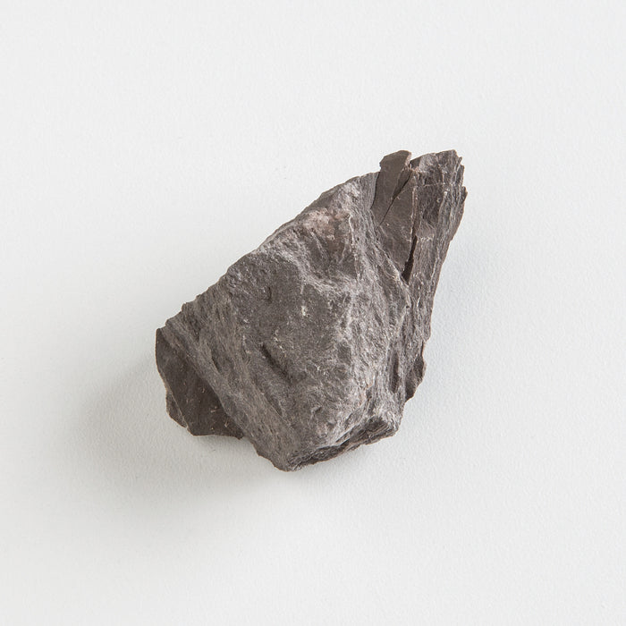

# Hornfels

> **Family:** Metamorphic (contact / thermal) · **Protolith:** shale or other argillaceous rock
> **Key process:** "Baking" beside a hot intrusion · **Quick ID:** Very hard, dark, fine, massive, **no foliation**; splintery "horny" fracture; in a contact aureole.

## At a glance

| Property | Value |
|---|---|
| Colour | Dark grey/black/brown |
| Texture | Massive, fine-grained, hard |
| Fracture | "Horny" / splintery to conchoidal |
| Foliation | **None** (unlike schist/gneiss) |
| Key minerals | Cordierite, andalusite, biotite, quartz |
| Setting | Contact aureole around granite intrusions |

## Composition
A **contact-metamorphic** rock — the fine-grained, hard product of "baking" shale or other argillaceous rock beside a hot intrusion. Minerals include **cordierite, andalusite, biotite, and quartz**. **Spotted hornfels** shows small cordierite/andalusite porphyroblasts.

## Protolith & metamorphic grade
Hornfels forms by **contact (thermal) metamorphism** — a shale/mudstone is baked by the heat of a nearby magma intrusion, at **low pressure but elevated temperature**, recrystallising clay minerals into cordierite, andalusite, and biotite. It is a **low-pressure** (hornfels-facies) rock, in contrast to the regionally metamorphosed schists.

## Texture & foliation
**Massive, fine-grained, hard**, with a "horny" (splintery) fracture; **no foliation** (contact metamorphism lacks the directed pressure that makes schistosity). The lack of foliation distinguishes hornfels from all foliated metamorphic rocks.

## Diagnostic field features
- Very hard, dark, fine, massive.
- Occurs in the **contact aureole** around granites.
- **"Spotted hornfels"** shows small cordierite/andalusite porphyroblasts.
- Breaks with a **splintery/conchoidal fracture**, not along foliation.

## Identification tests — step by step
1. **Foliation:** hornfels has **none** — it does not split along planes (unlike schist/slate).
2. **Hardness/fracture:** hard, breaks with a splintery/conchoidal fracture.
3. **Texture:** fine, massive, "horny."
4. **Porphyroblasts:** look for spots of cordierite/andalusite (spotted hornfels).
5. **Context:** is it in the **contact aureole** of a granite? (the key setting clue).

## Genesis & setting
Hornfels forms where a magma intrusion **bakes** the surrounding country rock, recrystallising it without the directed pressure that causes foliation. It is a classic **contact-metamorphic** rock, found in the **aureole** (baked zone) immediately around intrusions — a guide to the intrusion's margin and any associated skarn mineralisation.

## Host states / localities
Around granite intrusions nationwide — the Basement and margins of Older/Younger Granites. Hornfels aureoles rim many Nigerian granite plutons.

## Associated minerals & rocks
Granite, skarn, marble (in the contact zone) (see [Skarn](skarn.md), [Marble & Calc-silicate](marble-calc-silicate.md)). Where the baked rock was carbonate, it becomes marble or skarn; where shale, hornfels.

## Economic relevance
- An indicator of the **contact zone** (which may host skarn mineralization — Fe, W, Cu, Au).
- Occasionally used as **dimension stone** (it is hard and takes a polish).
- **Andalusite** (in hornfels) is a **refractory** mineral of industrial value where abundant.

## Lookalikes & how to distinguish

| Looks like | How to tell it apart |
|---|---|
| **Schist / slate** | Those are **foliated** (split along planes); hornfels is massive with no foliation. |
| **Basalt** | Basalt is igneous (a lava); hornfels is baked sedimentary in a contact aureole. |
| **Chert** | Chert is very hard and massive but usually lighter and glassy; hornfels is darker and spotted. |

## Field checklist
- [ ] Hard, fine, massive?
- [ ] **No foliation** (doesn't split along planes)?
- [ ] Splintery/conchoidal fracture?
- [ ] Spotted porphyroblasts (cordierite/andalusite)?
- [ ] In a granite contact aureole?

## Field tips
- Hard, massive, dark, fine; in a contact aureole; breaks with a **splintery/conchoidal fracture** rather than splitting along foliation.
- The **absence of foliation** is the single best way to tell hornfels from schist/slate.
- Hornfels marks the **contact aureole** — look nearby for **skarn** and possible mineralisation.
- Spotted hornfels (with cordierite/andalusite spots) indicates the hottest part of the aureole.

## Facts
- "Hornfels" means "hornstone" in German — a nod to its hard, horny toughness.
- It is a **contact-metamorphic** rock, baked by intrusion heat (no foliation).
- **Spotted hornfels** gets its spots from cordierite/andalusite porphyroblasts.
- Hornfels aureoles map the **margins of granite plutons** and their skarn potential.

*Figure II.B.12 — Hornfels (contact-metamorphic rock). Source: [Eisco Labs](http://www.eiscolabs.com/products/esng0056pk12).*

## Related
- [Skarn](skarn.md) · [Granite](../igneous/granite.md) · [Metasediments](metasediments.md) · [Marble & Calc-silicate](marble-calc-silicate.md)
