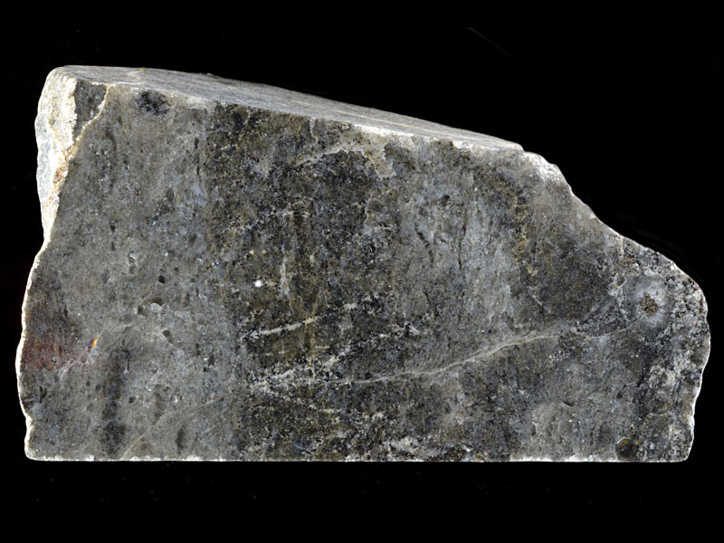
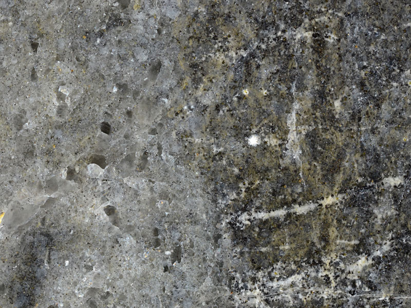
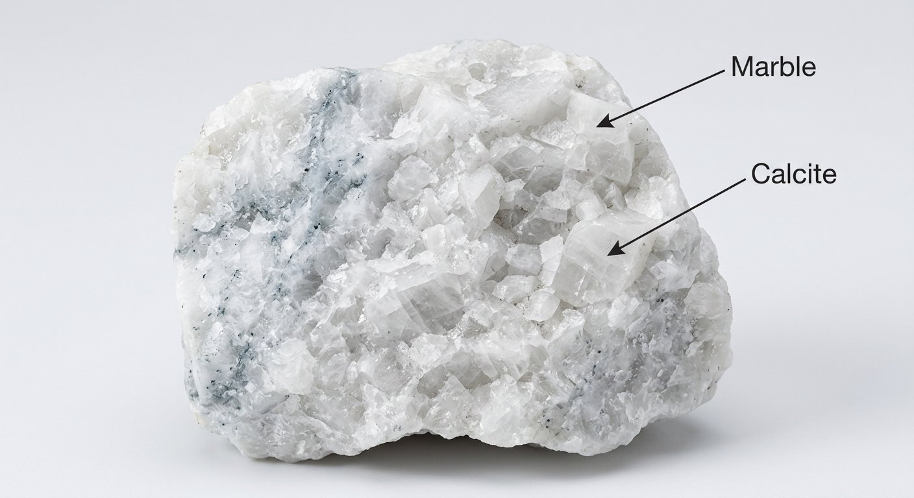
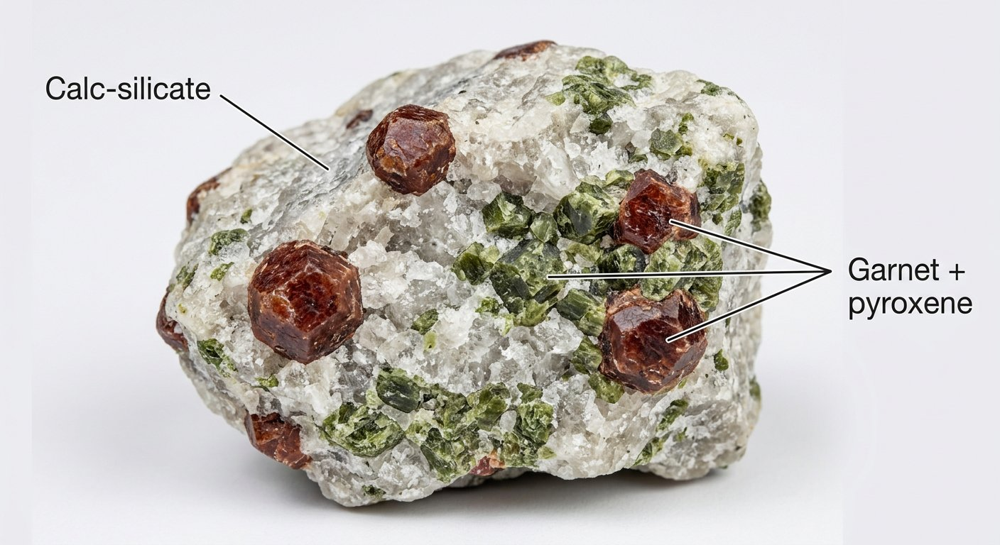

# Marble & Calc-Silicate Rock

> **Family:** Metamorphic · **Protolith:** limestone/dolomite
> **Key feature:** Fizzes with acid + soft + crystalline · **Quick ID:** Acid fizz + knife-scratchable + crystalline = marble; calc-silicate adds garnet/pyroxene.

## At a glance

| Property | Value |
|---|---|
| Colour | White, grey, pink, or green |
| Acid test | **Fizzes vigorously** (calcite/dolomite) |
| Hardness | ~3 (soft — scratched by a knife) |
| Texture | Crystalline, interlocking, often banded/veined |
| Composition | Recrystallized calcite/dolomite |
| Setting | Metamorphosed limestone lenses in Basement |

## Composition
- **Marble:** recrystallized **calcite** and/or **dolomite**.
- **Calc-silicate rock:** marble rich in silicate minerals — **garnet (grossular), diopside, wollastonite, quartz, talc** — formed where impurities (clay/silica) in the limestone reacted during metamorphism.

Chemically marble is **CaCO₃ / CaMg(CO₃)₂**; calc-silicate varieties add Ca-silicates.

## Protolith & metamorphic grade
Marble is **metamorphosed limestone or dolomite** — heat and pressure recrystallise the calcite into interlocking crystals, destroying any original fossils. **Calc-silicate rocks** form where the limestone contained silica/clay impurities, producing silicate minerals like **wollastonite, diopside, and grossular garnet** — these indicate the **contact/regional metamorphic grade**.

## Texture & foliation
**Crystalline, interlocking** calcite grains — often coarse and sugary; commonly **banded/veined** with colored impurities. Calc-silicate varieties have visible garnet/pyroxene crystals. Marble lacks the foliation of schist (it is a **granoblastic** carbonate).

## Diagnostic field features
- **Fizzes vigorously with dilute hydrochloric acid** (calcite/dolomite).
- **Soft** — easily scratched by a steel knife (hardness ~3).
- Can be carved/polished; may be white, grey, pink, or green.
- Calc-silicate: visible **garnet/pyroxene** crystals in a carbonate matrix.

## Identification tests — step by step
1. **Acid:** fizzes vigorously with dilute HCl (carbonate).
2. **Hardness:** soft — a knife scratches it easily (unlike quartzite).
3. **Crystals:** interlocking, sugary calcite crystals (vs chalky limestone).
4. **Silicates:** look for garnet (grossular), diopside, wollastonite (calc-silicate).
5. **Vs quartzite:** quartzite doesn't fizz and is much harder.

## Genesis & setting
Marble forms where limestone/dolomite is **metamorphosed** — by regional heat/pressure or by the heat of a nearby granite intrusion (**contact metamorphism**). Where the carbonate meets intruding magma, it can also form **skarn** (calc-silicate) with ore minerals.

## Host states / localities
Classic Nigerian marbles:
- **Igbeti** (Oyo) — world-renowned for pure white marble.
- **Jakura** (Kogi).
- **Mega / Mure** (Kwara).
- Plus limestone lenses in the Basement.

## Associated minerals & rocks
Garnet, diopside, wollastonite, quartz, talc, graphite. Associated rocks: skarn, hornfels, quartzite, limestone (protolith).

## Economic relevance
- **Cement and lime** (calcium carbonate).
- **Ornamental/dimension stone** — tiles, sculpture, countertops (Igbeti marble is a major resource).
- **Wollastonite and garnet** as industrial minerals.

## Lookalikes & how to distinguish

| Looks like | How to tell it apart |
|---|---|
| **Quartzite** | Quartzite doesn't fizz and is much harder; marble fizzes and is soft. |
| **Limestone** | Limestone is the sedimentary parent (may have fossils); marble is recrystallised. |
| **Skarn / calc-silicate** | Skarn is coarser, with abundant garnet/pyroxene/ore minerals at a granite contact. |

## Field checklist
- [ ] Fizzes vigorously with acid?
- [ ] Soft (knife-scratchable)?
- [ ] Crystalline/sugary (not chalky)?
- [ ] White/grey/pink/green?
- [ ] Garnet/pyroxene (calc-silicate)?

## Field tips
- **Acid fizz + soft (knife-scratchable) + crystalline** = marble.
- **Marble vs. quartzite:** quartzite doesn't fizz and is much harder.
- Green/pink marbles often owe their colour to **grossular garnet or diopside**.
- Near granite contacts, watch for marble grading into **skarn** (a mineralised zone).

## Facts
- **Igbeti (Oyo State)** marble is among the purest and most famous in Nigeria.
- Marble is **metamorphosed limestone** — same mineral (calcite), recrystallised.
- The **Taj Mahal** is faced in white marble.
- Marble fizzes in acid because it is **calcium carbonate** — a quick, definitive test.

*Figure II.B.6 — White marble: recrystallized calcite. Source: [eiscolabs.com](https://www.eiscolabs.com/products/esng0058).*

*Figure II.B.6b — Calc-silicate rock (skarn). Source: [Virtual Microscope](https://www.virtualmicroscope.org/content/calc-silicate-skarn).*

*Figure II.B.6c — Calc-silicate rock. Source: [Virtual Microscope](https://www.virtualmicroscope.org/content/calc-silicate-skarn).*

*Figure II.B.6d — Labeled illustration: marble crystalline calcite rock. Original diagram prepared for this guide.*

*Figure II.B.6e — Labeled illustration: calc-silicate (garnet + pyroxene). Original diagram prepared for this guide.*

## Related
- [Quartzite & Quartz schist](quartzite-quartz-schist.md) · [Skarn](skarn.md) · [Limestone & Dolomite](../sedimentary/limestone.md) (parent rock) · [Marble (industrial)](../../03-mineral-resources/industrial/marble.md)
