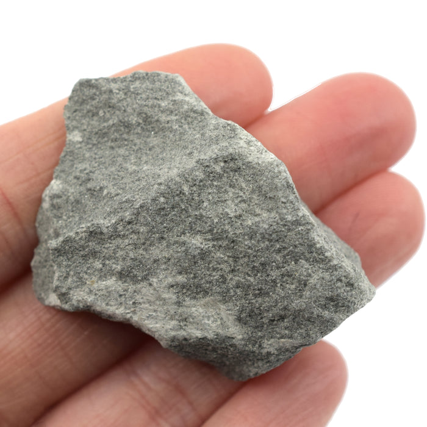
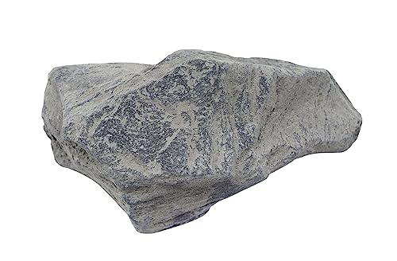
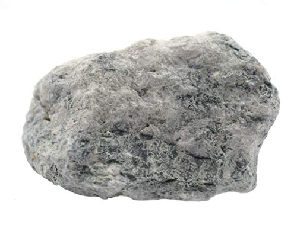

# Metasediments (Metagreywacke, Metaconglomerate)

> **Family:** Metamorphic · **Protolith:** sedimentary rocks (greywacke / conglomerate)
> **Key feature:** Clastic (fragmented) texture + metamorphic foliation · **Quick ID:** Rounded pebbles → metaconglomerate; angular gritty fragments → metagreywacke.

## At a glance

| Property | Metagreywacke | Metaconglomerate |
|---|---|---|
| Protolith | Greywacke (gritty sandstone) | Conglomerate (pebbly) |
| Texture | Gritty, poorly sorted | **Rounded pebbles** in a matrix |
| Foliation | Present (recrystallised) | Present; may stretch pebbles |
| Key clue | Angular rock fragments in dark matrix | Visible rounded pebbles (chert, quartz) |
| Setting | Schist belts, Benue margins | Schist belts |

## Composition
- **Metagreywacke:** metamorphosed **greywacke** — a gritty sandstone with rock fragments in a fine matrix; now recrystallised and often foliated.
- **Metaconglomerate:** metamorphosed **conglomerate** — rounded **pebbles** in a finer matrix, often flattened/stretched by pressure.

Recrystallised minerals: quartz, mica, and (in conglomerates) deformed pebbles of chert/quartz.

## Protolith & metamorphic grade
Metasediments are **metamorphosed sedimentary rocks**. Greywacke (a poorly sorted, gritty sandstone) recrystallises to metagreywacke; conglomerate (rounded pebbles) to metaconglomerate. Metamorphism adds **foliation** and recrystallised mica/quartz; grade is typically low-to-medium in the schist belts.

## Texture & foliation
Greywacke: gritty, poorly sorted. Conglomerate: **rounded clasts (pebbles)** in a matrix. When metamorphosed, both gain **foliation** and recrystallised minerals (quartz, mica). Intense deformation can **stretch/flatten pebbles** into ellipsoids.

## Diagnostic field features
- **Conglomerate/metaconglomerate:** visible rounded **pebbles** (chert, quartz).
- **Greywacke/metagreywacke:** gritty, angular rock fragments in a dark matrix.
- Foliation may flatten/stretch the pebbles.
- Poorly sorted — grains of many sizes mixed together.

## Identification tests — step by step
1. **Clast size:** pebbles (>2 mm, rounded) → conglomerate; sand/grit → greywacke.
2. **Clast shape:** rounded (conglomerate) vs angular/gritty (greywacke).
3. **Foliation:** metamorphic foliation + recrystallised mica indicate metasediment.
4. **Sorting:** greywacke is characteristically **poorly sorted** (mixed grain sizes).
5. **Vs sandstone:** sandstone is sedimentary (no foliation); metagreywacke is foliated/recrystallised.

## Genesis & setting
These are sedimentary rocks (conglomerate, greywacke) that were buried and metamorphosed, gaining foliation and recrystallised minerals. In Nigeria they occur in and around the **schist belts** and along the margins of sedimentary basins — recording both ancient Basement sedimentation and later metamorphism.

## Host states / localities
Common in and around the **schist belts**: **Osun (Ilesa–Ife), Oyo, Kwara (Egbe–Isanlu), Edo (Igarra), Niger**, and along the Benue margins.

## Associated minerals & rocks
**Gold** (in associated quartz veins), quartz, mica; sometimes **kyanite**. Associated rocks: mica schist, quartzite, greywacke (sedimentary parent).

## Economic relevance
- **Aggregate** and construction fill.
- **Gold host** in the schist belts (watch for quartz veins and alteration).
- Indicator of the **sedimentary component** of the Basement sequence.

## Lookalikes & how to distinguish

| Looks like | How to tell it apart |
|---|---|
| **Sandstone** | Sandstone is sedimentary (no foliation, loose grains); metagreywacke is foliated/recrystallised. |
| **Conglomerate** | Conglomerate is sedimentary (rounded pebbles, no foliation); metaconglomerate is foliated. |
| **Quartzite** | Quartzite is nearly pure fused quartz; metagreywacke has a gritty, poorly-sorted fragment texture. |

## Field checklist
- [ ] Rounded pebbles (conglomerate) or gritty fragments (greywacke)?
- [ ] Clasts rounded vs angular?
- [ ] Foliation / recrystallised mica (metamorphic)?
- [ ] Poorly sorted (greywacke)?
- [ ] Quartz veins nearby (gold)?

## Field tips
- **Rounded pebbles** → conglomerate (metaconglomerate).
- **Angular gritty fragments** in a dark matrix → greywacke (metagreywacke).
- Foliation + recrystallisation indicate metamorphism.
- In the schist belts, metasediments with **quartz veins** are worth checking for gold.

## Facts
- **Metagreywacke** is metamorphosed greywacke — a gritty, poorly sorted sandstone.
- **Greywacke** is characteristically **dark and poorly sorted** (many grain sizes mixed).
- Intense deformation can **stretch conglomerate pebbles** into ellipsoids (a strain indicator).
- Metasediments record the **sedimentary layer** of the Basement, later metamorphosed.

*Figure II.B.8 — Greywacke: gritty, poorly sorted sandstone with rock fragments. Source: [eiscolabs.com](http://www.eiscolabs.com/products/eisco-greywacke-specimen-3cm-in-size).*

*Figure II.B.8b — Metasediment: slate. Source: [Amazon](https://www.amazon.com/Raw-Slate-Metamorphic-Rock-Specimen/dp/B0CC3K8NXT).*

*Figure II.B.8c — Metasediment: green slate. Source: [Amazon](https://www.amazon.com/Green-Slate-Metamorphic-Rock-Specimen/dp/B084JBTVDG).*

## Related
- [Mica schist & Phyllite](mica-schist-phyllite.md) · [Quartzite & Quartz schist](quartzite-quartz-schist.md) · [Conglomerate & Breccia](../sedimentary/conglomerate-breccia.md) · [Greywacke](../sedimentary/greywacke.md)
