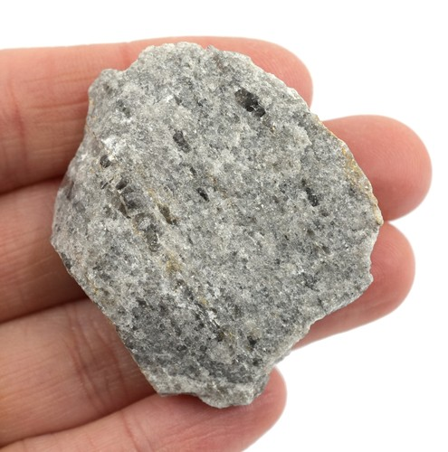
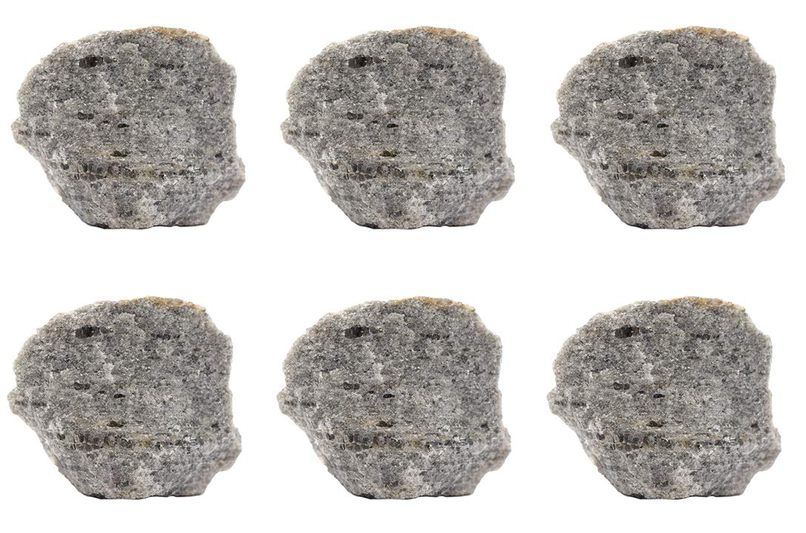
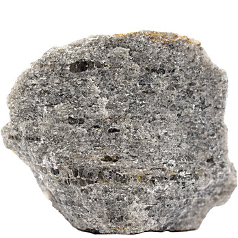

# Mica Schist & Phyllite

> **Family:** Metamorphic (low-to-medium grade) · **Protolith:** shale/mudstone or felsic volcanic rock
> **Key feature:** Strong mica foliation — splits into shiny sheets · **Quick ID:** Shiny mica flakes aligned along foliation; splits into thin sheets; garnet common.

## At a glance

| Property | Value |
|---|---|
| Colour | Silvery/grey/brown (mica sheen); phyllite darker with sheen |
| Texture | Strongly foliated; splits into sheets |
| Key minerals | Mica (biotite ± muscovite), quartz, feldspar |
| Index minerals | Garnet, kyanite, staurolite, graphite |
| Variety | **Phyllite** — lower grade, silky sheen |
| Setting | The schist belts — Nigeria's gold ground |

## Composition
Abundant **mica** (biotite and/or muscovite) with quartz and feldspar; ± **garnet, kyanite, staurolite, graphite**. **Phyllite** is a lower-grade, finer cousin with a **silky sheen** (between slate and schist in grade). Schists grade upward into **gneiss** and downward into **slate**.

## Protolith & metamorphic grade
Mica schist forms from a **shale/mudstone or felsic volcanic protolith** under **low-to-medium-grade** (greenschist- to amphibolite-facies) metamorphism. **Index minerals** record grade: chlorite (low) → biotite → garnet → staurolite → kyanite → sillimanite (high). Finding **garnet or kyanite** flags higher grade.

## Texture & foliation
**Strongly foliated** — splits easily along shiny mica-rich planes. **Phyllite** has a **wrinkled, silky/glossy** surface (finer mica than schist). The foliation is the dominant feature and gives schist its sheet-splitting character.

## Diagnostic field features
- **Flakes/splinters of shiny mica**; the rock splits into thin sheets.
- **Garnet** porphyroblasts (small pink/red crystals) are common.
- **Phyllite:** silky sheen, slightly crinkled foliation.
- Quartz veins commonly cut across the foliation.

## Identification tests — step by step
1. **Folia­tion:** does it split into thin sheets along shiny mica planes?
2. **Mica:** shiny flakes of biotite/muscovite visible (schist) vs fine silky sheen (phyllite).
3. **Porphyroblasts:** look for garnet (pink/red) or staurolite.
4. **Quartz veins:** note any quartz veins — these host the gold.
5. **Vs slate:** schist has visible coarse shiny mica; slate is dull and very fine.

## Genesis & setting
Mica schists and phyllites form by **regional metamorphism** of mud-rich rocks — heat and directed pressure recrystallise clay minerals into aligned mica, producing foliation. In Nigeria they form the **schist belts**, the ancient, gold-bearing metasedimentary belts of the Basement.

## Host states / localities
The **schist belts** — Nigeria's main **gold** ground:
- **Ilesa–Ife / Ilesha** (Osun, Oyo)
- **Egbe–Isanlu** (Kogi, Kwara)
- **Igarra** (Edo)
- **Maru / Anka** (Zamfara, Katsina, Kebbi)

## Associated minerals & rocks
**GOLD** (in quartz veins), garnet, kyanite, staurolite, columbite, graphite. Associated rocks: quartzite, amphibolite, greenschist, talc/chlorite schist.

## Economic relevance
- **GOLD** — the schist belts are the prime hard-rock gold targets in Nigeria.
- **Ornamental/dimension stone**; source of **mica**.
- **Kyanite/graphite** locally.
- Source of industrial **quartz** from associated veins.

## Lookalikes & how to distinguish

| Looks like | How to tell it apart |
|---|---|
| **Phyllite** | Phyllite has a fine **silky sheen** and lower grade; schist has coarse shiny mica and may have garnet. |
| **Slate** | Slate is dull, very fine, splits into thin flat sheets; schist has visible shiny mica. |
| **Gneiss** | Gneiss has coarse light/dark banding; schist is uniformly mica-foliated. |
| **Greenschist** | Greenschist is green (chlorite/epidote); mica schist is silvery/brown. |

## Field checklist
- [ ] Splits along shiny mica foliation?
- [ ] Visible mica flakes (schist) or silky sheen (phyllite)?
- [ ] Garnet/kyanite/staurolite porphyroblasts?
- [ ] Quartz veins present (gold hosts)?
- [ ] In a schist belt?

## Field tips
- **Splits along shiny mica foliation** = schist/phyllite.
- **Garnet crystals** are a strong hint (and often accompany gold).
- **Follow quartz veins** within the schist — that's where gold concentrates.
- Note foliation orientation — it guides where to look for vein/structural traps.

## Facts
- Nigeria's **schist belts** are the country's principal hard-rock **gold** provinces.
- **Garnet–staurolite–kyanite** assemblages mark the higher-grade (amphibolite-facies) schists.
- **Graphite** occurs in some schists (from original organic matter).
- Schistosity (schist foliation) is so strong the rock can be split into roofing-like flakes.

*Figure II.B.4 — Mica schist: shiny mica flakes aligned along foliation. Source: [eBay (Eisco Labs)](https://www.ebay.com/shop/mica-schist?_nkw=mica+schist).*

*Figure II.B.4b — Mica schist. Source: [Amazon](https://amazon.com/Mica-Schist-Metamorphic-Rock-Specimens/dp/B083TCSKST).*

*Figure II.B.4c — Mica schist specimen. Source: [Thomas Sci](https://www.thomassci.com/p/mica-schist-raw-metamorphic-rock-specimens-approx-1-inch-pk12).*

## Related
- [Quartzite & Quartz schist](quartzite-quartz-schist.md) · [Banded gneiss](banded-gneiss.md) · [Greenschist](greenschist.md) · **Part III** — [gold](../../03-mineral-resources/metallic/gold.md). **Part IV, §4.2** — the schist belts.
