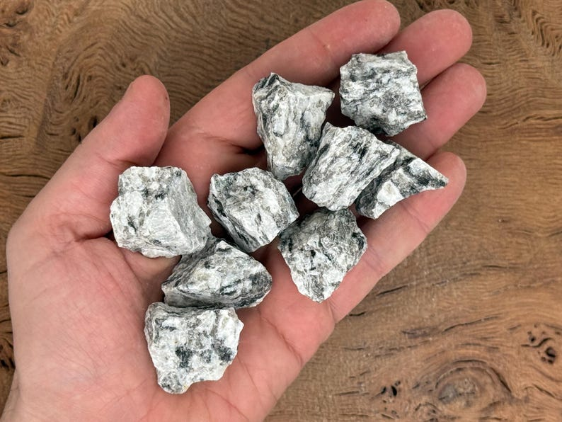

# Migmatite

> **Family:** Metamorphic (high-grade) · **Origin:** partially melted rock

## Composition
A **mixed rock**: pale, granitic **leucosome** (melted/re crystallized silica-rich
material) swirled through a dark **melanosome** (dark, mafic residue). Typical
minerals: quartz, feldspar, biotite, garnet, sillimanite.

## Texture
**Banded to streaky**, often complexly folded — the light and dark components are
interleaved. Can resemble a "marble cake."

## Diagnostic field features
- **Interbanded light (granitic) and dark (mafic) layers**, often tightly folded.
- The light part looks like granite; the dark part like schist/gneiss.
- Sometimes contains **augen** (eye-shaped feldspar).

## Host states / localities
Common in the **core of the Basement Complex**: **Plateau, Kaduna, Oyo, Kwara,
Niger, Kogi, Nasarawa, FCT**, and elsewhere.

## Associated minerals
Garnet, sillimanite, cordierite, kyanite; quartz and feldspar (industrial).

## Economic relevance
- **Dimension stone and aggregate**.
- Source of **quartz, feldspar**.
- Migmatite terranes can host **rare-metal pegmatites** and some **gold**.

## Identification notes
- **Light + dark swirling bands** = migmatite.
- Distinguished from gneiss by the **granitic (leucosome) veins** looking like
  intruded/partial-melt material rather than simple mineral banding.

*Figure II.B.1 — Migmatite: pale granitic leucosome folded through dark melanosome. Source: [Etsy](https://www.etsy.com/in-en/listing/4304285418/migmatite-rough-stone-migmatite-rock).*

## Related
- [Banded gneiss](banded-gneiss.md) · [Charnockite](../igneous/charnockite.md) · [The three rock families](../../00-fundamentals/00-04-three-rock-families.md)
