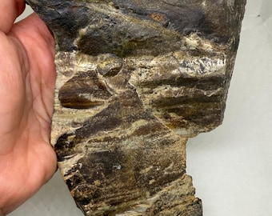

# Migmatite

> **Family:** Metamorphic (high-grade / anatexis) · **Key process:** partial melting
> **Index minerals:** Garnet, sillimanite, cordierite, kyanite · **Grade:** Ultra-high (highest-temperature Basement rocks)
> **Quick ID:** Interbanded pale granitic **leucosome** swirled through dark **melanosome**, often tightly folded — a "marble-cake" rock.

## At a glance

| Property | Value |
|---|---|
| Colour | Mixed — pale granitic bands + dark mafic bands |
| Texture | Banded to streaky, often complexly folded |
| Components | Leucosome (pale melt) + melanosome (dark residue) + mesosome |
| Grade | High-grade (partial melting / anatexis) |
| Key minerals | Quartz, feldspar, biotite, garnet, sillimanite |
| Setting | Deep core of high-grade Basement terranes |

## Composition
A **mixed rock** recording partial melting:
- **Leucosome** — pale, granitic, silica-rich melt (quartz + feldspar) that segregated into veins.
- **Melanosome** — dark, mafic residue left after melting (biotite, garnet, hornblende).
- **Mesosome** — the intermediate, un-melted parent material.

Typical minerals: **quartz, feldspar, biotite, garnet, sillimanite**; index minerals of high grade (**garnet, sillimanite, cordierite, kyanite**).

## Protolith & metamorphic grade
Migmatites form by **anatexis** — partial melting of a granitic-to-sedimentary protolith at **very high temperature** (typically 650–750+ °C) and pressure, deep in the crust. The presence of **sillimanite** (over kyanite) signals the highest temperatures reached in the Nigerian Basement.

## Texture & foliation
**Banded to streaky**, often complexly folded — light and dark components interleaved. The leucosome forms irregular, folded **veins and pods** within the melanosome, giving the classic "**marble cake**" appearance. Can also contain **augen** (eye-shaped feldspar).

## Diagnostic field features
- **Interbanded light (granitic) and dark (mafic) layers**, often tightly folded.
- The light part looks like **granite**; the dark part like **schist/gneiss**.
- Sometimes contains **augen** (eye-shaped feldspar).
- The pale leucosome looks like it was **injected/melted in**, not simply banded.

## Identification tests — step by step
1. **Look for two components:** pale granitic material (leucosome) + dark mafic material (melanosome).
2. **Leucosome character:** is the pale part coarse and granitic (melted), like a vein?
3. **Folding:** are the bands intricately folded/streaky (not flat)?
4. **Index minerals:** look for garnet/sillimanite (high grade).
5. **Context:** occurs in the deep, high-grade core of the Basement.

## Genesis & setting
Migmatites record the transition from **high-grade metamorphism to melting** — as temperature rises, the lowest-melting (silica-rich) fraction of the rock partially melts to form the pale **leucosome**, leaving a dark **melanosome** residue. They mark the **deepest, hottest levels** of the crust and are the bridge between metamorphic rocks and granite magma.

## Host states / localities
Common in the **core of the Basement Complex**: **Plateau, Kaduna, Oyo, Kwara, Niger, Kogi, Nasarawa, FCT**, and elsewhere. Migmatite–gneiss is the dominant rock of the Nigerian Basement core.

## Associated minerals & rocks
Garnet, sillimanite, cordierite, kyanite; quartz and feldspar (industrial). Associated rocks: banded gneiss, charnockite, granite.

## Economic relevance
- **Dimension stone and aggregate.**
- Source of **quartz, feldspar**.
- Migmatite terranes can host **rare-metal pegmatites** and some **gold**.
- Source of high-grade **sillimanite/kyanite** refractories locally.

## Lookalikes & how to distinguish

| Looks like | How to tell it apart |
|---|---|
| **Gneiss** | Gneiss has regular mineral banding; migmatite has **granitic leucosome veins** that look melted/injected. |
| **Granite** | Granite is uniform and massive; migmatite is banded with a dark melanosome. |
| **Schist** | Schist is finely and evenly foliated; migmatite has coarse, irregular, folded bands. |

## Field checklist
- [ ] Pale granitic leucosome + dark melanosome?
- [ ] Bands intricately folded/streaky?
- [ ] High-grade index minerals (garnet/sillimanite)?
- [ ] Leucosome looks melted/injected (not flat banding)?
- [ ] Deep Basement core setting?

## Field tips
- **Light + dark swirling bands** = migmatite.
- Distinguished from gneiss by the **granitic (leucosome) veins** looking like intruded/partial-melt material rather than simple mineral banding.
- Migmatite terranes are worth exploring for **pegmatites** (rare metals/gems) and **gold**.
- Note the folding — it records deep crustal flow.

## Facts
- Migmatites record the onset of **melting** in the crust — the bridge between metamorphic rock and granite magma.
- The name comes from the Greek **migma**, "mixture."
- Migmatite–gneiss is the **dominant rock of the Nigerian Basement core**.
- The pale **leucosome** can be coarse enough to look like a granite dyke cutting the dark rock.

*Figure II.B.1 — Migmatite: pale granitic leucosome folded through dark melanosome. Source: [Etsy](https://www.etsy.com/in-en/listing/4304285418/migmatite-rough-stone-migmatite-rock).*

*Figure II.B.1b — Migmatite (mixed igneous-metamorphic rock). Source: [Etsy](https://www.etsy.com/in-en/listing/4304285418/migmatite-rough-stone-migmatite-rock).*

*Figure II.B.1c — Migmatite specimen. Source: [Etsy](https://www.etsy.com/in-en/listing/4304285418/migmatite-rough-stone-migmatite-rock).*

## Related
- [Banded gneiss](banded-gneiss.md) · [Charnockite](../igneous/charnockite.md) · [The three rock families](../../00-fundamentals/00-04-three-rock-families.md)
