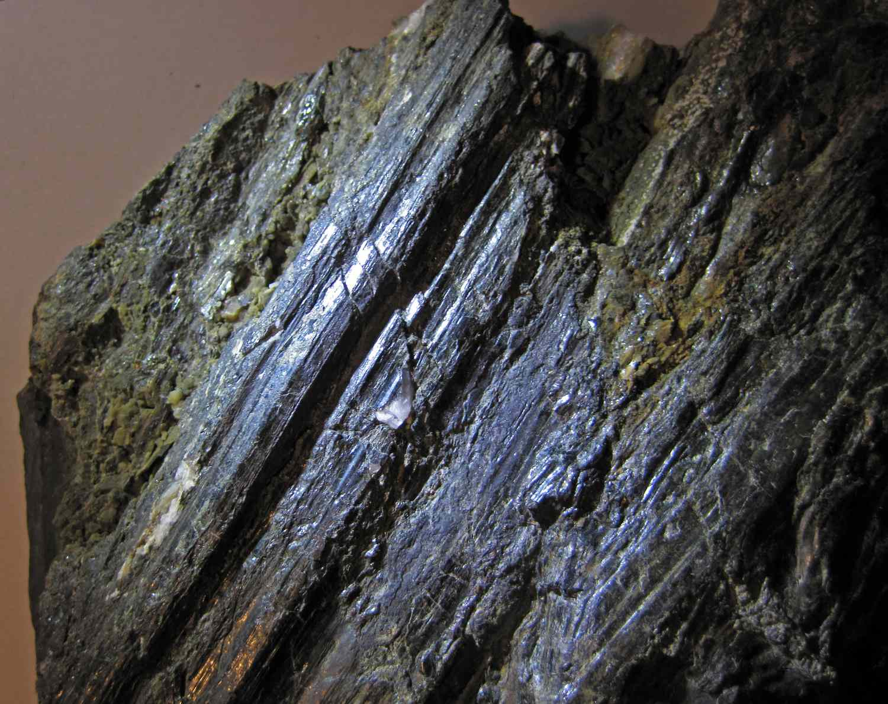
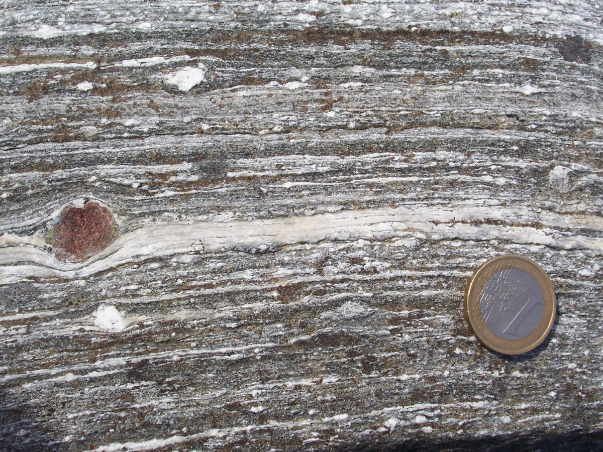
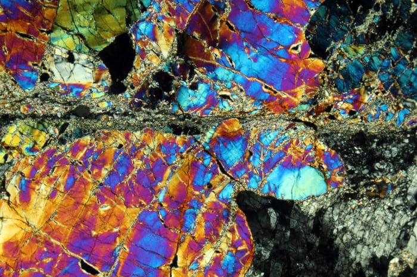
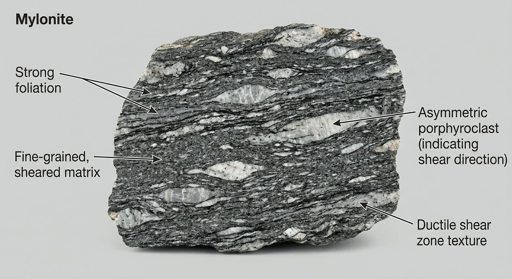
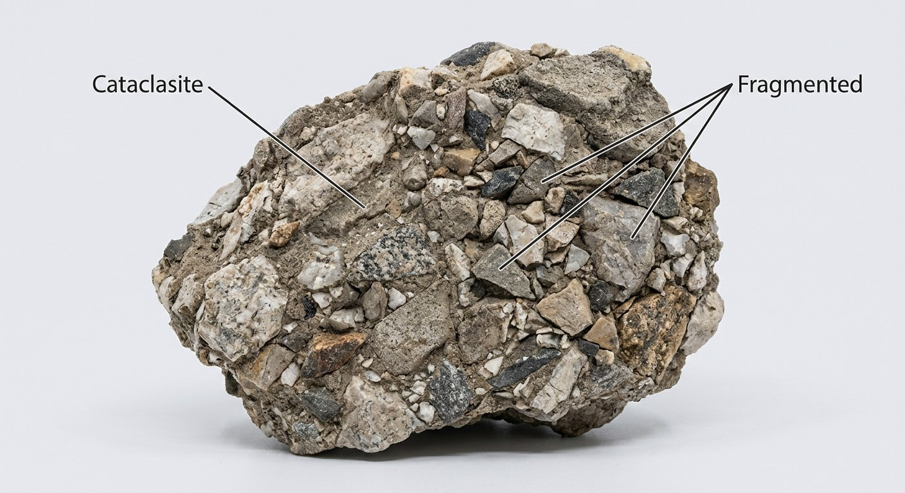

# Mylonite & Cataclasite (Fault Rocks)

> **Family:** Metamorphic (deformation / fault rocks) · **Process:** Intense shearing in fault/shear zones
> **Key clue:** Sheared, fine texture along faults; polished **slickensides** · **Quick ID:** Restricted to fault zones; slickensided, fine, often with quartz veins and sulfides.

## At a glance

| Property | Mylonite | Cataclasite / Fault breccia |
|---|---|---|
| Deformation | **Ductile** (deep, hot) | **Brittle** (shallow, cool) |
| Texture | Fine-grained, foliated | Angular clasts in fine matrix |
| Surface | Polished **slickensides** | Brecciated, fractured |
| Key clue | Sheared fine foliated rock | Angular fault fragments |
| Setting | Faults and shear zones | Faults and fracture zones |

## Composition
Rocks formed by intense deformation in **fault/shear zones**:
- **Mylonite** — ductile deformation; fine-grained, foliated (original grains ground down and recrystallised).
- **Cataclasite / fault breccia** — brittle deformation; angular clasts in a fine crushed matrix.

Mineralogy reflects the original rock (often quartz, feldspar, mica), heavily comminuted; quartz veins and sulfides commonly fill fractures.

## Protolith & metamorphic grade
Fault rocks form by **deformation**, not by heat/pressure metamorphism in the usual sense. **Mylonite** forms at **depth** (ductile regime) where rock flows and recrystallises; **cataclasite** forms near the **surface** (brittle regime) where rock fractures. They record the movement history of faults.

## Texture & foliation
Mylonite is fine-grained and **foliated** (often with **slickensided** surfaces and surviving "**porphyroclasts**" — larger original grains that resisted grinding); cataclasite is made of **angular fragments** in a fine matrix.

## Diagnostic field features
- Restricted to **faults and shear zones** (never far from one).
- Sheared, fine texture; polished, striated **slickensides**; often flanked by **quartz veins**.
- Porphyroclasts (surviving large grains) in mylonite.
- Angular, fractured clasts in cataclasite.

## Identification tests — step by step
1. **Setting:** is the rock in a fault/shear zone? (essential — these rocks don't form elsewhere).
2. **Slickensides:** look for polished, striated surfaces (fault movement).
3. **Texture:** fine foliated (mylonite) vs angular brecciated (cataclasite).
4. **Porphyroclasts:** surviving larger grains in a fine matrix (mylonite).
5. **Veins:** quartz veins and sulfides along the fault.

## Genesis & setting
Fault rocks form where rocks are **ground down and sheared** along faults and shear zones. Ductile shearing at depth makes **mylonite**; brittle fracturing near the surface makes **cataclasite**. Faults are major **fluid pathways**, so they are prime sites for mineralisation.

## Host states / localities
Nationwide along major shear zones — the **Basement** and especially the **schist belts** (see [Structural controls](../../01-general-geology/01-06-structural-controls.md)). Nigeria's gold-bearing schist belts are cut by major faults/shears.

## Associated minerals & rocks
Quartz veins, **gold**, sulfides (**pyrite, chalcopyrite, galena**) — fault zones channel fluids. Associated rocks: mica schist, quartzite, granite (all can be mylonitized).

## Economic relevance
**Structurally controlled** ore deposits — fault/shear zones are key fluid pathways for **gold** and base metals (see [Gold](../../03-mineral-resources/metallic/gold.md)). Recognising fault rocks is central to exploration targeting.

## Lookalikes & how to distinguish

| Looks like | How to tell it apart |
|---|---|
| **Schist** | Schist foliation is regional; mylonite foliation is a narrow fault zone with slickensides. |
| **Breccia (sedimentary/volcanic) | Breccias lack slickensides and are not confined to faults. |
| **Chert / quartzite** | Fault quartz veins can look like chert; check the fault context and slickensides. |

## Field checklist
- [ ] In a fault / shear zone?
- [ ] Slickensides (polished, striated)?
- [ ] Fine foliated (mylonite) or angular brecciated (cataclasite)?
- [ ] Porphyroclasts (surviving grains)?
- [ ] Quartz veins / sulfides along the fault?

## Field tips
- Sheared/fine texture along faults; slickensides; ductile (mylonite) vs brittle (cataclasite) behaviour.
- **Fault zones are prime gold targets** — map them and sample the quartz veins.
- Slickensides show the **direction of fault movement** — record their orientation.
- The width of the mylonite zone indicates the fault's displacement.

## Facts
- **Mylonite** is named from the Greek *mylos* (a mill) — "milled rock."
- **Slickensides** are polished, striated fault surfaces that record slip direction.
- Fault zones are among the most important **fluid pathways** for ore formation.
- **Cataclasite** forms near the surface (brittle); **mylonite** forms at depth (ductile).

*Figure II.B.11 — Fault slickensides on sheared (mylonitic) rock. Source: [ThoughtCo](https://www.thoughtco.com/gallery-of-slickensides-4122857).*

*Figure II.B.11b — Mylonite (fault rock). Source: [Rubyglint](https://rubyglint.com/rocks/mylonite).*

*Figure II.B.11c — Mylonite specimen. Source: [Rubyglint](https://rubyglint.com/rocks/mylonite).*

*Figure II.B.11d — Labeled illustration: mylonite sheared rock. Original diagram prepared for this guide.*

*Figure II.B.11e — Labeled illustration: cataclasite fragmented rock. Original diagram prepared for this guide.*

## Related
- [Structural controls](../../01-general-geology/01-06-structural-controls.md) · [Gold](../../03-mineral-resources/metallic/gold.md) · [Mica schist & Phyllite](mica-schist-phyllite.md)
