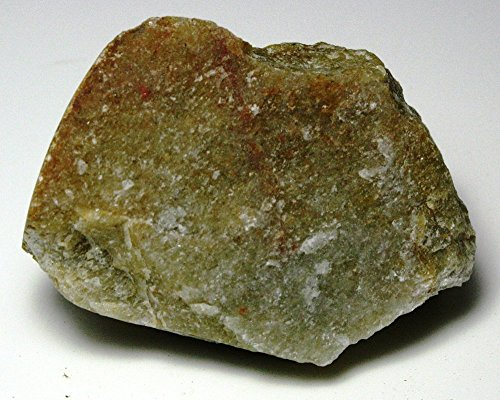
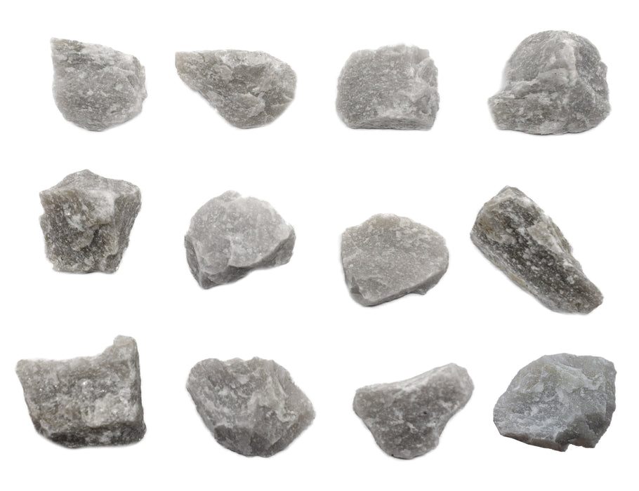
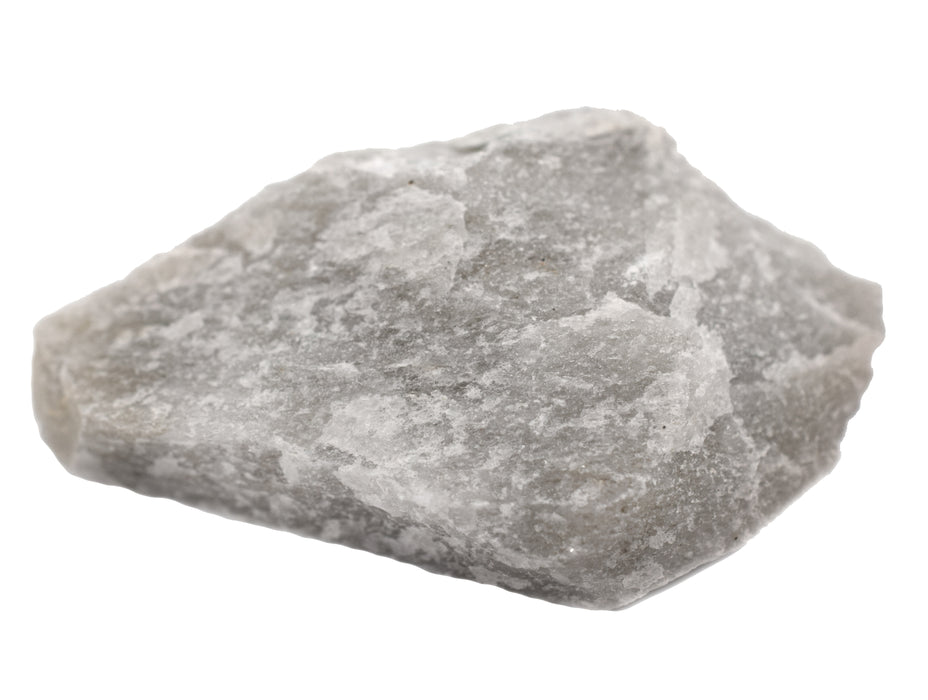
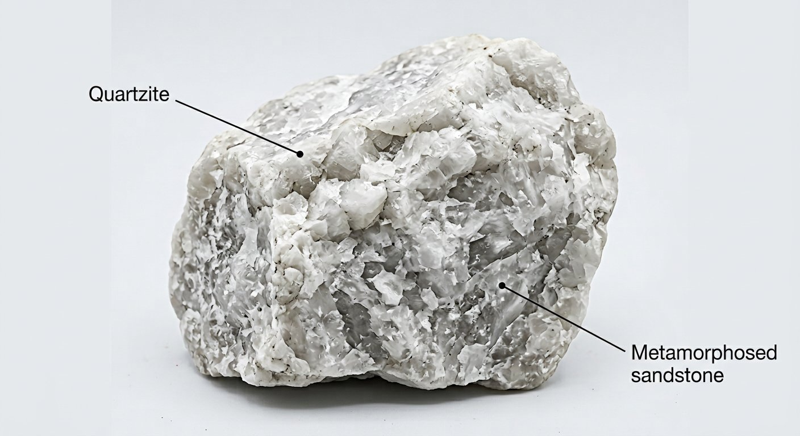
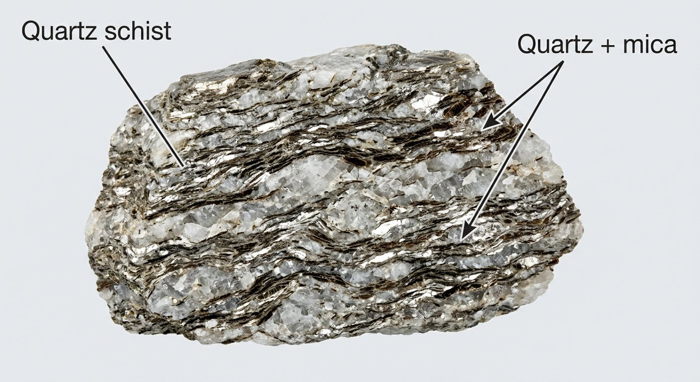

# Quartzite & Quartz Schist

> **Family:** Metamorphic · **Protolith:** sandstone (quartzite) / quartz-mica rock (quartz schist)
> **Key feature:** Very hard, quartz-dominated · **Quick ID:** Quartzite is harder than steel, sugary/glassy, no acid fizz; quartz schist adds mica foliation.

## At a glance

| Property | Quartzite | Quartz Schist |
|---|---|---|
| Protolith | Sandstone | Quartz-rich sandstone + mica |
| Composition | Almost pure **quartz** | Quartz + **mica** (muscovite/biotite) |
| Texture | Massive, sugary to glassy | **Foliated**, shiny mica |
| Hardness | ~7 (scratches steel) | ~6–7 |
| Acid | No fizz | No fizz |
| Setting | Schist belts (ridge-formers) | Schist belts |

## Composition
- **Quartzite:** almost pure **quartz** (recrystallized sandstone).
- **Quartz schist:** quartz + **mica** (muscovite/biotite), with foliation.

Chemically, quartzite is essentially **pure SiO₂** (>90%), making it a high-purity silica resource.

## Protolith & metamorphic grade
Quartzite forms by **recrystallisation of quartz sandstone** under low-to-high-grade metamorphism — the original sand grains fuse into interlocking quartz. Quartz schist forms where some **mica** was present in the original sediment, giving foliation. Quartzite commonly forms resistant **ridge-formers** in schist belts.

## Texture & foliation
- **Quartzite:** massive, **sugary to glassy**, interlocking quartz grains (no visible foliation).
- **Quartz schist:** **foliated**, with shiny mica flakes aligned.

## Diagnostic field features
- **Quartzite is very hard** — scratches steel and glass; breaks with a conchoidal or sugary fracture; typically white/grey/pink.
- **Quartz schist** has visible mica and splits along foliation.
- Quartzite often forms **rugged ridges and hills** (it resists erosion).

## Identification tests — step by step
1. **Hardness:** quartzite scratches steel/glass; a knife leaves little mark.
2. **Fracture:** sugary or glassy, not gritty (unlike sandstone).
3. **Acid:** no fizz (distinguishes from marble/limestone).
4. **Foliation:** quartzite is massive; quartz schist splits along mica.
5. **Grain:** interlocking/fused (quartzite) vs loose/gritty (sandstone).

## Genesis & setting
Quartzite forms when quartz sandstone is buried and heated so its grains **recrystallise and fuse** into a hard, massive rock. It is extremely resistant to weathering and chemical attack, so it forms prominent **ridges** in the schist belts.

## Host states / localities
Common in the **schist belts**: **Osun (Ilesa–Ife), Oyo, Kwara (Egbe–Isanlu), Edo (Igarra), Niger**, and elsewhere in the Basement. Quartzite ridges (e.g., "quartzite ridges") are a common landscape feature of the gold belts.

## Associated minerals & rocks
**Gold** (in quartz veins cutting the schist belts), kyanite; quartz. Associated rocks: mica schist, amphibolite, metasediments.

## Economic relevance
- **Silica/silicon and glass sand** (high-purity quartzite).
- **Dimension stone, aggregate** (very durable).
- Host/indicator for **gold** in the schist belts.
- Source of **ferrosilicon / silicon metal** where pure.

## Lookalikes & how to distinguish

| Looks like | How to tell it apart |
|---|---|
| **Marble** | Marble **fizzes with acid** and is softer (knife-scratchable); quartzite does not fizz and is much harder. |
| **Sandstone** | Sandstone is gritty and layered; quartzite has interlocking, fused grains (sugary). |
| **Quartz schist** | Quartz schist has mica and foliation; quartzite is massive. |

## Field checklist
- [ ] Harder than steel + sugary/glassy?
- [ ] No acid fizz?
- [ ] Massive (quartzite) or mica-foliated (quartz schist)?
- [ ] Forms a ridge/hill (resistant)?
- [ ] Associated quartz veins (gold)?

## Field tips
- **Harder than steel** + sugary/glassy + no acid fizz = quartzite.
- **Quartzite vs. marble:** both light and hard-ish, but **marble fizzes with acid** and is softer (scratched by a knife); quartzite does neither.
- **Quartzite vs. sandstone:** sandstone is gritty and layered; quartzite has interlocking, fused grains.
- Quartzite ridges are good places to look for **gold-bearing quartz veins**.

## Facts
- Quartzite is among the **hardest, most chemically resistant** common rocks.
- Pure quartzite is essentially **solid SiO₂** — an industrial silica source.
- Quartzite **ridge-formers** create the rugged topography of many schist belts.
- It is metamorphosed **sandstone** — same composition, recrystallised texture.

*Figure II.B.3 — Quartzite: massive, very hard, sugary quartz rock. Source: [Amazon](https://www.amazon.com/Quartzite-Metamorphic-Rock-Unpolished-Specimens/dp/B01FMKU8CM).*

*Figure II.B.3b — White quartzite. Source: [Eisco Labs](https://www.eiscolabs.com/products/eisco-white-quartzite-specimen-3cm-in-size-pack-of-12).*

*Figure II.B.3c — Quartzite specimen. Source: [Eisco Labs](http://www.eiscolabs.com/products/eisco-white-quartzite-specimen-3cm-in-size).*

*Figure II.B.3d — Labeled illustration: quartzite (metamorphosed sandstone). Original diagram prepared for this guide.*

*Figure II.B.3e — Labeled illustration: quartz schist (quartz + mica). Original diagram prepared for this guide.*

## Related
- [Mica schist & Phyllite](mica-schist-phyllite.md) · [Marble & Calc-silicate](marble-calc-silicate.md) · [Sandstone](../sedimentary/sandstone.md) · [Quartz, Silica & Glass sand](../../03-mineral-resources/industrial/quartz-glass-sand.md)
