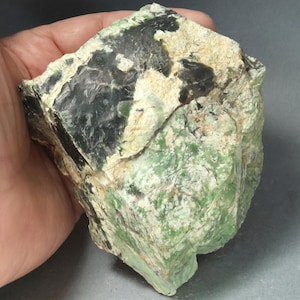
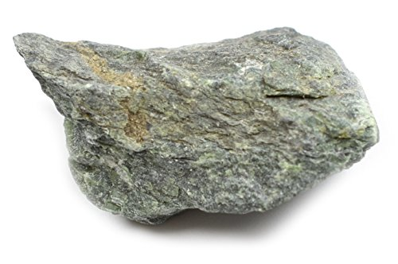
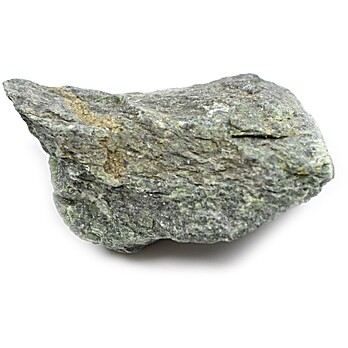
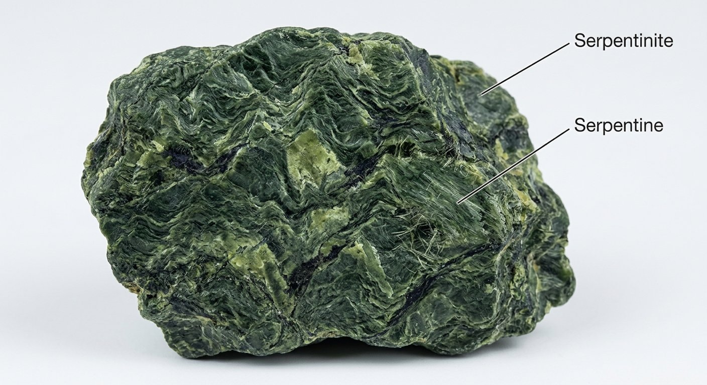
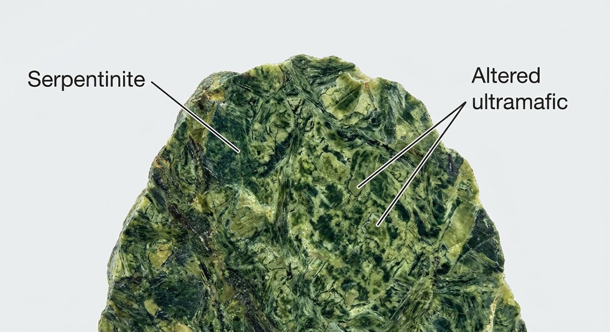

# Serpentinite

> **Family:** Metamorphic / altered ultramafic · **Protolith:** peridotite / dunite (hydrated)
> **Key feature:** Green, greasy, soft; **serpentine minerals** · **Quick ID:** Mottled green, greasy/waxy feel, softer than peridotite; may have white asbestos vein fibres.

## At a glance

| Property | Value |
|---|---|
| Colour | Green (many shades; mottled green typical) |
| Feel | **Greasy / waxy** |
| Hardness | Soft (~2.5–4, often scratched by a knife) |
| Key minerals | Serpentine (antigorite, chrysotile) |
| Texture | Massive, sometimes **fibrous** (chrysotile) |
| Protolith | Peridotite / dunite (hydration/alteration) |

## Composition
A metamorphic/altered **ultramafic rock** composed mainly of **serpentine minerals** (**antigorite, chrysotile**), formed by **hydration/alteration of peridotite/dunite**. Accessory **magnetite, chromite, talc, magnesite, and nickel minerals** may be present.

## Protolith & metamorphic grade
Serpentinite forms by **low-temperature hydration (serpentinization)** of ultramafic rock (peridotite/dunite) — olivine and pyroxene react with water to form **serpentine minerals**. It is an **alteration** product rather than a high-grade metamorphic rock, forming where ultramafics meet circulating water.

## Texture & foliation
**Massive**, sometimes **fibrous** (chrysotile asbestos); has a characteristic **greasy/waxy** feel. A "**mesh**" texture (serpentine replacing olivine) is common; **slip-fibre asbestos veins** may cross the rock.

## Diagnostic field features
- **Green** (many shades — mottled green is typical).
- **Softer and greasier** than fresh peridotite; may show a serpentine "mesh" texture.
- White **chrysotile asbestos** vein fibres in some specimens.
- Often forms lenses within the Basement.

## Identification tests — step by step
1. **Feel:** greasy/waxy, softer than fresh peridotite (a knife scratches it).
2. **Colour:** green, often mottled.
3. **Hand lens:** serpentine "mesh" texture; fibrous chrysotile veins.
4. **Hardness:** soft (~2.5–4), unlike hard fresh peridotite (6.5–7).
5. **Context:** forms from ultramafic bodies (with chromite, talc).

## Genesis & setting
Serpentinite forms when **peridotite/dunite is hydrated** — water alters olivine and pyroxene into soft, green **serpentine**. This happens where ultramafic rocks (mantle slices) are exposed to circulating water, often along faults and in ophiolite/suture zones.

## Host states / localities
Basement areas containing ultramafics — parts of **Kaduna, Plateau**, and some schist belts (see [Peridotite & Pyroxenite](../igneous/peridotite-pyroxenite.md)).

## Associated minerals & rocks
Peridotite, talc, chlorite, magnesite, **chromite**, **nickel** minerals (see [Talc / Chlorite schist](talc-chlorite-schist.md)). Associated rocks: talc schist, amphibolite, chromite-bearing dunite.

## Economic relevance
- **Asbestos (chrysotile)** — from fibrous serpentinite (handle with care).
- **Nickel** (serpentinized peridotite can be nickel-bearing), **magnesite**.
- Ornamental "**serpentine**" stone (carving, decorative).
- Source of **magnesia** compounds.

## Lookalikes & how to distinguish

| Looks like | How to tell it apart |
|---|---|
| **Greenschist** | Greenschist is foliated, chlorite/epidote (from basalt); serpentinite is greasy, from ultramafic, often with chromite. |
| **Talc / chlorite schist** | Talc-rich rock is even softer (hardness 1, soapy); serpentinite is moderately soft. |
| **Peridotite (fresh)** | Fresh peridotite is hard (6.5–7) with glassy olivine; serpentinite is soft and greasy. |

## Field checklist
- [ ] Green + greasy/waxy feel?
- [ ] Soft (knife-scratchable)?
- [ ] Serpentine "mesh" texture?
- [ ] White asbestos fibres (chrysotile)?
- [ ] From an ultramafic body (chromite nearby)?

## Field tips
- Green, greasy, softer than peridotite; forms by ultramafic alteration.
- **Handle with care where fibrous (asbestos) varieties occur** — avoid generating dust.
- Look for **chromite** grains — a sign of the ultramafic parent and Cr/Ni potential.
- Serpentinite bodies can carry **nickel, magnesite, and asbestos** — map and sample them.

## Facts
- Serpentinite forms by **hydration of mantle rock** (peridotite) — water turns hard olivine into soft green serpentine.
- Fibrous serpentinite is the source of **chrysotile (white) asbestos**.
- It has a distinctive **greasy/soapy** feel.
- Serpentinization produces conditions that can support unique microbes (and even generate hydrogen/methane).

*Figure II.B.10 — Serpentinite (altered ultramafic rock). Source: [Etsy](https://www.etsy.com/market/serpentinite_specimens).*

*Figure II.B.10b — Serpentinite (metamorphic rock). Source: [Amazon](https://www.amazon.in/Serpentinite-Specimen-Metamorphic-Rock-Approx/dp/B06WLKPXJF).*

*Figure II.B.10c — Serpentinite specimen. Source: [Thomas Sci](https://www.thomassci.com/p/serpentinite-raw-metamorphic-rock-specimens-approx-1-inch-pk12).*

*Figure II.B.10d — Labeled illustration: serpentinite (serpentine rock). Original diagram prepared for this guide.*

*Figure II.B.10e — Labeled illustration: serpentinite altered ultramafic. Original diagram prepared for this guide.*

## Related
- [Peridotite & Pyroxenite](../igneous/peridotite-pyroxenite.md) · [Talc / Chlorite schist](talc-chlorite-schist.md) · [Chromite](../../03-mineral-resources/metallic/chromite.md)
