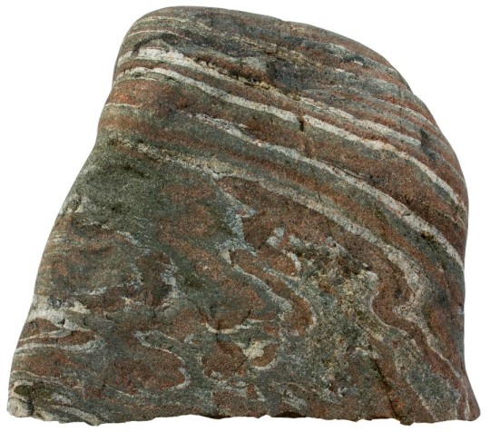

# Skarn

> **Family:** Metamorphic (contact-metasomatic) · **Protolith:** limestone/dolomite altered by intruding granite
> **Key clue:** Garnet + pyroxene (calc-silicates) at a granite–carbonate contact; often magnetic · **Quick ID:** Brown/red garnet + green pyroxene in carbonate wall-rock; often magnetic; an ore host.

## At a glance

| Property | Value |
|---|---|
| Colour | Brown/red (garnet) + green (pyroxene) |
| Texture | Coarse-grained, massive, granoblastic |
| Key minerals | Garnet, pyroxene, wollastonite, epidote |
| Common extras | Magnetite, sulfides (scheelite, chalcopyrite…) |
| Setting | Granite–carbonate **contact** |
| Economic | Ore host — Fe, W, Cu, Zn, Pb, Au |

## Composition
A **contact-metasomatic** rock of **calc-silicate minerals** — **garnet, pyroxene, wollastonite, epidote** — formed where a granite intrudes carbonate rock (limestone/dolomite). Commonly carries **magnetite** and **sulfides** (scheelite, chalcopyrite, galena, sphalerite). The chemistry is exchanged between magma and carbonate — hence "metasomatic."

## Protolith & metamorphic grade
Skarn forms by **contact metasomatism** — when hot, chemically reactive fluids from an intruding granite invade adjacent limestone/dolomite, the carbonate reacts and is replaced by **calc-silicate minerals** (garnet, pyroxene, wollastonite). It is a **high-temperature contact** rock, typically at the innermost (hottest) part of the contact aureole.

## Texture & foliation
**Coarse-grained, massive, granoblastic**; commonly carries **magnetite** and sulfides. The garnet and pyroxene crystals are often large and interlocking; no regional foliation (it is a contact rock).

## Diagnostic field features
- **Brown/red garnet + green pyroxene** in carbonate wall-rock at the granite contact.
- Often **magnetic** (magnetite).
- Coarse, hard, massive; may contain visible ore minerals (scheelite, sulfides).
- Always at a **granite–carbonate contact**.

## Identification tests — step by step
1. **Setting:** at the contact between granite and limestone/dolomite? (essential).
2. **Minerals:** garnet (red/brown) + pyroxene (green) — calc-silicates.
3. **Magnet:** often magnetic (magnetite).
4. **Acid:** little/no fizz (the carbonate has been replaced), though remnants may fizz.
5. **Ore minerals:** look for scheelite (pale, heavy), chalcopyrite (brassy), etc.

## Genesis & setting
Skarn forms where an intruding granite releases hot, reactive fluids into neighbouring carbonate rock, **replacing** the limestone with calc-silicate minerals and concentrating ore metals. Skarns are among the most important **contact-metasomatic ore deposits**, forming iron, tungsten, copper, zinc, lead, and gold.

## Host states / localities
Contacts of granites with limestone/dolomite — in the Basement and around intrusive complexes (see [Marble & Calc-silicate](marble-calc-silicate.md), [Limestone](../sedimentary/limestone.md)). Common wherever granite meets marble/limestone in the Basement.

## Associated minerals & rocks
Garnet, magnetite, **scheelite**, chalcopyrite, galena, sphalerite, gold (see [Wolframite & Scheelite](../../03-mineral-resources/metallic/wolframite-scheelite.md)). Associated rocks: marble, hornfels, granite, calc-silicate rock.

## Economic relevance
An important **ore host** — **iron**, **tungsten (scheelite)**, **copper, zinc, lead**, and **gold**. Skarns are prime exploration targets wherever granite intrudes carbonate; even non-economic skarns flag a mineralised contact.

## Lookalikes & how to distinguish

| Looks like | How to tell it apart |
|---|---|
| **Marble / calc-silicate** | Skarn is coarser, garnet/pyroxene-rich, often magnetic and ore-bearing, right at the granite contact. |
| **Amphibolite** | Amphibolite is hornblende + plagioclase (mafic, regional); skarn is garnet + pyroxene (calc-silicate, contact). |
| **Eclogite** | Eclogite has omphacite + pyrope, no plagioclase, high-pressure (regional); skarn is contact, with carbonate relics. |

## Field checklist
- [ ] At a granite–carbonate contact?
- [ ] Garnet (red/brown) + pyroxene (green)?
- [ ] Often magnetic (magnetite)?
- [ ] Ore minerals (scheelite, sulfides)?
- [ ] Coarse, hard, massive?

## Field tips
- Garnet + pyroxene + calc-silicates at a granite–carbonate contact; often magnetic.
- **Skarns are ore hosts** — sample for W (scheelite), Cu, Fe, Au.
- Look for the **contact itself** — skarn forms a zone between granite and marble/limestone.
- A **magnet** is a quick field tool: magnetic skarn suggests magnetite/iron (and often sulfides).

## Facts
- Skarn forms by **contact metasomatism** — granite fluids replace limestone with ore-rich calc-silicates.
- Skarns host **iron, tungsten, copper, zinc, lead, and gold** deposits worldwide.
- The word "skarn" is an old Swedish mining term.
- Skarns are often **magnetic** (magnetite) — a handy field clue.

*Figure II.B.13 — Skarn (magnetite, garnet and quartz). Source: [Sandatlas](https://sandatlas.org/garnet/).*

## Related
- [Marble & Calc-silicate](marble-calc-silicate.md) · [Granite](../igneous/granite.md) · [Limestone](../sedimentary/limestone.md) · [Wolframite & Scheelite](../../03-mineral-resources/metallic/wolframite-scheelite.md) · [Hornfels](hornfels.md)
