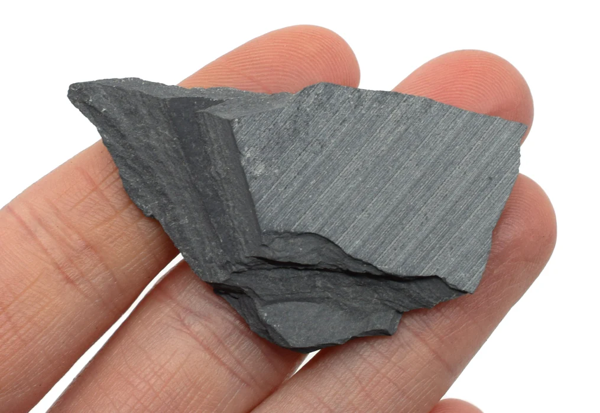

# Slate

> **Family:** Metamorphic (low grade) · **Protolith:** shale / mudstone
> **Key feature:** **Slaty cleavage** — splits into thin, flat, smooth sheets · **Quick ID:** Splits into thin flat sheets; dull, very fine, dark grey/black; lower grade than phyllite.

## At a glance

| Property | Value |
|---|---|
| Colour | Dark grey to black |
| Texture | Very fine-grained; **slaty cleavage** |
| Cleavage | Splits into thin, flat, smooth sheets |
| Lustre | Dull (no sheen) |
| Composition | Micas, chlorite, quartz (very fine) |
| Setting | Low-grade Basement; schist belts |

## Composition
A very fine-grained, **low-grade** metamorphic rock formed from **shale/mudstone**; composed of **micas, chlorite, and quartz** (too fine to see individual grains). As grade increases it becomes **phyllite**, then **schist**.

## Protolith & metamorphic grade
Slate forms by **low-grade** metamorphism of shale/mudstone — directed pressure aligns the tiny clay/mica minerals into planes of weakness (**slaty cleavage**). It is the **lowest-grade** foliated metamorphic rock; with more heat it grades into phyllite (silky sheen) then mica schist.

## Texture & foliation
Defined by **slaty cleavage** — it splits readily into thin, flat, smooth sheets (the defining property). The foliation is very fine and even; the rock is **dull** (no sheen), unlike the glossy phyllite.

## Diagnostic field features
- Excellent **slaty cleavage** (splits into thin flat sheets).
- **Dull lustre**; dark grey to black; very fine-grained.
- Lower grade than phyllite/schist.
- Splits perfectly flat — the classic roofing material.

## Identification tests — step by step
1. **Cleavage:** does it split into thin, flat, smooth sheets? (slaty cleavage — the defining test).
2. **Lustre:** dull (no sheen) — distinguishes from glossy phyllite.
3. **Grain size:** very fine (no visible mica flakes, unlike schist).
4. **Vs shale:** shale is the sedimentary parent (splits less perfectly, may be fissile/muddy).
5. **Ring:** a thin sheet may "ring" slightly when flicked.

## Genesis & setting
Slate forms by **low-grade regional metamorphism of shale** — mild heat and directed pressure align the platy minerals into perfect cleavage planes. It marks the low-grade margins of metamorphic belts, grading upward into phyllite and schist.

## Host states / localities
Low-grade Basement areas — parts of the **schist belts** and adjoining metasedimentary terrains (see [Siltstone, Shale & Mudstone](../sedimentary/siltstone-shale.md)). Found at the low-grade edges of the metamorphic belts.

## Associated minerals & rocks
Shale, phyllite, quartzite (grades upward into [Mica schist & Phyllite](mica-schist-phyllite.md)). Associated rocks: phyllite, metasiltstone, quartzite.

## Economic relevance
- **Roofing slate**, tiles, and writing slates — a classic dimension material.
- **Billboard/blackboard** material (smooth, flat, dark).
- Flagstones and paving.
- Indicator of low-grade metamorphic terrain (may host gold in associated higher-grade rocks).

## Lookalikes & how to distinguish

| Looks like | How to tell it apart |
|---|---|
| **Shale** | Shale is sedimentary (may be muddy/fissile, has fossils); slate is metamorphic (perfect slaty cleavage, rings when struck). |
| **Phyllite** | Phyllite has a **silky/glossy sheen**; slate is **dull**. |
| **Schist** | Schist has visible shiny mica flakes; slate is very fine and dull. |

## Field checklist
- [ ] Splits into thin, flat, smooth sheets?
- [ ] Dull (no sheen)?
- [ ] Very fine-grained (no visible mica)?
- [ ] Dark grey/black?
- [ ] Low-grade setting (schist-belt margin)?

## Field tips
- Splits into thin, flat, smooth sheets (slaty cleavage); dull and very fine — softer and duller than phyllite, which has a slight sheen.
- The **perfect flat splitting** is the giveaway.
- Slate marks the **low-grade edge** of a metamorphic belt — higher-grade (gold-bearing) rock lies nearby.
- Historic **quarrying** sites for roofing slate are worth noting.

## Facts
- **Slaty cleavage** is one of the defining textures in geology — perfect flat splitting.
- Slate has been used for **roofing and writing slates** for centuries.
- It is the **lowest-grade** foliated metamorphic rock (below phyllite and schist).
- Slate is metamorphosed **shale** — same fine material, realigned by pressure.

*Figure II.B.14 — Slate showing fine slaty cleavage. Source: [Geology Science](https://geologyscience.com/rocks/metamorphic-rocks/slate/).*

## Related
- [Siltstone, Shale & Mudstone](../sedimentary/siltstone-shale.md) · [Mica schist & Phyllite](mica-schist-phyllite.md) · [Metasediments](metasediments.md)
