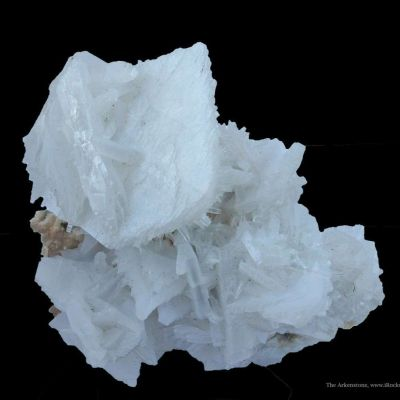

# Anhydrite

> **Family:** Sedimentary — chemical (evaporite) · **Composition:** anhydrous calcium sulfate (CaSO₄)
> **Quick ID:** Harder than gypsum (3.5), **no acid fizz**, and **hydrates (swells) to gypsum** on wetting.

## At a glance

| Property | Value |
|---|---|
| Colour | White, grey, blue-grey, pale pink |
| Hardness | ~3.5 (harder than gypsum's 2) |
| Composition | Anhydrite CaSO₄ (water-free) |
| Acid test | **No fizz** (sulfate, not carbonate) |
| Key behaviour | **Hydrates to gypsum** on wetting (swells) |
| Setting | Evaporite sequences (Chad, Benue, Nasarawa) |

## Composition
**Anhydrite, CaSO₄** — the anhydrous (water-free) form of gypsum; an **evaporite** mineral that forms rock beds with gypsum and halite. Chemically a **calcium sulfate** without water of crystallisation (gypsum is CaSO₄·2H₂O).

## Origin & classification
Anhydrite is a **chemical evaporite** — it precipitates from concentrated saline water, typically **before** gypsum in the evaporation sequence (at higher temperature/salinity) or by **dehydration of gypsum** at depth. It commonly occurs with gypsum, halite, and other evaporite minerals.

## Texture & sedimentary structures
Crystalline, massive, fibrous, or nodular. Often in **beds and nodules** within evaporite sequences, interlayered with gypsum and halite. Fine-grained (alabaster-like) to coarse crystalline.

## Diagnostic field features
- Hardness ~3.5 (harder than gypsum); **no water of crystallisation**.
- **Hydrates to gypsum** on exposure to water (and expands); lacks the perfect cleavage and softness of gypsum.
- White/grey/blue-grey; may have a pearly lustre on cleavage surfaces.
- **Does NOT fizz** with acid (it is a sulfate, not a carbonate).

## Identification tests — step by step
1. **Acid:** **no fizz** (rules out calcite/limestone).
2. **Hardness:** ~3.5 — harder than gypsum (2), softer than quartz (7).
3. **Hydration:** wet a fresh surface — it slowly **hydrates to gypsum** and may swell/crumble.
4. **Vs gypsum:** gypsum is softer (fingernail-scratchable) with perfect cleavage; anhydrite is harder and blockier.
5. **Vs calcite:** calcite fizzes; anhydrite does not.

## Depositional setting & formation
Anhydrite forms where **saline water evaporates** in restricted basins, precipitating calcium sulfate. It often precedes gypsum in the evaporite sequence and can form by **dehydration of gypsum** when buried and heated. Nigeria's anhydrite occurs in the evaporite basins of the north.

## Host states / localities
Occurs in evaporite sequences with gypsum and halite — the **Chad (Borno/Yobe) Basin**, and the Benue/Nasarawa salt–gypsum areas (see [Gypsum & Evaporites](gypsum-evaporites.md), [Rock Salt (Halite)](rock-salt.md)).

## Associated minerals & rocks
Gypsum, halite, calcite, dolomite, polyhalite (evaporite minerals). Associated rocks: gypsum, rock salt, limestone (evaporite sequence).

## Economic relevance
- **Cement** set regulator (like gypsum) and a source of **sulfuric acid**.
- Hydrates to **gypsum plaster**.
- Part of the evaporite mineral suite (with gypsum, salt, potash).
- Its **swelling** on hydration is an engineering concern in tunnels/foundations.

## Lookalikes & how to distinguish

| Looks like | How to tell it apart |
|---|---|
| **Gypsum** | Gypsum is softer (fingernail-scratchable, hardness 2) with perfect cleavage; anhydrite is harder (3.5) and blocky. |
| **Calcite** | Calcite fizzes with acid; anhydrite does not. |
| **Dolomite** | Dolomite weakly fizzes (when powdered); anhydrite never fizzes. |

## Field checklist
- [ ] No acid fizz?
- [ ] Harder than gypsum (~3.5)?
- [ ] Hydrates/swells on wetting?
- [ ] In an evaporite sequence (with gypsum/salt)?
- [ ] White/grey/blue-grey?

## Field tips
- Harder than gypsum, no water content, associated with evaporites; hydrates (swells) on wetting — the reverse of gypsum dehydrating to anhydrite.
- The **hydration test** (wet it and watch it change) is the distinguishing feature.
- Anhydrite's **swelling** on hydration is an important engineering consideration.
- It occurs with gypsum and halite — map the whole evaporite sequence.

## Facts
- Anhydrite is **water-free calcium sulfate**; add water and it becomes gypsum (and swells).
- It is an **evaporite** mineral, forming as saline water evaporates.
- Its **swelling** on hydration can damage tunnels, foundations, and mines.
- Anhydrite is used in **cement** and as a source of **sulfuric acid**.

*Figure II.C.18 — Anhydrite with calcite. Source: [iRocks](https://www.irocks.com/minerals/specimen/48665).*

## Related
- [Gypsum & evaporites](gypsum-evaporites.md) · [Rock Salt (Halite)](rock-salt.md) · [Calcite](../../03-mineral-resources/industrial/calcite.md) · [Trona](../../03-mineral-resources/industrial/trona.md)
