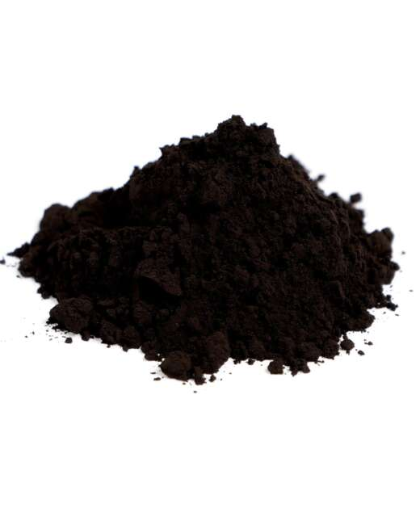
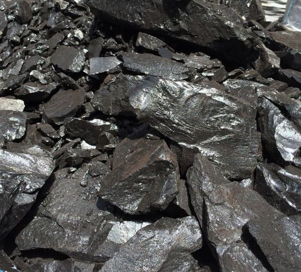

# Bitumen / Tar Sands

> **Family:** Sedimentary / residual · **Composition:** natural heavy hydrocarbon (asphalt)
> **Quick ID:** Black, sticky/tarry, strong petroleum smell, stains hands black; coats loose sand grains.

## At a glance

| Property | Value |
|---|---|
| Colour | Black / dark brown |
| Texture | Sticky, tar-like; coats sand grains |
| Feel | Greasy; softens when warm |
| Key test | **Petroleum smell** + sticky + black stain |
| Setting | SW bitumen belt (Ondo, Edo, Lagos, Ogun) |

## Composition
**Bitumen** — a thick, sticky, black **heavy hydrocarbon** — coating sand grains in "tar sands" or "oil sands." It is a very **viscous form of petroleum** (natural asphalt), chemically a complex mixture of heavy hydrocarbons with some sulfur, nitrogen, and metals.

## Origin & classification
Bitumen forms when **lighter petroleum migrates to the surface and is degraded** — bacteria, water washing, and evaporation strip the light fractions, leaving a thick, heavy residue. It is an **unconventional hydrocarbon resource**: oil that is too viscous to pump in its natural state, requiring upgrading or hot-water extraction.

## Texture & sedimentary structures
**Black, sticky, tar-like**, coating loose sand; heavy; greasy to the touch; softens when warm. It typically fills the pores of **porous sandstone**, cementing the grains into "tar sand." May ooze from outcrops as black seeps.

## Diagnostic field features
- **Black, sticky/tarry**, with a strong **petroleum smell**.
- Stains hands/clothing black; heavy.
- Sand grains coated and cemented by bitumen.
- Softens in the sun (warm) and hardens when cold.

## Identification tests — step by step
1. **Smell:** a distinct **petroleum** odour — the key clue.
2. **Feel:** sticky/tarry and greasy; softens when warm.
3. **Stain:** leaves a black stain on hands/paper.
4. **Vs coal:** coal is brittle and solid; bitumen is sticky and tarry.
5. **Vs black shale:** bitumen is sticky and smells of petroleum; shale does not.

## Depositional setting & formation
Bitumen accumulates where **oil seeps reach the surface** and degrade into heavy asphalt, often saturating porous near-surface sands. Nigeria's bitumen occurs in the **Dahomey (southwest) Basin**, where oil has migrated into near-surface sands — the **Ondo deposits are among the largest tar-sand resources in the region**.

## Host states / localities
- **Ondo State** — very large **bitumen/tar-sand** deposits (Akoko/Ikale area).
- **Edo, Lagos, Ogun** — the southwestern (Dahomey Basin) bitumen belt.

## Associated minerals & rocks
Sand, clay, heavy oil, sulfur; associated with conventional oil source systems. Associated rocks: sandstone (the reservoir), shale (the source).

## Economic relevance
- **BITUMEN** — road surfacing/asphalt; and a significant potential **unconventional oil resource** (Ondo's deposits are among the largest in the region).
- Reduces Nigeria's dependence on imported bitumen.
- Potential for **upgrading to synthetic crude oil**.

## Lookalikes & how to distinguish

| Looks like | How to tell it apart |
|---|---|
| **Coal** | Coal is brittle and solid; bitumen is sticky/tarry. |
| **Black shale** | Bitumen is sticky and smells of petroleum; black shale is fine-grained and not sticky. |
| **Oil-stained sandstone** | Oil stain is lighter; bitumen fully saturates and cements the sand. |

## Field checklist
- [ ] Black + sticky/tarry?
- [ ] Strong petroleum smell?
- [ ] Stains hands black?
- [ ] Coats loose sand grains?
- [ ] SW bitumen belt (Ondo/Edo/Lagos/Ogun)?

## Field tips
- **Black + sticky + petroleum smell** = bitumen/tar sand.
- **vs. coal:** coal is brittle and solid; bitumen is sticky/tarry.
- **vs. ordinary black shale:** bitumen is sticky and smells of petroleum.
- Bitumen softens in the sun — midday is the best time to spot seeps.
- Note the extent and grade of the tar sand — Ondo's resource is very large.

## Facts
- Bitumen is **natural asphalt** — petroleum degraded to a thick, sticky residue.
- Nigeria's **Ondo State** holds some of the largest **tar-sand** deposits in the region.
- Tar sands are an **unconventional oil** resource (too viscous to pump directly).
- Nigeria imports large quantities of bitumen — its own deposits are a strategic resource.

*Figure II.C.9 — Bitumen (natural asphalt / tar). Source: [iStock](https://www.istockphoto.com/photos/bitumen-tar).*

*Figure II.C.9b — Gilsonite (natural asphalt/bitumen). Source: [Natural Pigments](https://naturalpigments.com/artist-materials/asphaltum-bitumen).*

*Figure II.C.9c — Natural asphalt (gilsonite). Source: [Gilsonite Co](https://gilsoniteco.com/gilsonite-bitumen/).*

## Related
- [Coal & Lignite](coal.md) · [Sandstone](sandstone.md) · **Part III, III.D** — [bitumen](../../03-mineral-resources/energy/bitumen.md) & [petroleum](../../03-mineral-resources/energy/petroleum.md). **Part IV, §4.6** — the SW bitumen belt ([Dahomey–Sokoto basins](../../04-geological-provinces/04-06-dahomey-sokoto-basins.md)).
