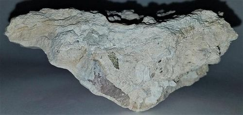

# Calcrete & Silcrete (Duricrusts)

## Composition
Near-surface **duricrusts** — hard caps formed by cementation of soil/regolith:
- **Calcrete (caliche)** — cemented by **calcium carbonate**.
- **Silcrete** — cemented by **silica**.

## Texture
Hard, massive, nodular, or laminated surface layers developed within the weathered profile.

## Diagnostic field features
- Hard, resistant crust capping softer material below.
- **Calcrete fizzes** in dilute acid (calcite cement); **silcrete** is extremely hard
  (silica cement).

## Host states / localities
Common in the **Sahelian/northern** regions — **Borno, Yobe, Sokoto, Katsina, Jigawa,
Kebbi** (calcrete especially); silcrete in parts of the north
(see [Laterite & Ferricrete](laterite-ferricrete.md)).

## Associated minerals
Sand, laterite, and near-surface groundwater; paleoclimate indicators.

## Economic relevance
Calcrete for **lime and road metal**; duricrusts strongly affect **groundwater,
foundations, and construction**; indicators of past arid climates.

## Identification notes
- Hard surface crust; test with acid (calcrete fizzes, silcrete doesn't).

## Images
**Hand specimen**

*Figure II.C.15 — Calcrete (caliche) duricrust. Source: [newtonsdisciple.com](https://newtonsdisciple.com/Caliche.html).*

## Related
- [Laterite & Ferricrete](laterite-ferricrete.md) · [Sandstone, Grit & Arkose](sandstone.md) · [Regolith & laterite](../../01-general-geology/01-07-regolith-and-laterite.md)
