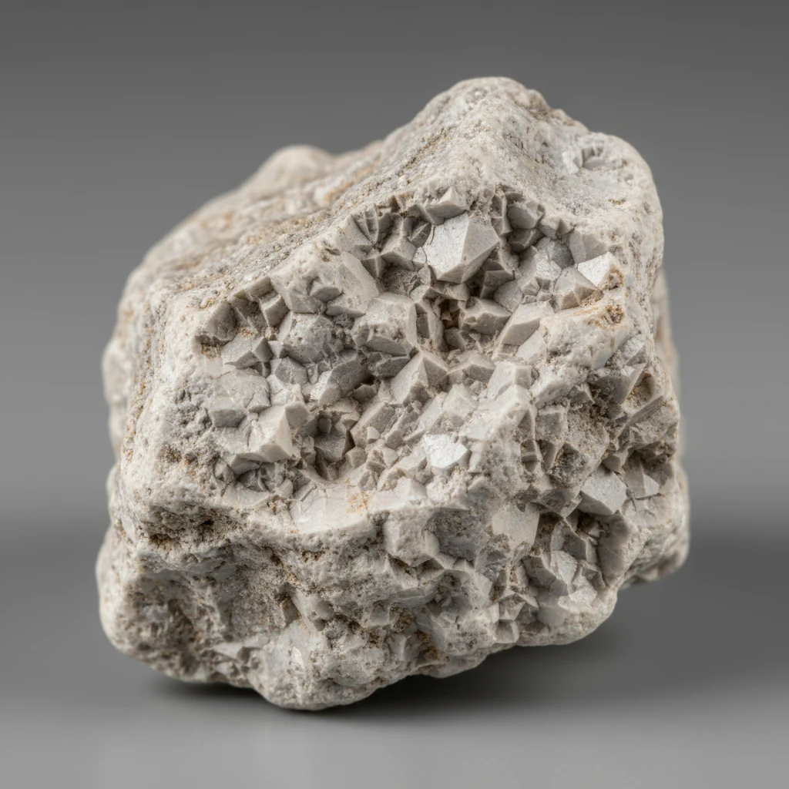

# Chalk

> **Family:** Sedimentary — organic · **Composition:** calcite (CaCO₃) from microscopic organisms
> **Quick ID:** Very soft (fingernail-scratchable), white, porous limestone that **fizzes** and writes on a rough surface.

## At a glance

| Property | Value |
|---|---|
| Colour | White (sometimes off-white/grey) |
| Hardness | **~1–2** (very soft — a fingernail scratches it) |
| Composition | Calcite (CaCO₃) — microscopic shells |
| Acid test | **Fizzes** in dilute acid |
| Texture | Very fine, soft, porous, earthy |
| Setting | Deep, clear, shallow-marine (Cretaceous–Recent) |

## Composition
A soft, white, porous **limestone** made of the calcite (CaCO₃) skeletons of microscopic organisms (**coccoliths / foraminifera**). Essentially pure, very fine **calcium carbonate** accumulated from the remains of countless tiny marine organisms.

## Origin & classification
Chalk is a **biochemical sedimentary rock** — it forms from the steady rain of microscopic calcite shells (coccoliths, foraminifera) settling onto a **deep, clear seafloor** and accumulating into thick, pure limestone. It is the **softest, finest** variety of limestone — the extreme end of the carbonate spectrum.

## Texture & sedimentary structures
Very fine, soft, porous, and earthy; **writes on a rough surface** (the classic chalk property). Typically **massive and bedded**; may contain **flint/chert nodules**. The texture is so fine that individual shells are visible only under a microscope.

## Diagnostic field features
- **Soft** (scratchable by a fingernail), white, porous.
- **Fizzes** in dilute acid (it's calcite).
- **Writes** on a rough surface (like a blackboard chalk).
- Very fine, earthy, and lightweight.

## Identification tests — step by step
1. **Hardness:** very soft — a fingernail easily scratches it (softer than other limestones).
2. **Acid:** fizzes vigorously with dilute HCl (calcite).
3. **Writing:** it writes on a rough surface.
4. **Texture:** very fine, white, porous, earthy.
5. **Vs limestone:** chalk is much softer, finer, and whiter than ordinary limestone.

## Depositional setting & formation
Chalk forms in **warm, clear, shallow-to-deep marine** settings where microscopic calcite-secreting organisms flourish and their shells accumulate on the seafloor. Over millions of years this builds thick, very pure, very fine limestone — the chalk deposits of Late Cretaceous–Recent age.

## Host states / localities
Chalk is a soft, shallow-marine Cretaceous–Recent carbonate; it is **not a major Nigerian rock**, though soft, fine limestones occur locally in the sedimentary basins (see [Limestone & Dolomite](limestone.md)). Nigeria's carbonates are generally harder, more fossiliferous limestones rather than true chalk.

## Associated minerals & rocks
Limestone, marl, flint/nodules. Associated rocks: limestone, marl, shale (marine sequence).

## Economic relevance
- **Lime and cement** (when blended with richer limestone).
- **Filler** (paper, paint, plastics).
- Traditional **writing chalk**.
- **Flint/chert nodules** within chalk have tool/ornamental value.

## Lookalikes & how to distinguish

| Looks like | How to tell it apart |
|---|---|
| **Limestone** | Chalk is much softer (fingernail) and finer/whiter; ordinary limestone is harder and often fossiliferous. |
| **Marl** | Marl is a mix of clay + carbonate (duller, more earthy, less pure); chalk is nearly pure calcite. |
| **Kaolin (white clay)** | Kaolin does **not** fizz; chalk **fizzes** (it's carbonate). |

## Field checklist
- [ ] Very soft (fingernail-scratchable)?
- [ ] White, porous, earthy?
- [ ] Fizzes with acid?
- [ ] Writes on a rough surface?
- [ ] Very fine (microscopic shells)?

## Field tips
- Very soft, white, porous limestone that fizzes — the soft, fine end-member of limestone.
- The **acid fizz** confirms it is carbonate (calcite), distinguishing it from white clay (kaolin).
- Its softness and writing property are the fastest field clues.
- Chalk is uncommon in Nigeria — Nigeria's carbonates are harder limestones.

## Facts
- Chalk is made of **microscopic organism shells** (coccoliths) — the famous White Cliffs of Dover are chalk.
- It is the **softest, finest** limestone — a fingernail scratches it.
- Chalk **fizzes** in acid because it is nearly pure **calcium carbonate**.
- Chalk is **not a major Nigerian rock** — included for completeness of the carbonate family.

*Figure II.C.19 — Chalk (soft white limestone). Source: [Rock Identifier](https://rockidentifier.io/wiki/chalk).*

## Related
- [Limestone & Dolomite](limestone.md) · [Oolitic Limestone (Oolite)](oolitic-limestone.md) · [Calcite](../../03-mineral-resources/industrial/calcite.md) · [Marl](../../03-mineral-resources/industrial/marl.md) · [Marble](../metamorphic/marble-calc-silicate.md)
