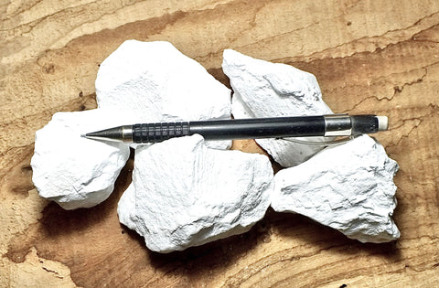
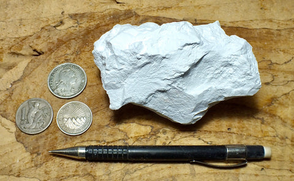
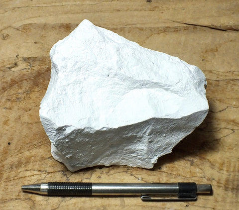
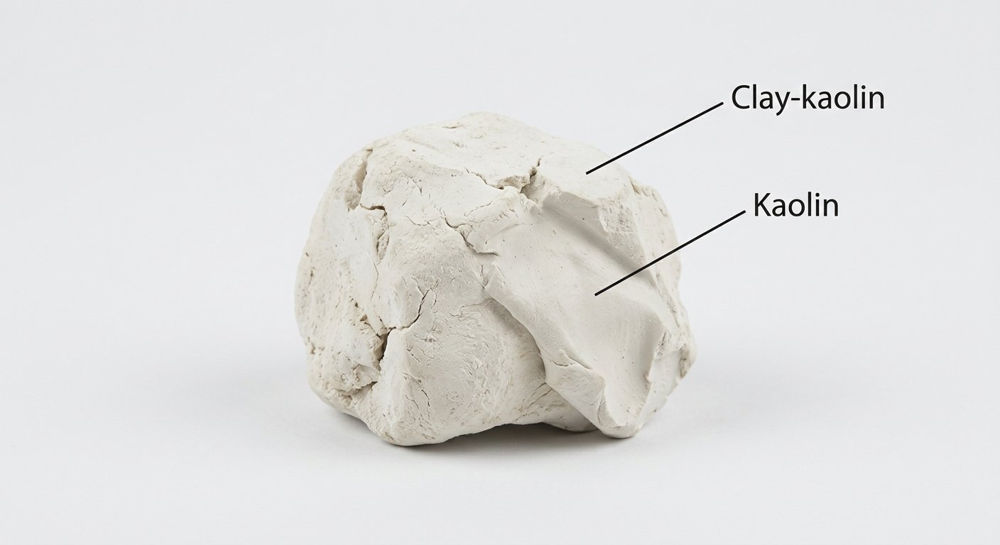
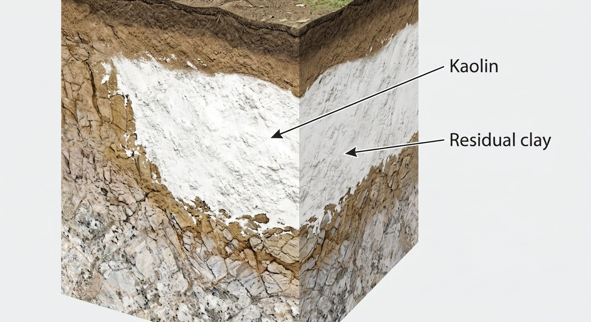

# Clay & Kaolin

> **Family:** Sedimentary / residual · **Composition:** clay minerals (kaolinite group)
> **Quick ID:** Earthy, plastic and sticky when wet, hard when dry; white kaolin is smooth/soapy; gives a "clayey" smell when dampened.

## At a glance

| Property | Value |
|---|---|
| Colour | White (kaolin) to grey, red, brown (iron-stained) |
| Texture | Fine, earthy; plastic when wet |
| Key minerals | Kaolinite, illite, smectite, halloysite |
| Behaviour | Plastic/sticky wet; hard when dry |
| Key test | Plasticity when wet + earthy smell |
| Setting | Deeply weathered feldspar-rich rock (tropics) |

## Composition
Fine-grained **hydrous aluminium silicates** — chiefly **kaolinite**, plus illite, smectite (montmorillonite), and halloysite. **Kaolin** is the white, high-kaolinite variety from feldspar weathering. Chemically Al₂Si₂O₅(OH)₄ (kaolinite) — an aluminium silicate.

## Origin & classification
Clay forms by **chemical weathering** of feldspar-rich rocks (granite, gneiss) — feldspar alters to **kaolinite** in warm, wet climates. It is a **residual** deposit (formed in place) or a **sedimentary** one (transported and redeposited). The clay-mineral type records the weathering intensity and source.

## Texture & sedimentary structures
**Fine, earthy, and plastic when wet**; dries hard; white (kaolin) to grey, red, or brown (iron-stained clays). Pure **kaolin** is white, smooth, and slightly soapy; **ball clay** is very plastic; **bentonite** (smectite) swells in water.

## Diagnostic field features
- **Earthy** texture; **plastic and sticky when wet**, hard when dry.
- Gives off a characteristic **"clayey" smell** when breathed on/dampened.
- White kaolin **stains** and feels smooth/soapy.
- Very fine — individual grains invisible.

## Identification tests — step by step
1. **Plasticity:** wet a sample — clay becomes plastic/sticky and can be moulded.
2. **Smell:** dampen and breathe on it — a distinctive earthy "clayey" smell.
3. **Feel:** smooth and soapy (kaolin) vs gritty (silt).
4. **Colour:** white (pure kaolin) vs grey/red/brown (impure/iron-stained).
5. **Vs siltstone:** clay is finer and more plastic; siltstone is slightly gritty.

## Depositional setting & formation
Clay forms by **intense tropical weathering** of feldspar-rich rocks — water and acids break down feldspar into kaolinite, leaving a fine, white residue. Nigeria's warm, wet climate and deeply weathered Basement are ideal for forming extensive **kaolin** and **laterite** profiles.

## Host states / localities
Formed by intense tropical weathering of feldspar-rich rocks — widespread: **Ondo, Ekiti, Ogun, Edo, Delta, Oyo, Osun, Kwara, Kogi, Enugu**, and more. Occurs within **laterite/regolith profiles** across the Basement.

## Associated minerals & rocks
Quartz, feldspar (source), mica, iron oxides; associated with **laterite** profiles. Associated rocks: laterite, granite/gneiss (parent), shale.

## Economic relevance
- **KAOLIN** — ceramics, paper coating, paint, rubber, plastics (a major industrial mineral; Nigeria is a significant producer).
- **Brick, pottery, and tile** clay.
- **Cement** raw material; **refractory** clays.
- **Bentonite** (smectite clay) for drilling mud and foundry sand.

## Lookalikes & how to distinguish

| Looks like | How to tell it apart |
|---|---|
| **Siltstone** | Siltstone is slightly gritty and lithified; clay is finer and plastic when wet. |
| **Chalk** | Chalk fizzes with acid; clay does not. |
| **Talc / soapstone** | Talc is very soft (hardness 1) and greasy; clay is plastic when wet (a different behaviour). |

## Field checklist
- [ ] Plastic/sticky when wet, hard when dry?
- [ ] Earthy "clayey" smell when damp?
- [ ] Fine (grains invisible)?
- [ ] White (kaolin) or iron-stained (grey/red/brown)?
- [ ] In a weathered/laterite profile?

## Field tips
- **Plastic when wet, earthy, fine** = clay.
- **White + soapy + plastic** = kaolin.
- **vs. siltstone:** clay is finer and more plastic; siltstone is slightly gritty.
- Kaolin occurs in the **upper, leached zone** of laterite profiles — map the regolith.
- The **plasticity test** (wet and mould) is the definitive clay ID.

## Facts
- **Kaolin** forms from the **weathering of feldspar** — warm, wet climates turn granite into white clay.
- Nigeria is a significant **kaolin producer** (ceramics, paper, paint).
- **Bentonite** (a smectite clay) can absorb many times its weight in water and swell.
- Clay's **plasticity when wet** comes from the platy shape of its tiny mineral grains.

*Figure II.C.6 — Kaolin: soft white kaolinite clay. Source: [Geological Specimen Supply](https://geologicalspecimensupply.com/products/kaolinite-teaching-student-specimens-of-the-primary-constituent-of-kaolin-clay-unit-of-5-specimens).*

*Figure II.C.6b — Kaolin (kaolinite clay) hand specimen. Source: [Geological Specimen Supply](https://geologicalspecimensupply.com/products/kaolinite-soft-kaolin-teaching-hand-display-specimen-of-the-primary-constituent-of-kaolin-clay).*

*Figure II.C.6c — Kaolin (kaolinite) display specimen. Source: [Geological Specimen Supply](https://geologicalspecimensupply.com/products/kaolinite-soft-white-kaolin-large-display-specimen-of-the-primary-constituent-of-kaolin-clay).*

*Figure II.C.6d — Labeled illustration: clay-kaolin (white kaolin clay). Original diagram prepared for this guide.*

*Figure II.C.6e — Labeled illustration: kaolin residual clay. Original diagram prepared for this guide.*

## Related
- [Laterite & Ferricrete](laterite-ferricrete.md) · [Siltstone, Shale & Mudstone](siltstone-shale.md) · **Part III** — [kaolin](../../03-mineral-resources/industrial/kaolin.md), [clay](../../03-mineral-resources/industrial/clay.md), [bentonite](../../03-mineral-resources/industrial/bentonite.md)
