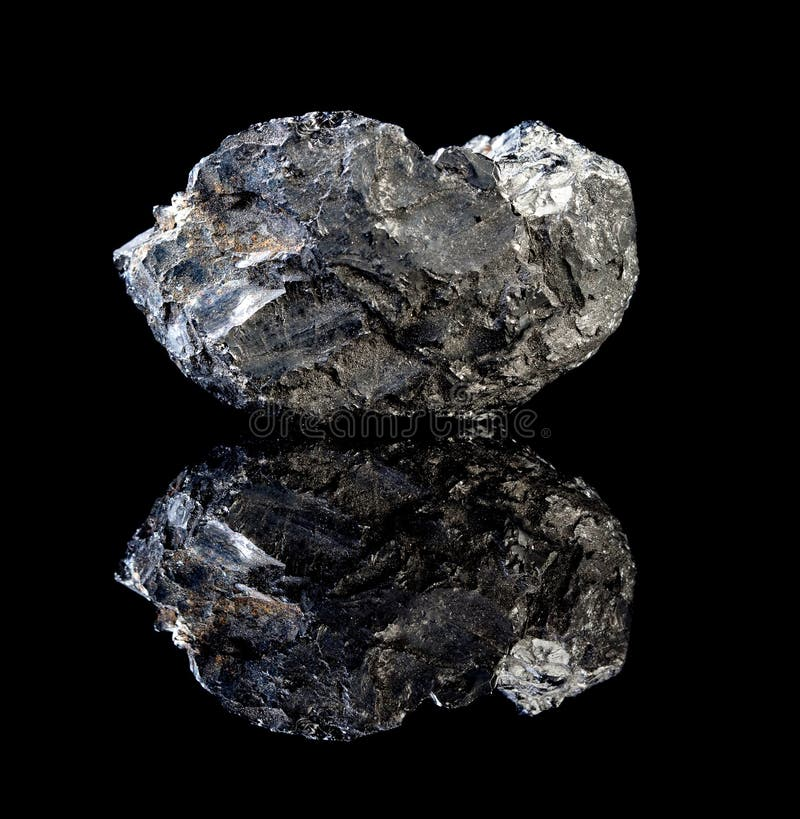

# Coal & Lignite

> **Family:** Sedimentary — organic · **Origin:** compacted, altered plant material
> **Rank series:** peat → lignite → bituminous coal → anthracite
> **Quick ID:** Black, light, brittle, often with plant fossils; burns with a smoky flame.

## At a glance

| Property | Value |
|---|---|
| Colour | Black (coal) / brown (lignite) |
| Texture | Brittle, layered; may preserve plant fossils |
| Weight | Light for its size |
| Hardness | Soft–brittle (~2–2.5) |
| Key test | **Flammable** — burns with a smoky flame |
| Setting | "Coal measures" — interbedded with shale/sandstone |

## Composition
Compacted, altered **plant matter**, increasing in carbon with rank: **peat → lignite → bituminous coal → anthracite**. Contains carbon, volatiles, moisture, and ash. Higher-rank coal is blacker, harder, and more carbon-rich; **lignite** is brown and lower-rank.

## Origin & classification
Coal is an **organic sedimentary rock** — it forms from plant material accumulated in **swamps** that was buried and progressively **coalified** (heat and pressure driving off volatiles and enriching carbon). Coal **rank** (lignite → anthracite) records the degree of burial and heating.

## Texture & sedimentary structures
**Black, brittle, and layered**; may preserve **plant fossils** (leaves, wood); breaks with a conchoidal-ish fracture; lightweight for its size. Often interbedded with **shale and sandstone** (the "coal measures"). **Lignite** is softer, browner, and more earthy.

## Diagnostic field features
- **Black, light, and brittle**.
- May show **woody/plant structure** or fossil leaves.
- **Flammable** — burns with a smoky flame.
- Often interbedded with **shale and sandstone** (the "coal measures").

## Identification tests — step by step
1. **Flammability:** a small piece burns with a smoky flame (the definitive test).
2. **Weight:** light for its size (carbon-rich, low density).
3. **Brittleness:** crumbles/breaks easily; may show plant fossils.
4. **Colour:** black (bituminous/anthracite) or brown (lignite).
5. **Vs bitumen:** coal is brittle solid plant matter; bitumen is sticky/oily.

## Depositional setting & formation
Coal forms in **swampy, waterlogged** environments where dead plants accumulate faster than they decay. Burial and compaction coalify the peat, driving off water and volatiles and enriching carbon over millions of years. Nigeria's coals formed in the ancient swamps of the **Benue Trough / Anambra Basin**.

## Host states / localities
- **Enugu** — the "Coal City," Nigeria's historic coal-mining center.
- **Kogi** (Ogboyaga/Ogboyega).
- **Nasarawa** (Lafia/Obi).
- Also **Benue, Anambra, Delta, Cross River**, and lignite in the **Chad** and SW basins.

## Associated minerals & rocks
Pyrite, quartz, clay, siderite; **methane** (coal-bed gas); plant fossils. Associated rocks: shale, sandstone, siltstone (the coal measures).

## Economic relevance
- **COAL** — historically mined at **Enugu**; used for power generation and industry (with a lignite resource base for future energy).
- Potential **coal-bed methane** (a gas resource) and chemical feedstocks.
- **Coke** for metallurgy where quality allows.

## Lookalikes & how to distinguish

| Looks like | How to tell it apart |
|---|---|
| **Lignite** | Lignite is brownish, softer, lower-rank; black coal is harder and more carbon-rich. |
| **Anthracite** | Anthracite is very hard, black, and high-rank (highest carbon). |
| **Bitumen / tar** | Bitumen is sticky/oily, not brittle plant matter. |
| **Black shale** | Black shale is fine-grained and non-flammable (mostly); coal is light, brittle, and burns. |

## Field checklist
- [ ] Black/brown, light, brittle?
- [ ] Plant fossils / woody structure?
- [ ] Flammable (burns smokily)?
- [ ] Interbedded with shale/sandstone (coal measures)?
- [ ] Enugu / Kogi / Nasarawa coal fields?

## Field tips
- **Black + light + brittle + plant fossils + flammable** = coal/lignite.
- **Lignite** is brownish, softer, and lower-rank than black coal.
- Distinguish from **bitumen/tar** (which is sticky/oily, not brittle plant matter).
- Coal occurs in the "**coal measures**" — look for shale/sandstone with coal seams.
- Note seam thickness and quality (ash, sulfur) — key economic factors.

## Facts
- **Enugu** is Nigeria's "Coal City" — site of the historic Udi coal mines.
- Coal formed from **ancient swamp plants** buried and coalified over ~300 million years.
- Coal can release **coal-bed methane** — a potential energy resource.
- The rank series **peat → lignite → bituminous → anthracite** records increasing burial and carbon content.

*Figure II.C.5 — Black coal: combustible organic sedimentary rock. Source: [Dreamstime](https://www.dreamstime.com/photos-images/natural-coal-rocks.html).*

## Related
- [Siltstone, Shale & Mudstone](siltstone-shale.md) · [Bitumen](bitumen.md) · [Peat](peat.md) · **Part III, III.D** — [coal](../../03-mineral-resources/energy/coal.md) (energy minerals)
