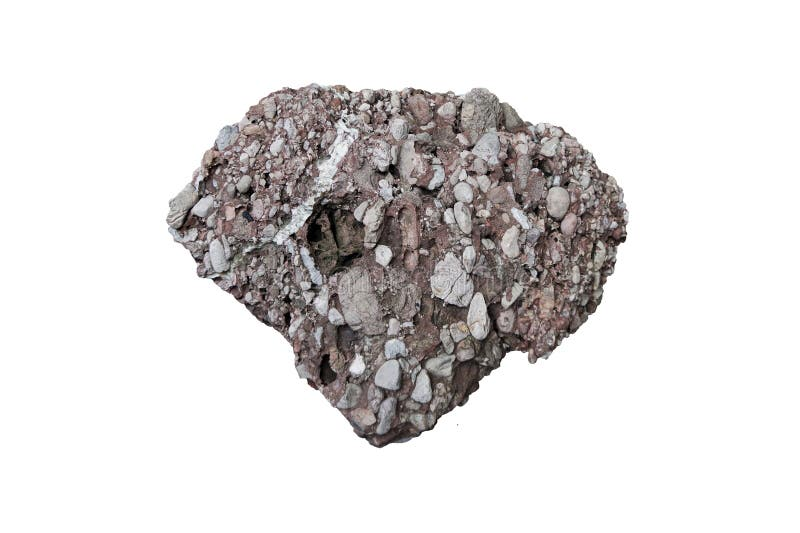

# Conglomerate & Breccia

> **Family:** Sedimentary — clastic · **Grain size:** gravel (>2 mm)
> **Varieties:** Conglomerate (rounded pebbles) · Breccia (angular clasts)
> **Quick ID:** Visible pebbles (conglomerate) or angular clasts (breccia) in a sandy matrix; coarse and gritty throughout.

## At a glance

| Property | Conglomerate | Breccia |
|---|---|---|
| Clast shape | **Rounded** pebbles | **Angular** clasts |
| Implies | Long transport (rivers, beaches) | Little transport (talus, faulting) |
| Texture | Very coarse, grain-supported | Very coarse, angular |
| Setting | High-energy: rivers, alluvial fans | Talus, fault zones, lahars |
| Energy | High | High |

## Composition
**Coarse clastic** sedimentary rocks made of gravel-sized clasts (>2 mm) in a finer matrix, cemented by silica, calcite, or iron oxides:
- **Conglomerate** — rounded pebbles.
- **Breccia** — angular clasts.

Clasts can be of many rock types (quartz, chert, granite, etc.), reflecting the source area.

## Origin & classification
These are the **coarsest clastic sedimentary rocks**, deposited in **high-energy** environments where only large clasts settle. **Rounding** records transport distance: well-rounded pebbles (conglomerate) travelled far; angular clasts (breccia) moved little (talus, landslides, fault brecciation). Classified by clast rounding and composition.

## Texture & sedimentary structures
Very coarse and clastic; **rounded** (conglomerate) vs **angular** (breccia) clasts; grain-supported. Often **poorly sorted** (mixed sizes) and **imbricated** (pebbles tilted like dominoes by current). May show **cross-bedding** at the large scale.

## Diagnostic field features
- Visible pebbles or angular clasts set in a sandy matrix.
- Indicates **high-energy** deposition (fast rivers, alluvial fans, talus).
- Coarse and gritty throughout — you can see and feel individual clasts.
- Imbrication (pebbles aligned) shows the current direction.

## Identification tests — step by step
1. **Clast size:** gravel (>2 mm) — visible pebbles/clasts.
2. **Clast shape:** **rounded → conglomerate; angular → breccia**.
3. **Matrix:** sandy/cemented matrix between clasts.
4. **Sorting:** often poorly sorted (mixed grain sizes).
5. **Vs breccia (fault):** fault breccia is confined to a fault zone; sedimentary breccia is bedded.

## Depositional setting & formation
Conglomerates and breccias form in **high-energy** settings — fast rivers, alluvial fans, debris flows, and talus slopes — where only coarse material is deposited. Burial and cementation lithify the gravel into rock. Basal conglomerates often mark the start of a sedimentary sequence (an unconformity).

## Host states / localities
The **Benue Trough** (e.g., the basal **Bima Sandstone** conglomerate), plus the **Sokoto/Chad** and other basins — **Benue, Kogi, Nasarawa, Plateau, Sokoto**, etc. Basal conglomerates commonly overlie the Basement unconformity.

## Associated minerals & rocks
Sandstone and grit (they interfinger with); **placer gold and tin** can concentrate in cemented conglomerates (see [Placers & Alluvium](placers-alluvium.md)). Associated rocks: sandstone, arkose, shale.

## Economic relevance
- **Aggregate** and building stone (coarse, durable).
- The **Bima Sandstone** is also an important **aquifer**.
- **Basal conglomerates** can host **placers** (gold, tin) where they are reworked.
- Mark **unconformities** — useful for basin analysis.

## Lookalikes & how to distinguish

| Looks like | How to tell it apart |
|---|---|
| **Fault/volcanic breccia** | Those are confined to faults/volcanic vents; sedimentary breccia is bedded. |
| **Sandstone** | Sandstone grains are sand-sized (<2 mm); conglomerate has visible pebbles. |
| **Metaconglomerate** | Metaconglomerate is metamorphic (foliated, stretched pebbles). |

## Field checklist
- [ ] Visible pebbles/clasts (>2 mm)?
- [ ] Rounded (conglomerate) or angular (breccia)?
- [ ] Sandy/cemented matrix?
- [ ] High-energy setting (basal conglomerate, fan)?
- [ ] Imbrication (current direction)?

## Field tips
- Look at the clasts: **rounded → conglomerate; angular → breccia**; coarse and gritty throughout.
- **Imbrication** (pebbles tilted the same way) reveals the ancient current direction.
- Basal conglomerates mark the **base of a sedimentary sequence** (over the Basement).
- Check conglomerates for **reworked placer gold/tin** where they sit above mineralised rock.

## Facts
- Conglomerate and breccia are the **coarsest** clastic sedimentary rocks.
- **Rounding** records transport distance — rounded pebbles travelled far, angular clasts barely moved.
- The **basal Bima conglomerate** (Benue) marks the start of that basin's sedimentary fill.
- **Imbricated** pebbles (tilted like dominoes) record ancient current directions.

*Figure II.C.12 — Conglomerate (rounded pebbles in a cemented matrix). Source: [Dreamstime](https://dreamstime.com/conglomerate-sedimentary-rock-made-rounded-pebbles-sand-usually-held-together-cemented-silica-calcite-iron-image180000198).*

## Related
- [Sandstone, Grit & Arkose](sandstone.md) · [Placers & Alluvium](placers-alluvium.md) · [Metaconglomerate](../metamorphic/metasediments.md) · [Sedimentary basins](../../01-general-geology/01-04-sedimentary-basins.md)
