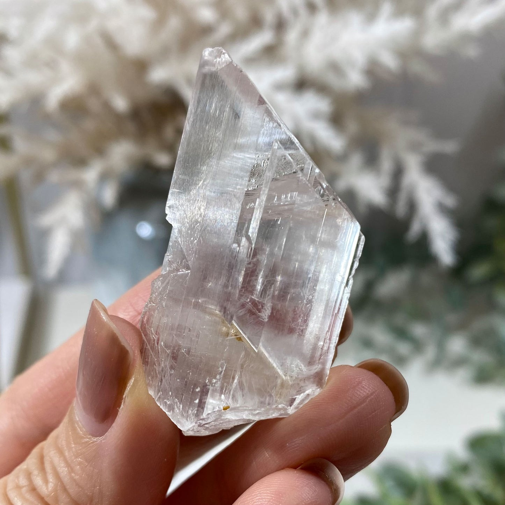

# Gypsum & Other Evaporites

> **Family:** Sedimentary — chemical (evaporite) · **Composition:** hydrated calcium sulfate
> **Quick ID:** Very soft (fingernail-scratchable) + **no acid fizz** + clear tabular or fibrous crystals.

## At a glance

| Property | Value |
|---|---|
| Colour | Clear, white, grey (sometimes tinted) |
| Hardness | **~2** (very soft — a fingernail scratches it) |
| Composition | Gypsum CaSO₄·2H₂O (and anhydrite CaSO₄) |
| Acid test | **No fizz** (unlike calcite/limestone) |
| Texture | Crystalline, fibrous, or granular |
| Setting | Evaporite basins (Chad, Gombe, Nasarawa) |

## Composition
**Gypsum** (CaSO₄·2H₂O) and **anhydrite** (CaSO₄), deposited by the evaporation of seawater or lake water. Often found with **halite (salt)** and other evaporites. Chemically a **calcium sulfate** mineral — note it does **not** contain carbonate, so it does not fizz in acid.

## Origin & classification
Gypsum is a **chemical evaporite** — it precipitates when saline water (seawater or brine) evaporates in a restricted basin, lake, or sabkha, concentrating dissolved calcium sulfate until it crystallises. Evaporites form in a predictable order (carbonate → gypsum → halite) as evaporation proceeds.

## Texture & sedimentary structures
**Crystalline to fibrous/granular**. Varieties include:
- **Selenite** — clear, tabular crystals.
- **Satin spar** — fibrous, silky.
- **Alabaster** — fine-grained, massive (used for carving).
Often in **beds and nodules** within evaporite sequences.

## Diagnostic field features
- **Very soft** — easily scratched by a **fingernail** (hardness 2).
- Clear/white/grey; may form **clear tabular crystals** or **fibrous** veins.
- **Does NOT fizz** with acid (unlike calcite/limestone).
- Satin-spar (fibrous) and clear selenite are distinctive and beautiful.

## Identification tests — step by step
1. **Fingernail:** gypsum is so soft (hardness 2) a fingernail scratches it.
2. **Acid:** a drop of HCl produces **no fizz** (rules out calcite/limestone).
3. **Crystal form:** look for clear tabular (selenite) or fibrous (satin spar) habits.
4. **Vs calcite:** calcite fizzes with acid and is harder (3); gypsum does neither.
5. **Vs halite:** halite tastes salty and breaks into cubes; gypsum does not.

## Depositional setting & formation
Gypsum forms where **saline water evaporates** — restricted marine basins, saline lakes, and coastal sabkhas. As water evaporates, dissolved minerals precipitate in sequence: first carbonates, then **gypsum**, then **halite** (salt). Nigeria's gypsum occurs in the evaporite basins of the north (Chad, Gombe, Nasarawa).

## Host states / localities
- **Gombe** (Nafada, Dukku) — major gypsum deposits.
- **Nasarawa** (Awe).
- **Bauchi, Borno (Chad Basin), Sokoto**, and other evaporite basins.

## Associated minerals & rocks
Halite, anhydrite, calcite, dolomite; in layered evaporite sequences. Associated rocks: rock salt, limestone, shale (evaporite-associated).

## Economic relevance
- **GYPSUM** — plaster, plasterboard, cement (as a set retarder), and fertilizer — a nationally important industrial mineral (Gombe is a key producer).
- **Anhydrite** for cement and chemicals.
- **Alabaster** (fine gypsum) for sculpture and ornament.

## Lookalikes & how to distinguish

| Looks like | How to tell it apart |
|---|---|
| **Calcite** | Calcite **fizzes** with acid and is harder (3); gypsum does not fizz and is softer (2). |
| **Halite (salt)** | Halite tastes salty and breaks into cubes; gypsum is not salty and lacks cubic cleavage. |
| **Talc** | Talc is even softer (hardness 1) and soapy; gypsum is hardness 2 and not soapy. |

## Field checklist
- [ ] Very soft (fingernail-scratchable)?
- [ ] **No** acid fizz?
- [ ] Clear tabular (selenite) or fibrous (satin spar) crystals?
- [ ] In an evaporite basin (with salt)?
- [ ] White/clear/grey colour?

## Field tips
- **Soft (fingernail-scratchable) + no acid fizz** = gypsum.
- **vs. calcite:** calcite fizzes with acid and is harder (3).
- Satin-spar (fibrous) and clear selenite are distinctive.
- Gypsum marks an **evaporite** environment — look for associated salt and anhydrite.

## Facts
- Gypsum is **hardness 2** — soft enough to scratch with a fingernail.
- It is a key **evaporite** mineral, precipitating as saline water evaporates.
- **Gombe State** (Nafada/Dukku) hosts some of Nigeria's largest gypsum deposits.
- Gypsum is added to **cement** to slow its setting, and is the raw material for **plasterboard**.

*Figure II.C.7 — Selenite gypsum crystals. Source: [Reverie Minerals](https://reverieminerals.com/products/selenite-gypsum-crystal-mineral-specimen).*

## Related
- [Rock salt (halite)](rock-salt.md) · [Anhydrite](anhydrite.md) · [Limestone & Dolomite](limestone.md) · **Part III** — [gypsum](../../03-mineral-resources/industrial/gypsum.md)
