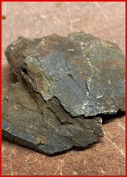
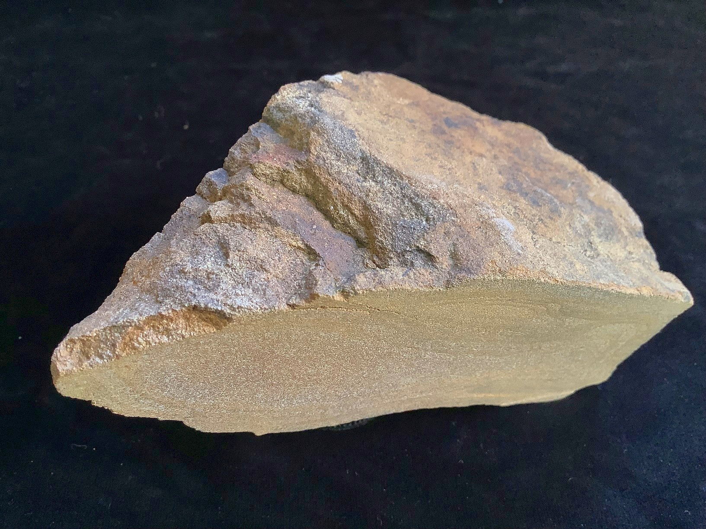

# Oolitic & Lateritic Ironstone (Iron Ore)

> **Family:** Sedimentary / residual · **Composition:** iron oxides & carbonates
> **Types:** Oolitic ironstone · Banded iron formation (BIF) · Lateritic ironstone
> **Quick ID:** Heavy + reddish-brown/ochre (rusty) + oolitic or banded; red-brown streak; often magnetic.

## At a glance

| Property | Value |
|---|---|
| Colour | Reddish-brown/ochre to dark grey |
| Texture | Oolitic, banded, or massive |
| Weight | **Heavy** (iron-rich) |
| Streak | Red-brown (hematite/goethite) |
| Magnetism | Magnetic where magnetite/BIF present |
| Key test | Weight + colour + red-brown streak |
| Setting | Itakpe ridge; lateritic Basement |

## Composition
**Hematite / limonite (goethite)** and/or **siderite / chamosite**, occurring as:
- **Oolitic ironstone** — concentric "ooid" grains of iron minerals.
- **Banded iron formation (BIF)** — alternating iron-rich and chert/silica layers.
- **Lateritic ironstone** — iron concentrated by tropical weathering.

Chemically dominated by **Fe₂O₃ (hematite)** or **FeO(OH) (goethite/limonite)**; the iron gives the rock its weight, colour, and streak.

## Origin & classification
Ironstones form by two main routes:
- **Chemical/organic sedimentation** — iron precipitated in marine settings (oolitic ironstones, BIF), often in the absence of oxygen.
- **Residual enrichment (lateritization)** — tropical weathering leaches silica and concentrates iron as **lateritic ironstone / ferricrete**.

## Texture & sedimentary structures
**Oolitic** (tiny round grains), **banded** (BIF's alternating iron/silica layers), or **massive**; typically **heavy**, reddish-brown to dark grey; **magnetic** where magnetite is present. Oolitic texture and banding are the key sedimentary clues.

## Diagnostic field features
- **Heavy** and **reddish-brown/ochre** (rusty).
- **Oolitic** texture (small spherical grains) or **banding**.
- May attract a **magnet** (magnetite/BIF).
- Gives a **red-brown streak** on unglazed porcelain.

## Identification tests — step by step
1. **Weight:** noticeably heavy for its size (iron-rich).
2. **Streak:** red-brown streak on unglazed porcelain (hematite/goethite).
3. **Magnet:** magnetic varieties (magnetite/BIF) attract a magnet.
4. **Texture:** oolitic (round grains) or banded (BIF).
5. **Vs sandstone:** ironstone is heavier, redder, with a red-brown streak.

## Depositional setting & formation
Oolitic ironstones and BIFs formed in **marine settings** where iron precipitated (often in low-oxygen conditions). **Lateritic ironstones** form today in the **tropics**, where intense weathering strips silica and concentrates iron near the surface — very relevant to Nigeria's deeply weathered Basement.

## Host states / localities
- **Itakpe** (Kogi) — the famous **Itakpe Hill** iron-ore ridge (NIOMCO, feeding the Ajaokuta steel complex).
- **Agbaja & Ajabanoko** (Kogi).
- Also **Enugu, Kogi, Nasarawa**, and lateritic iron in many Basement areas.

## Associated minerals & rocks
Hematite, magnetite, goethite/limonite, quartz, chamosite; phosphorus in some ores. Associated rocks: shale, sandstone, itabirite (metamorphosed BIF), laterite.

## Economic relevance
- **IRON ORE for steel** — Nigeria's main iron deposits (Itakpe/Ajaokuta steel complex); a strategic resource.
- Also lateritic iron as a local resource.
- **Phosphorus** content is a quality issue for some ores (must be monitored for steelmaking).

## Lookalikes & how to distinguish

| Looks like | How to tell it apart |
|---|---|
| **Laterite / ferricrete** | Laterite iron is a surface enrichment (often porous/nodular); ironstone/BIF is bedded/oolitic bedrock. |
| **Sandstone** | Ironstone is much heavier and gives a red-brown streak; sandstone is lighter and gritty. |
| **Hematite (massive)** | Massive hematite is nearly pure iron oxide; ironstone is a rock with iron minerals + silica/carbonate. |

## Field checklist
- [ ] Heavy for its size?
- [ ] Reddish-brown/ochre, red-brown streak?
- [ ] Oolitic or banded texture?
- [ ] Magnetic (magnetite/BIF)?
- [ ] Itakpe ridge / lateritic Basement?

## Field tips
- **Heavy + reddish/brown + oolitic or banded** = ironstone.
- **Magnetic** varieties point to magnetite/BIF.
- Distinguish from ordinary sandstone by **weight, colour, and iron content** (a streak test gives a red-brown streak).
- Ironstone is a strategic resource — note grade (iron %) and impurities (phosphorus).

## Facts
- The **Itakpe Hill** (Kogi) iron ore feeds the **Ajaokuta steel complex** — Nigeria's flagship iron-and-steel project.
- **Banded iron formations (BIF)** are the source of most of the world's iron ore and record the rise of atmospheric oxygen.
- Lateritic iron concentrates in the **tropics** — Nigeria's deep weathering is ideal for it.
- Ironstone's weight and red-brown streak are the quickest field identifiers.

*Figure II.C.4 — Banded iron formation: alternating iron-rich and silica layers. Source: [iStock](https://www.istockphoto.com/photos/banded-iron).*

*Figure II.C.4b — Sedimentary ironstone specimen. Source: [Geo Supplies](https://www.geosupplies.co.uk/acatalog/Single-Specimen-of-Sedimentary-Ironstone-779.html).*

*Figure II.C.4c — Ironstone hand specimen. Source: [Virtual Microscope](https://virtualmicroscope.org/content/sw17-ironstone).*

## Related
- [Sandstone](sandstone.md) · [Laterite & Ferricrete](laterite-ferricrete.md) · **Part III** — [iron ore](../../03-mineral-resources/metallic/iron-ore.md)
