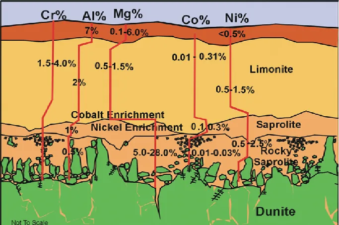
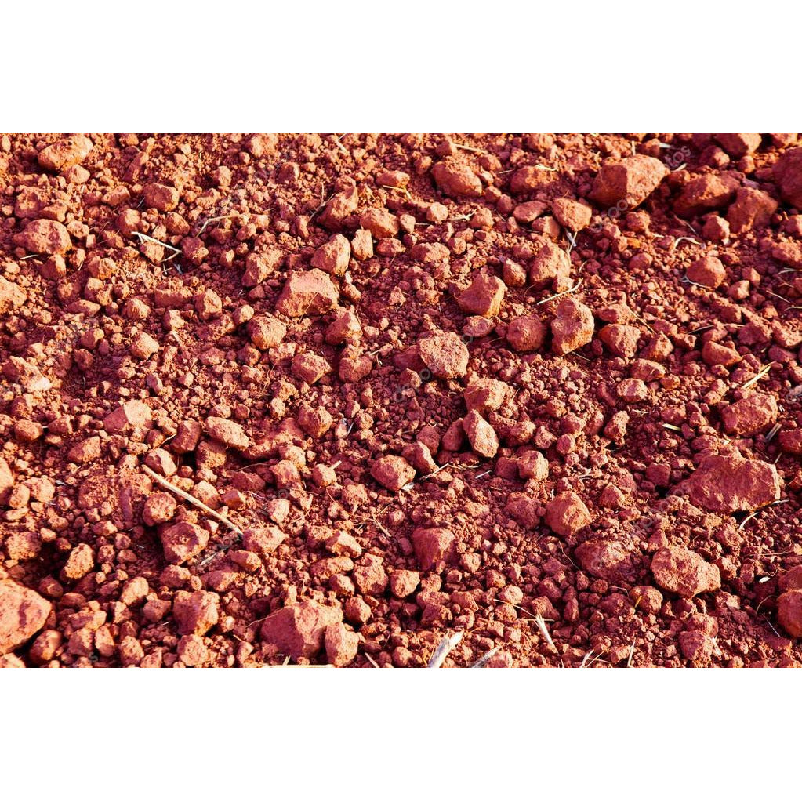
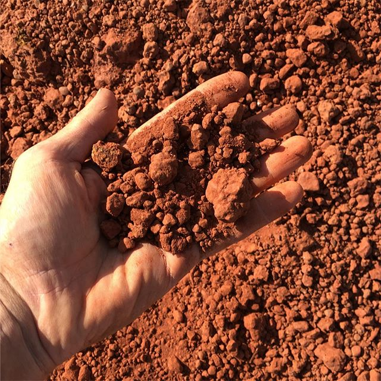

# Laterite & Ferricrete

> **Family:** Residual / sedimentary · **Origin:** intense tropical weathering (lateritization)
> **Quick ID:** Reddish-brown, nodular/pisolitic, hard iron cap (ferricrete) over softer pale saprolite.

## At a glance

| Property | Value |
|---|---|
| Colour | Reddish-brown (iron-rich) |
| Texture | **Pisolitic / nodular**; hard crust over soft zone |
| Key feature | Hard **ferricrete** cap over softer saprolite/pallid zone |
| Weight | Heavy (iron-rich) |
| Setting | Deeply weathered Basement (tropics) |
| Nature | **Weathered** material, not primary bedrock |

## Composition
Iron- and aluminium-rich material left behind as soluble elements are stripped from rock by tropical weathering. **Laterite** is Al–Fe rich; **ferricrete** is an iron-cemented **duricrust** (hard cap). Rich in **hematite/goethite (iron)** and **gibbsite/aluminium minerals**, with residual quartz and kaolinite.

## Origin & classification
Laterite is a **residual** deposit — it forms **in place** by intense tropical weathering (lateritization), where heavy rainfall leaches away silica, alkalis, and other soluble elements, leaving a concentrate of insoluble **iron and aluminium**. It is not a transported sedimentary rock but a **weathering profile** developed on bedrock.

## Texture & sedimentary structures
**Pisolitic (pea-like) or nodular**, with a hard crust over a softer, paler "**saprolite/pallid zone**." Reddish-brown; heavy; sometimes honeycombed (vesicular). A complete profile has zones: **topsoil → laterite/ferricrete → saprolite → pallid zone → fresh bedrock**.

## Diagnostic field features
- **Reddish-brown** colour; **nodular/pisolitic** texture.
- A **hard iron cap** (ferricrete) over softer weathered rock.
- Heavy and iron-rich.
- Forms a resistant **caprock** that creates flat-topped hills and plateaus.

## Identification tests — step by step
1. **Colour/texture:** reddish-brown + nodular/pisolitic.
2. **Profile:** hard crust over softer, paler material (saprolite) — a weathering profile.
3. **Weight:** heavy (iron-rich).
4. **Context:** deeply weathered Basement (tropics).
5. **Vs ironstone:** laterite is a surface weathering product (pisolitic/porous); ironstone is bedded bedrock.

## Depositional setting & formation
Laterite forms under **intense tropical weathering** — high rainfall and temperature leach soluble elements from bedrock, concentrating iron and aluminium near the surface. Over long timescales this builds a thick **regolith profile**. Nigeria's warm, wet climate and ancient, deeply weathered Basement are ideal for extensive laterite.

## Host states / localities
Blankets much of the **Basement Complex** under tropical weathering: **Plateau, Kaduna, Oyo, Ondo, Ekiti, Kwara, Niger, Kogi, Nasarawa**, and most Basement states.

## Associated minerals & rocks
Concentrated **iron, aluminium (bauxite potential), manganese, gold**, and residual **kaolin**; **cassiterite** in some lateritized pegmatite areas. Associated rocks: clay/kaolin (saprolite), fresh granite/gneiss below.

## Economic relevance
- **Lateritic iron** and potential **bauxite (aluminium)**.
- **Road-base / construction material** (widely used).
- **Residual concentration** of gold, manganese, and other metals — important in exploration (see **§1.11 / regolith geochemistry**).
- Residual **cassiterite** in lateritized tin fields.

## Lookalikes & how to distinguish

| Looks like | How to tell it apart |
|---|---|
| **Ironstone (BIF/oolitic)** | Ironstone is bedded bedrock; laterite is a surface weathering profile (pisolitic/porous, over saprolite). |
| **Clay / kaolin** | Clay is the paler, softer saprolite below the laterite cap. |
| **Calcrete** | Calcrete fizzes (carbonate cement); laterite does not fizz (iron cement). |

## Field checklist
- [ ] Reddish-brown + nodular/pisolitic?
- [ ] Hard cap over softer pale saprolite?
- [ ] Heavy (iron-rich)?
- [ ] Deeply weathered Basement?
- [ ] No acid fizz (rules out calcrete)?

## Field tips
- **Reddish + nodular/pisolitic + hard crust** = laterite/ferricrete.
- It is a **weathered** material, not a primary bedrock — **sample the whole profile**.
- Heavy iron enrichment at the top of the profile.
- In exploration, laterite can **concentrate** gold, manganese, and other metals — sample the ferricrete and saprolite.
- Map the profile thickness — it controls construction, foundations, and agriculture.

## Facts
- **Laterite** gets its name from the Latin *later* (brick) — it hardens like brick when exposed.
- Lateritization is the reason much of Nigeria's Basement is deeply weathered.
- Laterite can concentrate **bauxite (aluminium ore)** and **residual gold**.
- The hard **ferricrete** cap creates many of Nigeria's flat-topped hills and plateaus.

*Figure II.C.10 — A typical laterite weathering profile showing mineral concentration
with depth. Source: [geologyscience.com](https://geologyscience.com/geology-branches/mining-geology/lateritic-deposits/).*

*Figure II.C.10b — Laterite/ferricrete (ferruginous duricrust). Source: [Pavement Materials](https://www.pavementmaterials.co.za/products/ferricrete-laterite-g4-natural-gravel-supplier-cape-town-johannesburg-pretoria-durban).*

*Figure II.C.10c — Ferricrete laterite gravel. Source: [Pavement Materials](https://www.pavementmaterials.co.za/products/ferricrete-laterite-g4-natural-gravel-supplier-cape-town-johannesburg-pretoria-durban).*

## Related
- [Regolith & laterite](../../01-general-geology/01-07-regolith-and-laterite.md) · [Clay & Kaolin](clay-kaolin.md) · [Ironstone](ironstone.md) · [Placers & alluvium](placers-alluvium.md) · [Calcrete & silcrete](calcrete-silcrete.md)
