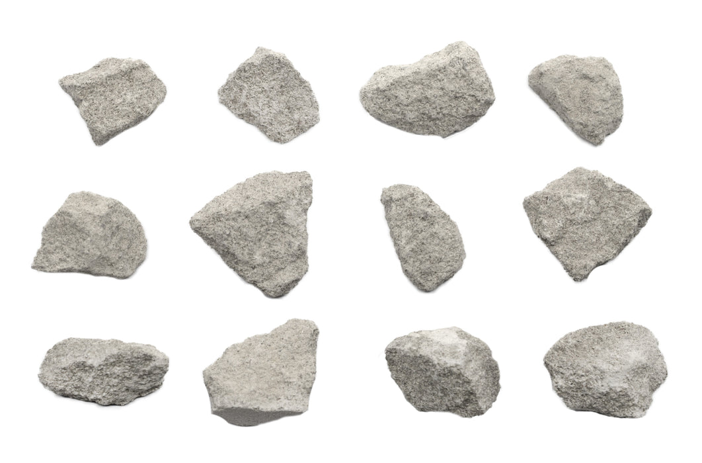
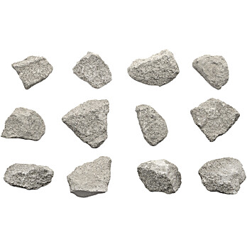

# Oolitic Limestone (Oolite)

> **Family:** Sedimentary — chemical/organic · **Composition:** calcium carbonate (CaCO₃) ooids
> **Quick ID:** Made of countless tiny **spheres (ooids)** — sugary/granular — and **fizzes** in dilute acid.

## At a glance

| Property | Value |
|---|---|
| Colour | Cream, white, tan, buff |
| Texture | **Oolitic** — tiny spherical ooids |
| Composition | Calcite (CaCO₃) ooids + cement |
| Acid test | **Fizzes** in dilute acid |
| Grain | Even, sand-like spherical ooids |
| Setting | Shallow, warm, agitated marine water |

## Composition
A limestone built from **ooids** — small, spherical, concentrically layered grains of **calcium carbonate (CaCO₃)** — cemented together. The ooids are typically 0.25–2 mm, with concentric coatings around a nucleus (a sand grain or shell fragment).

## Origin & classification
Oolitic limestone is a **chemical/organic sedimentary rock**. **Ooids** form in **shallow, warm, agitated marine water** where calcium carbonate precipitates in concentric layers around a nucleus, rolling like snowballs on the seafloor. It is a variety of limestone, classified by its oolitic (rather than fossiliferous or micritic) texture.

## Texture & sedimentary structures
**Oolitic** — a granular, sand-like texture of tiny spherical ooids; may show **ripple-cross lamination** (from the agitated water that formed the ooids). Even-grained and porous; the ooids give a characteristic sugary feel.

## Diagnostic field features
- Made of countless tiny **spheres (ooids)** — sugary/granular.
- **Fizzes** in dilute acid (it's calcite).
- Even, sand-like texture (distinct from fossiliferous limestone).
- A hand lens reveals the individual spherical ooids.

## Identification tests — step by step
1. **Hand lens:** look for tiny **spherical ooids** with concentric layers — the giveaway.
2. **Acid:** fizzes with dilute HCl (calcite).
3. **Texture:** even, granular, sand-like (vs fossiliferous limestone's shells).
4. **Vs sandstone:** oolitic limestone fizzes; sandstone does not.
5. **Vs oolitic ironstone:** ironstone is heavy and red-brown; oolitic limestone is light and fizzes.

## Depositional setting & formation
Ooids form in **shallow, warm, wave-agitated marine water** (like the Bahamas today), where calcium carbonate precipitates in layers around rolling nuclei. Accumulation and cementation produce oolitic limestone. It indicates a **high-energy shallow-marine** environment.

## Host states / localities
Wherever limestone occurs — **Ogun, Benue, Cross River, Edo, Enugu, Kogi**, etc. (see [Limestone & Dolomite](limestone.md)). Oolitic horizons occur within Nigeria's limestone sequences.

## Associated minerals & rocks
Limestone, dolomite, calcite (see [Calcite](../../03-mineral-resources/industrial/calcite.md)). Associated rocks: limestone, dolostone, shale.

## Economic relevance
- **Cement and lime** — some oolitic limestones are valued as cement feedstock and building stone.
- **Dimension/facing stone** (attractive even texture).
- A **high-energy shallow-marine** indicator (useful in basin analysis).

## Lookalikes & how to distinguish

| Looks like | How to tell it apart |
|---|---|
| **Oolitic ironstone** | Ironstone is heavy and reddish-brown (red-brown streak); oolitic limestone is light and fizzes. |
| **Sandstone** | Sandstone is gritty and doesn't fizz; oolitic limestone fizzes. |
| **Fossiliferous limestone** | Oolitic limestone has spherical ooids, not shells/fossils. |

## Field checklist
- [ ] Tiny spherical ooids (hand lens)?
- [ ] Fizzes with acid?
- [ ] Even, sand-like granular texture?
- [ ] Light colour (cream/white/tan)?
- [ ] Not heavy/red (rules out oolitic ironstone)?

## Field tips
- Oolitic (spherical-grain) texture + acid fizz; distinguish from ordinary (fossil/micritic) limestone by the even oolitic grain.
- Use a **hand lens** to see the concentric ooids.
- Oolitic limestone is prized as **cement feedstock**.
- Its even texture makes attractive **dimension stone**.

## Facts
- **Ooids** are tiny spheres of calcite that form like snowballs in agitated shallow seas.
- Oolitic limestone is a prized **cement** raw material.
- A hand lens reveals the ooids' **concentric layers**.
- It indicates a **high-energy, shallow-marine** depositional environment.

*Figure II.C.13 — Oolitic limestone (ooids). Source: [Eisco Labs](https://www.eiscolabs.com/products/eisco-oolitic-limestone-specimen-3cm-in-size-pack-of-12).*

*Figure II.C.13b — Oolitic limestone. Source: [Eisco Labs](https://www.eiscolabs.com/products/eisco-oolitic-limestone-specimen-3cm-in-size-pack-of-12).*

*Figure II.C.13c — Oolitic limestone (ooids). Source: [Thomas Sci](https://www.thomassci.com/p/oolitic-limestone-raw-sedimentary-rock-specimens-approx-1-inch-pk12).*

## Related
- [Limestone & Dolomite](limestone.md) · [Calcite](../../03-mineral-resources/industrial/calcite.md) · [Ironstone](ironstone.md) · [Chalk](chalk.md)
