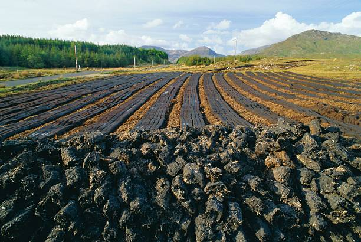
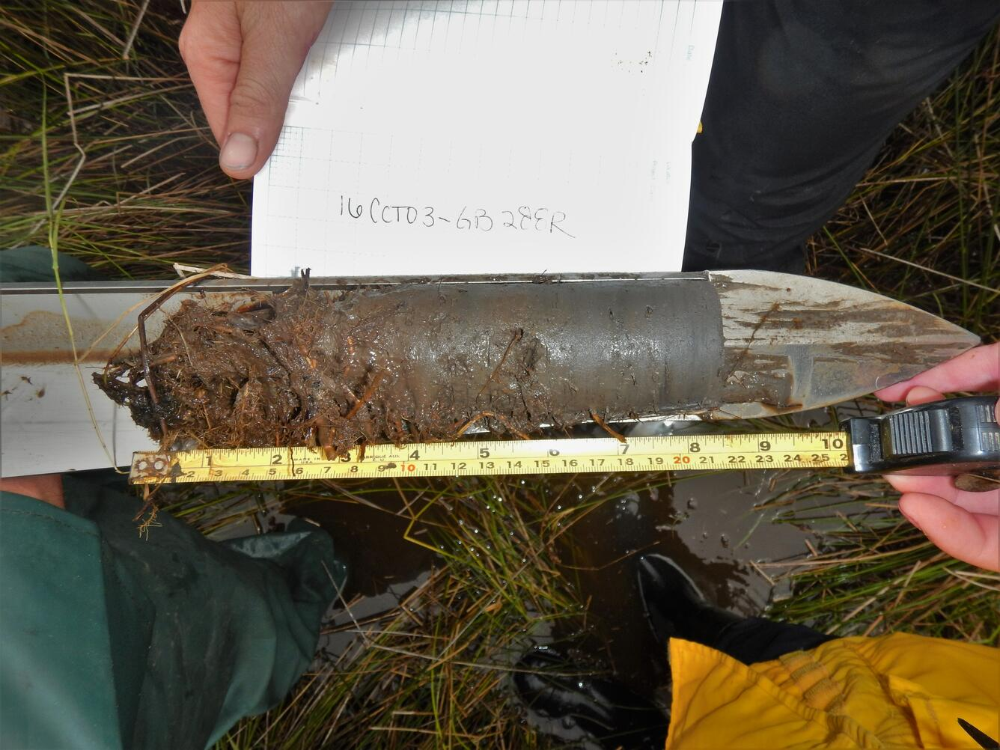
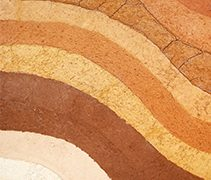
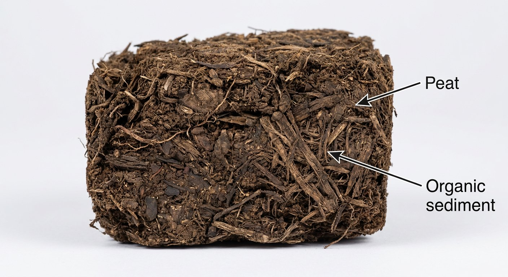
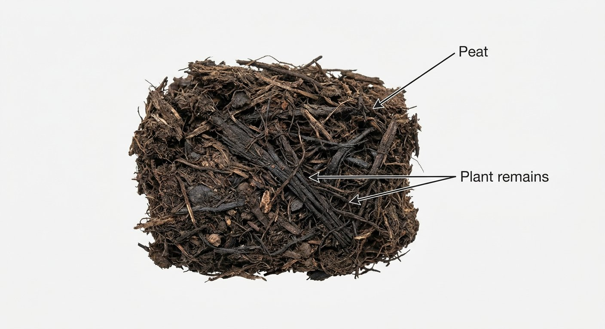

# Peat

> **Family:** Sedimentary — organic · **Origin:** partly decomposed plant matter in waterlogged settings
> **Quick ID:** Brown/black fibrous plant remains; light when dried; combustible; the precursor to coal.

## At a glance

| Property | Value |
|---|---|
| Colour | Brown to black |
| Texture | Fibrous, spongy, soft |
| Moisture | Very high (waterlogged) |
| Key test | Fibrous plant structure + combustible |
| Setting | Swamps, bogs, waterlogged basins |
| Significance | First stage in **coal formation** |

## Composition
Partly decomposed **organic matter** (plant material) accumulated in waterlogged, oxygen-poor settings. It is the **precursor to lignite and coal**. Very high moisture and carbon content; when dried, it is light and burns readily.

## Origin & classification
Peat is an **organic sedimentary accumulation** — dead plants in **waterlogged, oxygen-poor** swamps and bogs decay only partially (the lack of oxygen slows decomposition), building up thick layers of fibrous organic matter. With burial, compaction, and heating, peat transforms into **lignite**, then **coal** — the coalification series begins here.

## Texture & sedimentary structures
Fibrous, spongy, and soft; brown to black; very high moisture content. You can often see **identifiable plant remains** (stems, roots, leaves). Forms in **layers/beds** within swamp and alluvial sequences.

## Diagnostic field features
- Brown/black, **fibrous** plant remains; light when dried; combustible.
- Forms in swamps, bogs, and waterlogged basins.
- Spongy, wet, and compressible underfoot.
- May smell earthy/peaty.

## Identification tests — step by step
1. **Structure:** visible **fibrous plant remains** (stems, roots) — the giveaway.
2. **Moisture:** very wet/spongy; light and flammable when dried.
3. **Combustibility:** dried peat burns readily.
4. **Setting:** swamp/bog/waterlogged basin.
5. **Vs coal:** peat is fibrous, soft, and wet; coal is compacted, black, and brittle.

## Depositional setting & formation
Peat accumulates in **waterlogged, oxygen-poor** environments — swamps, bogs, mangroves, and floodplains — where plant production outpaces decay. In Nigeria, the **Niger Delta wetlands and coastal swamps** are the main peat-forming environments today.

## Host states / localities
**Niger Delta and coastal wetlands** and some inland basins — **Delta, Bayelsa, Rivers, Cross River, Akwa Ibom, Ondo**, etc. Forms in modern mangrove swamps and waterlogged lowlands.

## Associated minerals & rocks
Clay and alluvial/mangrove deposits; grades into [Coal & Lignite](coal.md) with burial. Associated rocks: clay, alluvium, mangrove mud.

## Economic relevance
- Traditional **fuel** (dried peat burns).
- **Horticultural growing medium** (peat moss).
- A potential **energy resource**; the first stage in coal formation.
- Important **carbon store** and wetland ecosystem component.

## Lookalikes & how to distinguish

| Looks like | How to tell it apart |
|---|---|
| **Lignite / coal** | Peat is fibrous, soft, and wet; coal is compacted, black, and brittle. |
| **Organic-rich clay/mud** | Peat is dominantly fibrous plant matter and lighter when dried; mud is mineral. |
| **Compost/soil** | Peat is a thick, fibrous accumulation in a wetland setting. |

## Field checklist
- [ ] Fibrous plant remains visible?
- [ ] Very wet/spongy, light when dried?
- [ ] Combustible (when dried)?
- [ ] Swamp/bog/waterlogged setting?
- [ ] Niger Delta / coastal wetland?

## Field tips
- Fibrous organic material in a wet setting; with burial and compaction it becomes lignite, then coal.
- Peat marks a **waterlogged, low-oxygen** depositional environment.
- It is **compressible** — important for foundations and construction in wetlands.
- Note thickness and extent — thick peat is a fuel/horticultural resource.

## Facts
- Peat is the **first stage of coal formation** — buried and compressed, it becomes lignite then coal.
- It forms in **waterlogged, oxygen-poor** swamps where plants can't fully decay.
- Nigeria's **Niger Delta wetlands** are active peat-forming environments.
- Peatlands are major **carbon stores** — important for climate.

*Figure II.C.14 — Peat being cut from a bog. Source: [Getty Images](https://www.gettyimages.com/photos/peat-harvesting).*

*Figure II.C.14b — Peat sediment core. Source: [USGS](https://usgs.gov/media/images/marsh-peat-auger-sediment-core-containing-peat-above-a-gray-clayey-silt).*

*Figure II.C.14c — Peat (organic sediment) sample. Source: [Radiocarbon](https://www.radiocarbon.com/ams-dating-sediments.htm).*

*Figure II.C.14d — Labeled illustration: peat compacted organic matter. Original diagram prepared for this guide.*

*Figure II.C.14e — Labeled illustration: peat fibrous plant remains. Original diagram prepared for this guide.*

## Related
- [Coal & Lignite](coal.md) · [Clay & Kaolin](clay-kaolin.md) · [Alluvium & beach/river sands](placers-alluvium.md) · [Siltstone, Shale & Mudstone](siltstone-shale.md)
