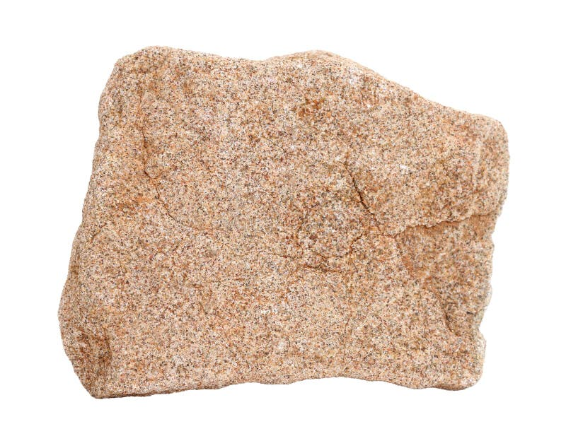
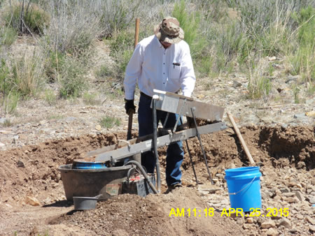
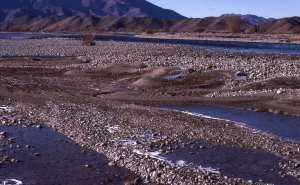

# Alluvium & Beach/River Sands (Placers)

> **Family:** Sedimentary — unconsolidated · **Origin:** water-sorted deposits
> **Quick ID:** Loose sand/gravel with dark "black sand" bands; **panning** concentrates heavy minerals.

## At a glance

| Property | Value |
|---|---|
| Texture | **Unconsolidated** (loose), sorted into layers |
| Setting | Riverbeds, terraces, beaches |
| Key clue | Dark **"black sand"** bands among light quartz |
| Heavy minerals | Cassiterite, gold, ilmenite, rutile, zircon, monazite, magnetite |
| Field test | **Panning** concentrates the heavy grains |
| Economic | Placer tin/gold; heavy-mineral sands; aggregate |

## Composition
Loose **sand and gravel** (alluvium) in which **dense "heavy minerals"** are concentrated by flowing water. Heavy minerals include **cassiterite (tin), gold, ilmenite, rutile, zircon, monazite, and magnetite** in a light quartz-sand matrix.

## Origin & classification
Placers are **unconsolidated sedimentary deposits** in which flowing water (rivers, waves) sorts grains by **size and density**, concentrating the **dense heavy minerals** where the current slows (river bends, behind bars, beaches). They are among the easiest ore deposits to mine (loose, surface, no drilling/blasting).

## Texture & sedimentary structures
**Unconsolidated** (loose), sorted into layers by grain size and density; often shows dark **"black sand"** bands (magnetite/ilmenite). Layering, cross-bedding, and graded beds are common; the heavy minerals collect in **streaks and pay-streaks**.

## Diagnostic field features
- Loose sand/gravel, often in **riverbeds, river terraces, and beaches**.
- **"Black sand"** layers (heavy minerals) among lighter quartz sand.
- **Panning** concentrates the heavy grains — a classic field technique.
- Gold/tin grains are dense and settle in the pan.

## Identification tests — step by step
1. **Pan it:** swirl sand/gravel in a pan — dense heavy minerals concentrate in the bottom.
2. **Black sand:** look for dark bands of magnetite/ilmenite.
3. **Loose:** the material is unconsolidated (not cemented).
4. **Setting:** river bends, terraces, beaches — where water slows.
5. **Magnet:** run a magnet through the concentrate to pull out magnetite.

## Depositional setting & formation
Placers form where **flowing water slows and drops its heaviest load** — inside river bends, behind obstructions, on beaches where waves sort grains, and in ancient terrace gravels. Over time, heavy minerals (gold, cassiterite, magnetite) accumulate into economic **pay-streaks**.

## Host states / localities
- **River placers** of the **Jos Plateau** rivers (tin/gold) — **Plateau, Bauchi**.
- **Coastal beach sands** — **Lagos, Ondo, Delta, Rivers, Akwa Ibom, Cross River**.
- Rivers and streams nationwide (gold, tin, heavy minerals).

## Associated minerals & rocks
**Cassiterite, gold, ilmenite, rutile, zircon, monazite, magnetite** (heavy minerals) in a quartz-sand matrix. Associated rocks: sandstone, laterite, alluvium.

## Economic relevance
- **PLACER TIN and GOLD** — historically and currently important (Jos rivers supplied much of Nigeria's tin).
- **Heavy-mineral beach sands** — titanium (ilmenite/rutile), zircon, and rare-earth (monazite).
- **Building sand and gravel** — a major construction resource.
- Among the **easiest deposits to mine** (loose, near-surface).

## Lookalikes & how to distinguish

| Looks like | How to tell it apart |
|---|---|
| **Sandstone** | Sandstone is cemented/lithified; placer/alluvium is loose. |
| **Laterite** | Laterite is a hard iron crust; placers are loose sorted sands. |
| **Black sand (magnetite)** | Black sand itself is the heavy-mineral concentrate — pan it to confirm. |

## Field checklist
- [ ] Loose (unconsolidated) sand/gravel?
- [ ] Black sand bands / heavy grains?
- [ ] Panning concentrates heavy minerals?
- [ ] River bend / terrace / beach setting?
- [ ] Cassiterite / gold / ilmenite in the pan?

## Field tips
- **Pan it** — heavy minerals concentrate in the pan; look for **black sand**.
- Placers sit where water slows (river bends, beaches, terrace gravels).
- Dense black grains (magnetite/ilmenite) vs. light quartz sand.
- Use a **magnet** to separate magnetite from gold/cassiterite in the concentrate.
- Sample along **pay-streaks** — heavy minerals concentrate in specific layers.

## Facts
- **Placer gold** sparked many gold rushes — it is the easiest gold to find and mine.
- The **Jos Plateau river placers** supplied much of Nigeria's historic **tin** (cassiterite).
- **Black sand** on beaches is concentrated **magnetite and ilmenite** (heavy minerals).
- Placers are **unconsolidated** — no drilling or blasting needed to mine them.

*Figure II.C.11 — Sand/gravel: the loose host in which heavy minerals are
concentrated into placers. Source: [Dreamstime](https://dreamstime.com/photos-images/sedimentary-rock.html).*

*Figure II.C.11b — Placer gold (alluvial) deposit. Source: [NM Tech Geoinfo](https://geoinfo.nmt.edu/resources/minerals/metallic/gold/placer/home.html).*

*Figure II.C.11c — Alluvial gravel bar (river deposit). Source: [Geological Digressions](https://www.geological-digressions.com/atlas-of-fluvial-deposits-2/).*

## Related
- [Sandstone](sandstone.md) · [Laterite & Ferricrete](laterite-ferricrete.md) · [Regolith & laterite](../../01-general-geology/01-07-regolith-and-laterite.md) · **Part III** — [cassiterite](../../03-mineral-resources/metallic/cassiterite.md), [gold](../../03-mineral-resources/metallic/gold.md), [ilmenite/rutile](../../03-mineral-resources/metallic/titanium-minerals.md), [zircon & monazite](../../03-mineral-resources/metallic/zircon-monazite.md)
